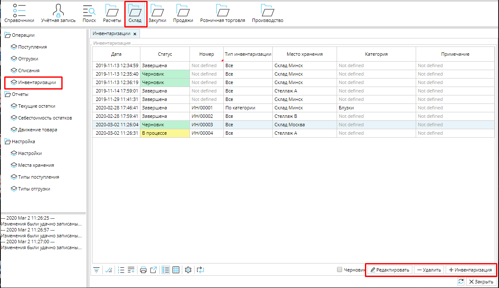
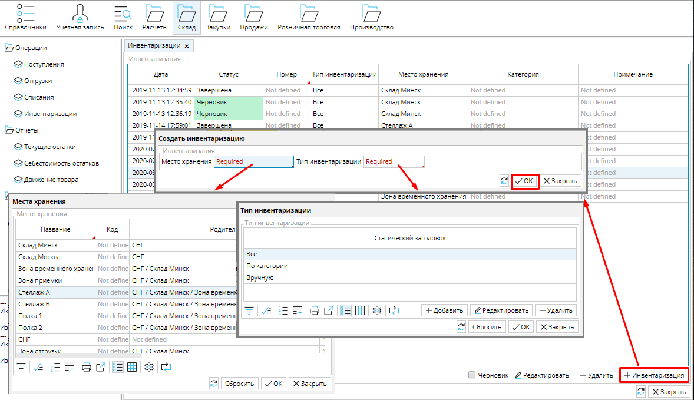
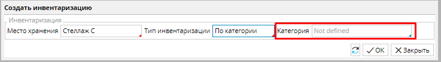
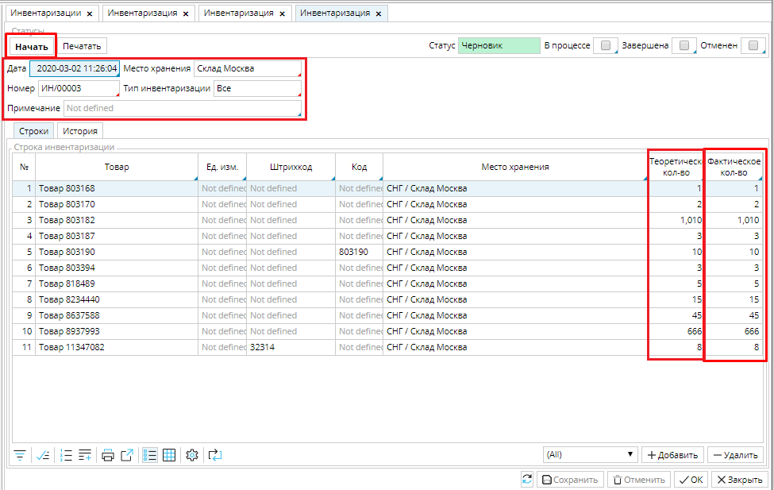
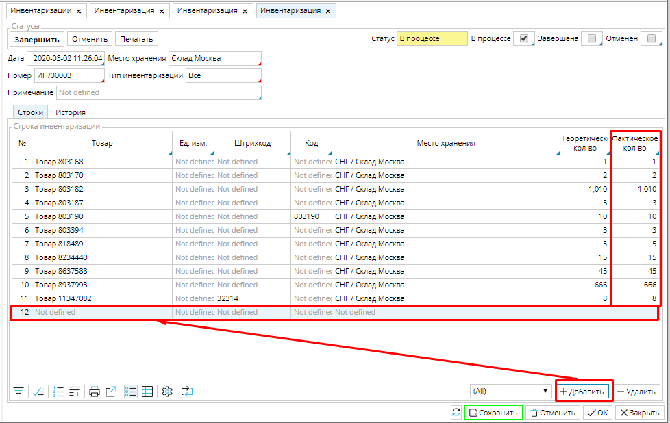
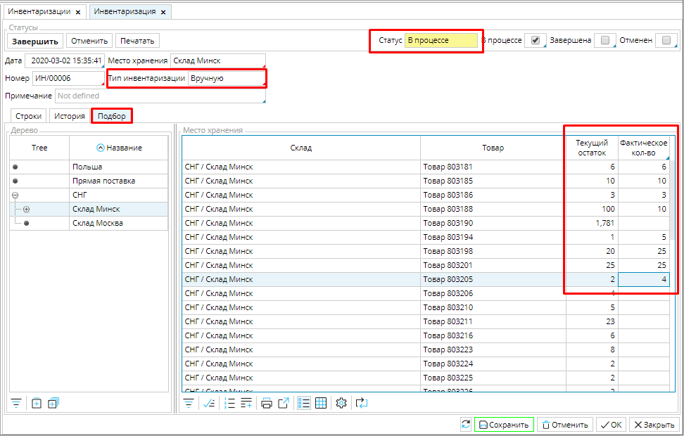
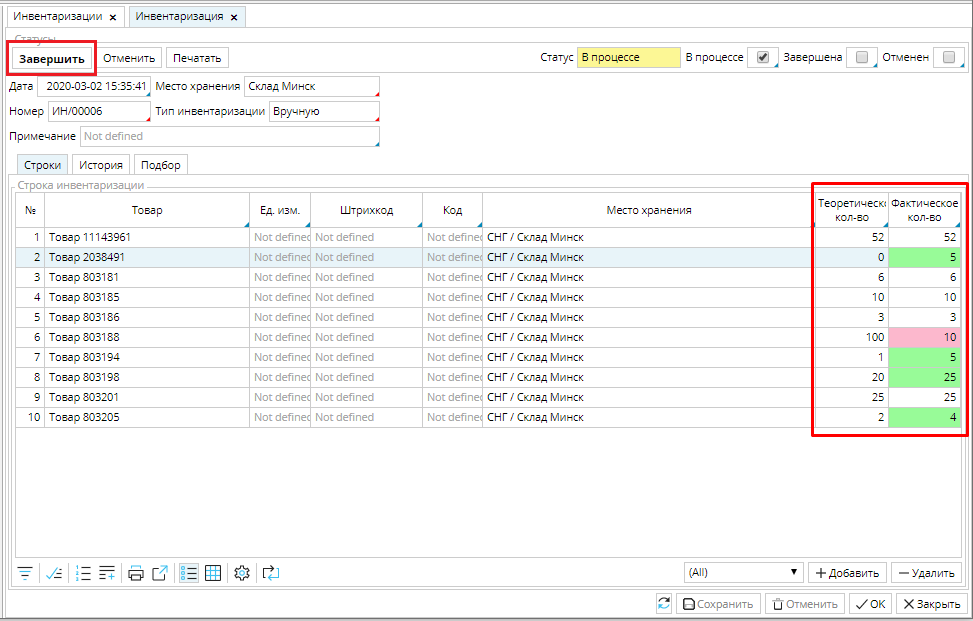
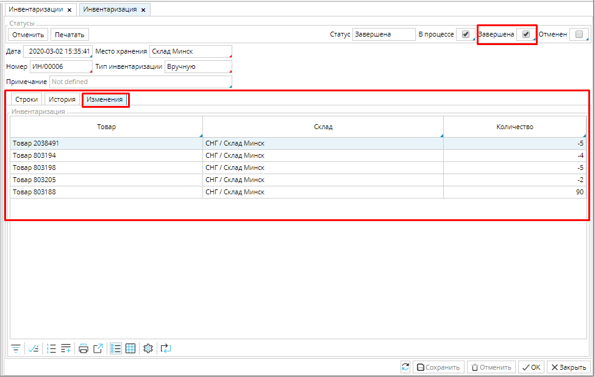
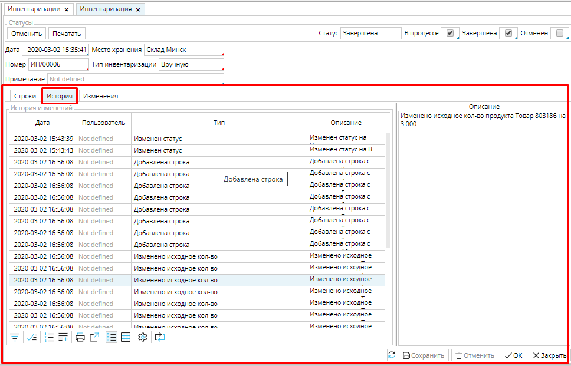

Проведение инвентаризации запасов с MyCompany - это просто и быстро.  Список всех инвентаризаций находится в модуле **Склад - Инвентаризации**.

### Рис. 1 Список инвентаризаций

  

В зависимости от стадии процесса объект **Инвентаризация** может находиться в нескольких статусах, которые для удобства выделены цветом. 

|Статус|Пояснения|
|---|---|
|*<strong>Черновик</strong>*|Вы готовитесь к инвентаризации, издаете приказ, собираете комиссию, назначаете дату, и т.д.|
|*<strong>В процессе</strong>*|Проверка фактического наличия имущества. Все обнаруженные несоответствия фиксируются в столбце Фактическое наличие.|
|*<strong>Завершена</strong>*|Фактическое наличие отражено  и количество товаров на складах откорректировано инвентаризацией.|

Чтобы провести инвентаризацию нажмите кнопку **+Инвентаризация** и выберите ее параметры: место хранения и тип. Нажмите **ОК** и будет создана **Инвентаризация** в статусе ***Черновик***. 

  

### Рис. 2 Создание новой инвентаризации

  

**Место хранения** - вы можете провести инвентаризацию всего склада или любой его зоны, для этого выберите **место хранения** из списка и нажмите **ОК**. Подробнее о местах хранения читайте [**здесь**](Location_settings.md). 

**Тип инвентаризации** - вы можете выбрать один из трех типов: **все**, **по категории**, **вручную**.

**Все** - если вы выбираете этот тип, то в инвентаризацию будут включены все товары находящиеся в выбранном **месте хранения**. 

**По категории** - если вы выбираете этот тип, то в окне параметров инвентаризации появится поле **Категория**, и необходимо будет выбрать категорию товаров.  

### Рис. 3 выбор категории товаров для инвентаризации. 

Только товары выбранной **категории**, находящиеся в выбранном **месте хранения** будут отобраны для инвентаризации. 

**Вручную** - если вы выбираете этот тип, то список товаров инвентаризации не будет создан автоматически, вы будете создавать его самостоятельно, добавляя товары вручную.

В созданной **Инвентаризации** в поле **Дата** будет указана дата и время создания. При необходимости эти данные можно изменить, кликнув в поле и установив нужные.

**Место хранения** и **Тип** будут указаны в соответствии с выбранными вами параметрами при создании инвентаризации.

**Номер** проставится автоматически при первом сохранении, если настроен [**нумератор**](Numerators.md).

**Примечание** - можете создать примечание, которое поможет вам ориентироваться в общем списке инвентаризаций, например, вы можете указать, что инвентаризация для годовой отчетности.

Теоретическое, т.е. проведенное по документам, и   фактическое количество товара, в черновике будет одинаковым. Чтобы иметь возможность корректировать фактические остатки в Инвентаризации необходимо нажать кнопку **Начать**.  

### Рис. 4 "Начать" инвентаризацию

  

**Инвентаризация** перейдет в статус ***В процессе***, в столбце ***Фактическое количество*** можно будет ввести реальный остаток товара, если он отличается от теоретического. Если на складе оказался товар, которого нет в списке, используйте кнопку **Добавить**.  Нажмите кнопку, в список добавиться пустая строка, нажмите в поле ***Товар*** и выберите из открывшегося  списка номенклатур  недостающий товар, нажмите **ОК**, затем заполните недостающую информацию о товаре. 

### Рис. 5 Инвентаризация "В процессе"

  

Если вы проводите инвентаризацию **Вручную**, то при переходе в статус ***В процессе***, становится доступна вкладка **Подбор**. В правом блоке отображены все товары, которые находятся в месте хранения, выбранном в левом блоке. Также указаны текущие остатки по каждому товару. Те товары, для которых вы проставите **Фактическое количество**, будут добавлены в список товаров **Инвентаризации**. 

### Рис. 6 Вкладка Подбор в Инвентаризации вручную

  

Если при проведении инвентаризации выявлены  расхождения в теоретическом и фактическом количестве товаров, они подсвечиваются цветом в списке товаров во вкладке **Строки**. 

### Рис. 7 Расхождения теоретического и фактического количества товаров

  

Когда вы проверили и ввели фактическое количество всех товаров, нажмите **Завершить **(рис. 7). Статус **Инвентаризации** измениться на ***Завершен***, и появиться вкладка **Изменения**, где будут отображены только те товары, фактическое количество которых не соответствует теоретическому, и величина изменения. 

### Рис. 8 Вкладка Изменения

  

Во вкладке **История** можно просмотреть, кто, когда и какие изменения вносил в инвентаризацию. 

### Рис. 9 Вкладка История

  

  

Сверки и взаиморасчеты

Переоценка

  
