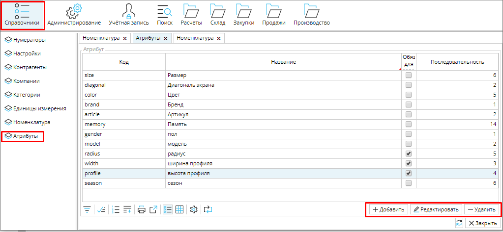
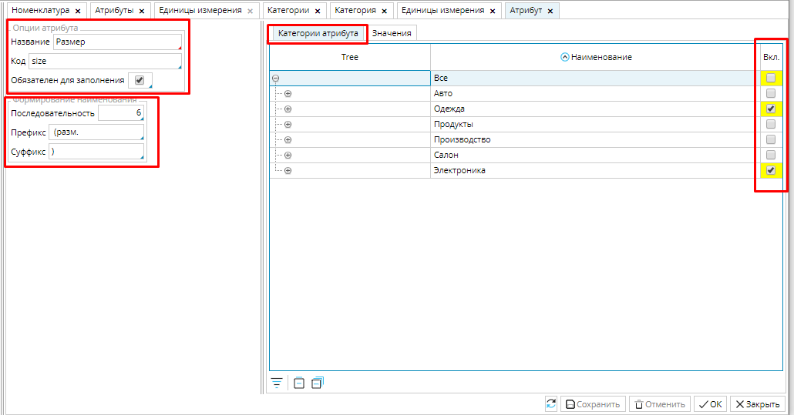
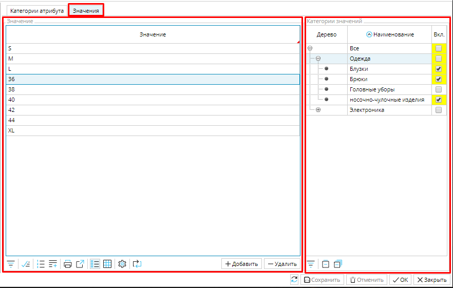

Каждый товар или услуга имеют ряд отличительных признаков, таких, например, как цвет или размер, которые позволяют  однозначно их идентифицировать. Такие признаки в MyCompany  называются **Атрибутами**. Пользователь настраивает перечень атрибутов и их значения в **Справочники - Атрибуты**. 

### Рис. 1 Вкладка Атрибуты

  

Добавление, редактирование и удаление атрибутов производится соответствующими кнопками в правом нижнем углу. Чтобы создать атрибут, кликните **Добавить**, откроется окно формы атрибута, где указывают свойства атрибута, назначают категории, которые характеризует данный атрибут и вводят перечень значений. 

### Рис. 2 Форма Атрибута

  

**Название** - введите имя атрибута. Желательно, чтобы оно было кратким, но понятным относительно товара или услуги, которую он характеризует. Например, понятно, что обозначает атрибут  *размер* для товаров из категории *Одежда*.

**Код** - можно ввести вручную или использовать [нумератор](Numerators.md). 

**Обязателен для заполнения** - если эта функция включена, система будет выделять красным поля данного атрибута в товаре или услуге, пока не будет указано значение.

**Последовательность** - номер позиции атрибута в [полном наименовании номенклатуры](Items_directory.md#Itemhead). Если позиция не указана, атрибут не будет включен в полное наименование. 

**Префикс** / **Суффикс**  - если в каждом значении атрибута есть повторяющаяся часть,  ее можно указать как префикс или суффикс.  Например, вы бы хотели, чтобы размер отображался в наименовании как "(разм.\_\_\_)". Для этого задаем префикс "*(разм.*" и суффикс "*)*"

**Вкладка Категории атрибута** - в этой вкладке отображается иерархическое дерево категорий. Все товары и услуги из категорий, которые вы отметите в столбике **Вкл.** будут иметь данный атрибут.

**Вкладка Значения** - состоит из двух блоков:

**Значение** - в этом блоке можно добавлять и удалять значения атрибутов соответствующими кнопками. При нажатии кнопки **Добавить** появляется новая строка, куда необходимо ввести значение атрибута.

**Категории значений** - каждый атрибут может иметь большое количество значений. Например, характеристику *Размер* может иметь не только одежда, но и обувь, предметы обихода и т.д.  Чтобы упростить выбор значения атрибута для товара или услуги, в данном блоке можно отфильтровать, какие значения атрибута будут отображаться для конкретных категорий. Для этого необходимо кликнуть на значение и отметить галочками категории, в которых оно будет отображаться. 

### Рис. 3 Форма Атрибута вкладка Значения

  

Не забудьте сохранить новый атрибут или внесенные вами изменения.

  

  
