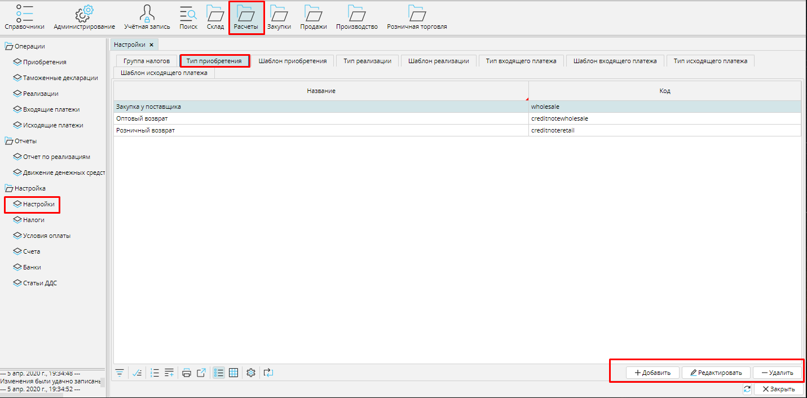
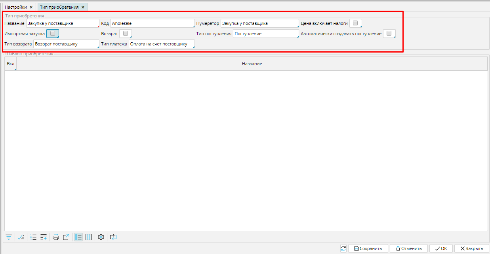

Приобретение - это документ, который отражает в системе инвойс или накладную, т.е.  первичный документ учета. **Типы приобретений **используются для того, чтобы вы могли легко и быстро ориентироваться в своих документах, и чтобы система  могла автоматически создавать нужные вам типы документов в соответствии с заданными вами настройками. 

Вы можете создать и настроить столько типов приобретений, сколько вам нужно для деятельности. Список всех типов приобретений вы найдете в Расчеты - Настройки вкладка Тип приобретения.  С помощью кнопок Добавить, Редактировать и Удалить вы можете корректировать список. 

### Рис. 1 Список типов приобретения

  

Чтобы создать **Тип приобретения**, нажмите кнопку **Добавить** и  установите подходящие настройки.

### Рис. 2 Настройка типа приобретения

  

**Название **-используйте понятное вам и сотрудникам имя для типа приобретения. 

Код - введите код типа приобретения, который поможет ориентироваться в списках приобретений.

**Нумератор** - укажите нумератор, который будет использоваться для создания уникального номера приобретения. О настройке нумераторов читайте [**здесь**](http://documentation.luxsoft.by/pages/viewpage.action?pageId=72942230). 

Цена включает налоги - включите этот признак (поставьте галочку), если вы указываете в системе цену товара, которая уже включает в себя налог, тогда итоговая стоимость в документе будет выглядеть так: , если  этот признак выключен (галочка не стоит), то итоговая стоимость заказа будет выглядеть так: . 

Импортная закупка  - включите этот признак (поставьте галочку), если вы производите закупку у зарубежного поставщика.

Возврат - включите этот  признак, если настраиваемый тип приобретения является возвратом товара покупателем. 

**Тип поступления** - выберите из списка **[тип поступления](Receipt_type.md)**. Документ **Поступление **данного типа будет автоматически создан на основе этого типа приобретения (кнопка **Создать поступление **в **Приобретении**). 

**Автоматически создавать поступление **- если вы включите этот признак, то при переводе Приобретения в статус ***К оплате*** (кнопка **В работу** в **Приобретении**), будет автоматически создано Поступление на количество товара в Приобретении в статусе ***Принят***.

**Тип платежа** - выберите из списка **[тип исходящего платежа](Payment_type.md)**. Документ оплаты данного типа будет автоматически создан при оплате поставки (кнопка **Оплатить** в **Приобретении**). 

Тип  возврата -  выберите из списка тип реализации. Документ Реализация этого типа будет автоматически создан, если вы будете создавать возврат по Приобретению данного типа (кнопка Вернуть в Приобретении). 

**Тип платежа** - выберите из списка **[тип исходящего платежа](Payment_type.md)**. Документ оплаты данного типа будет автоматически создан при оплате поставки (кнопка **Оплатить** в **Приобретении**). 

Сохраните созданный тип приобретения.

  

  

  
