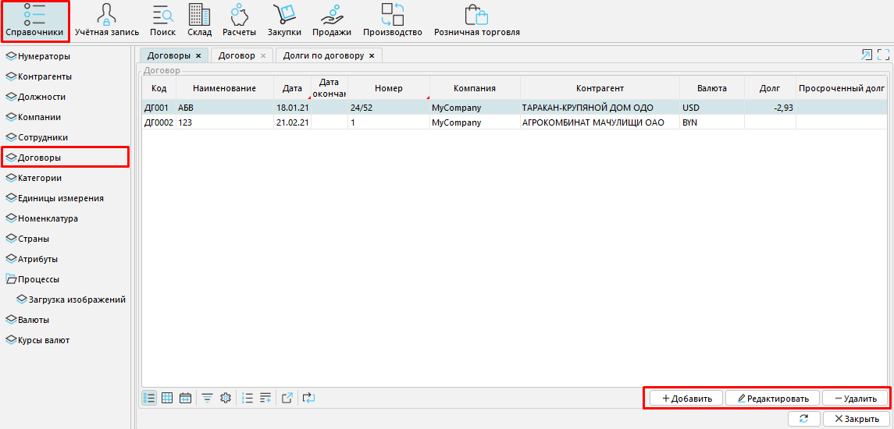
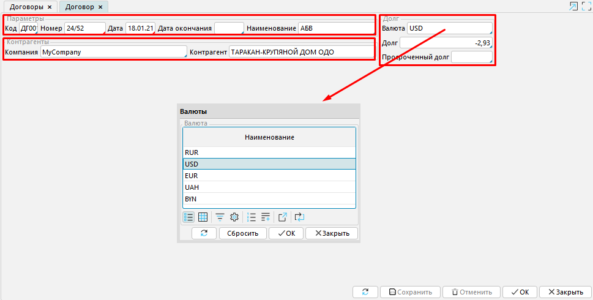
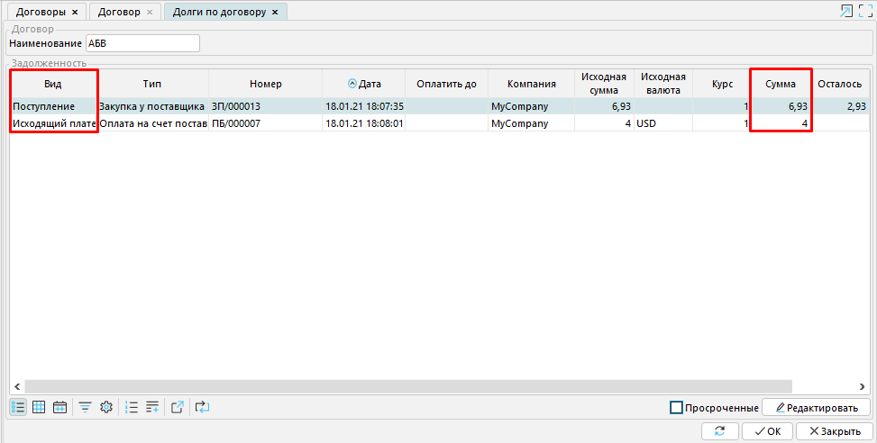

*Договор* в MyCompany - это объект, который содержит информацию о долгах компании перед контрагентами.

  
*Рис. 1 Вкладка Договоры*

  

В **Справочники - Договоры** предусмотрено управление информацией о договорах: добавление новых, а также редактирование и удаление уже имеющихся.

  

  
*Рис. 2 Форма Договор*

Каждый элемент данной вкладки объединяет данные, представленные тремя блоками:

***Параметры*** - содержит уникальную информацию о договоре (**Код, Номер, Дату, Дату окончания** и **Наименование** договора).

***Контрагенты*** - отражает стороны договора (**[Компания](Partners_directory.md)** и **Контрагент**).

***Долг*** - включает сведения об обязательствах Компании перед Контрагентом. Здесь указывается исходная **Валюта** сделки и сумма **Долга**.

Долги по договору возникают в случае непогашения или частичного погашения компанией своих обязательств. То есть, в случае, когда сумма [поступления](Vendor_payments.md) равна сумме исходящего платежа по конкретному договору, долг не образовывается.

Строка **Просроченный долг** автоматически заполняется тогда, когда обязательства не погашены в соответствующий условиям оплаты срок.

  
*Рис. 3 Долги по договору*

  

  

