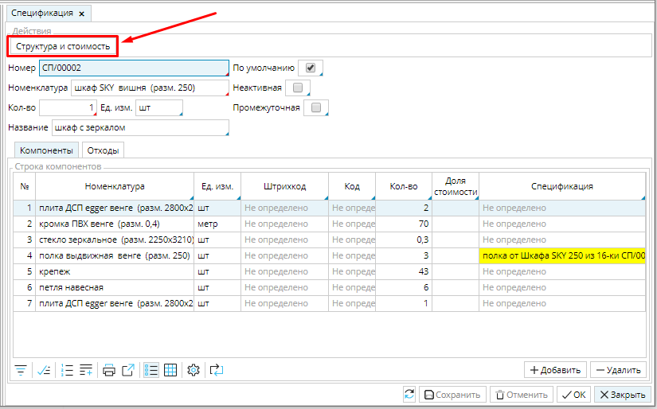
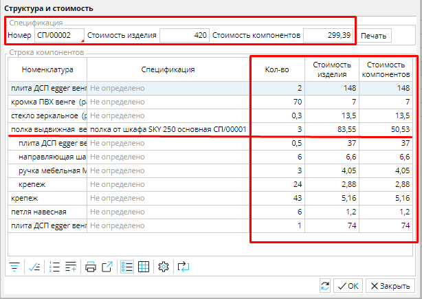

  

Для расчета стоимости спецификации применяется плановый метод расчета себестоимости, поэтому для корректных подсчетов для всех компонентов должна быть установлена **[Плановая себетоимость](Items_directory.md#Плановаясебестоимость-broken) **в карточке товара. 

Чтобы просмотреть стоимость спецификации, в форме **Спецификация** надо нажать кнопку **Структура и стоимость**.

### Рис. 1 Кнопка "Структура и стоимость" в спецификации

  

Откроется одноименная форма. В верхней строке отображены итоги по спецификации: общая стоимость всех компонентов спецификации и стоимость изделия. **Стоимость изделия** наследуется из карточки производимого товара ([Плановая себестоимость](Items_directory.md#Плановаясебестоимость-broken)) и отображается с учетом количества, на которое рассчитана спецификация. Например, если себестоимость товара 10, а спецификация рассчитана на производство 3 единиц, то стоимость изделия будет равна 30.

Если вы составили новую спецификацию, то информация об общей стоимости компонентов может помочь правильно определить стоимость изделия и установить плановую себестоимость товара в карточке, которая может соответствовать совокупной стоимости компонентов для производства одной единицы, или включать дополнительные издержки, которые вы несете при производстве, например, оплату труда. 

  

### Рис. 2 Структура и стоимость спецификации

  

В таблице будут отображены все компоненты спецификации и их количество,  стоимость каждого компонента и стоимость  изделия. 

  

