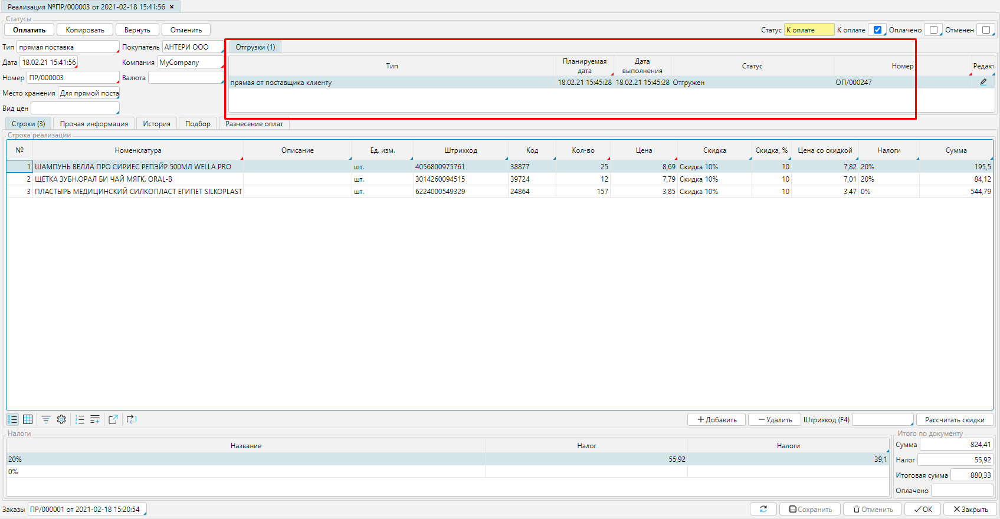

The page is under development

[//]: # (После установки всех [**настроек**]&#40;Cross-docking_settings.md&#41; осуществляем продажу товаров со склада продавца. Сначала оформляем [**заказ от покупателя**]&#40;Customer_orders.md&#41;, тип заказа необходимо установить ***Продажа со склада поставщика***, склад - ***Для прямой поставки***. Обратите внимание, что спецификацию в данном случае необходимо создавать [**вручную**]&#40;Customer_orders.md&#41;, т.к. на вкладке **Подбор** отображаются только товары, которые есть в наличии на складе.)

[//]: # ()
[//]: # (![]&#40;images/Cross-docking_orders_1.png&#41;  )

[//]: # (*Рис. 1 Формирование заказа покупателя*)

[//]: # ()
[//]: # (  )
[//]: # ()
[//]: # (Согласовав все детали заказа с покупателем, необходимо произвести закупку и отправить товары покупателю. Для этого оформляем [**заказ поставщику**]&#40;Puchase_order.md&#41;, устанавливаем тип заказа ***Прямая поставка*** и склад - ***Прямая поставка.*** Введите список товаров к закупке в соответствии с заказом покупателя.)

[//]: # ()
[//]: # (![]&#40;images/Cross-docking_orders_2.png&#41;  )

[//]: # (*Рис. 2 Составление заказа поставщику*)

[//]: # ()
[//]: # (  )
[//]: # ()
[//]: # (![]&#40;images/Cross-docking_orders_3.png&#41;  )

[//]: # (*Рис. 3 Подтвержденный заказ поставщику*)

[//]: # ()
[//]: # (  )
[//]: # ()
[//]: # (Когда заказ переведен в статус ***Подтвержден***, в форме появится кнопка **Создать поступление**. Нажмите на нее и откроется [**Поступление**]&#40;Vendor_payments.md&#41; в соответствии с заказом. Проверьте, если настройки были сделаны правильно, то будет указан тип документа ***Для прямой поставки,*** и место хранения - ***Для прямой поставки***.)

[//]: # ()
[//]: # (![]&#40;images/Cross-docking_orders_4.png&#41;)

[//]: # ()
[//]: # (*Рис. 4 Приобретение по заказу*)

[//]: # ()
[//]: # (  )
[//]: # ()
[//]: # (При сохранении **Поступления** &#40;при проведении оплаты или просто с помощью кнопки **Сохранить**&#41;, в системе автоматически будет создана **Приемка** приобретенного товара на склад в статусе ***Принят***.)

[//]: # ()
[//]: # (![]&#40;images/Cross-docking_orders_5.png&#41;  )

[//]: # (*Рис. 5 Отображение Приемки в Поступлении*)

[//]: # ()
[//]: # (  )
[//]: # ()
[//]: # (![]&#40;images/Cross-docking_orders_6.png&#41;  )

[//]: # (*Рис. 6 Документ Приемка*)

[//]: # ()
[//]: # (  )
[//]: # ()
[//]: # (После закупки необходимых товаров можно продолжить продажу. В подтвержденном заказе покупателя необходимо нажать кнопку **Реализовать**. Откроется [**Реализация**]&#40;Customer_invoice_and_Payment_collection.md&#41;, созданная в соответствии с заказом.)

[//]: # ()
[//]: # (![]&#40;images/Cross-docking_orders_7.png&#41;  )

[//]: # (*Рис. 7 Подтвержденный заказ покупателя*)

  

  
*Рис. 8 Реализация по заказу покупателя*

  

Проверьте *тип* документа, должен быть указан ***Прямая поставка***, *место хранения* - ***Для прямой поставки***. При сохранении **Реализации** (при проведении оплаты или просто с помощью кнопки **Сохранить**), в системе автоматически будет создана **Отгрузка** товара со склада в статусе ***Отгружен.***

  
*Рис. 9 Отображение отгрузки в реализации*

  

  
*Рис. 10 Отгрузка проданного товара*

  

После того, как товар отгружен покупателю и проведены оплаты, можно закрывать оба заказа.

  

  
