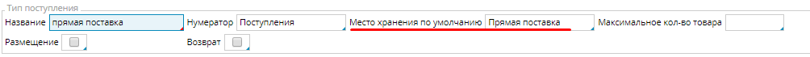
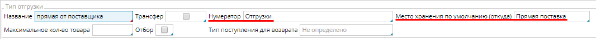
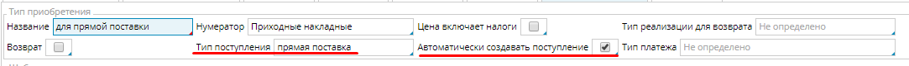
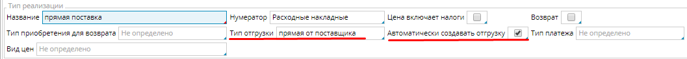
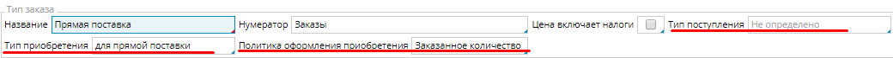
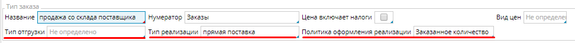

Для наглядности в настройках будем использовать наименование "Прямая поставка" или схожие. Необходимые настройки:

1.  Создайте [**склад**](Location_settings.md) ***Прямая поставка***.
2.  Создайте  **[тип поступления](Receipt_type.md)** ***прямая поставка***:  
    *Нумератор* - обязательно настройте и укажите [**нумератор**](Numerators.md);  
    *Место хранения по умолчанию* - укажите специально созданный склад **Прямая поставка**.   
      
      
3.  Создайте [**тип отгрузки**](Shipment_type.md) ***прямая от поставщика***:  
    *Нумератор* - обязательно настройте и укажите [**нумератор**](Numerators.md);*Место хранения по умолчанию (откуда)* - укажите специально созданный склад **Прямая поставка  
    **  
      
4.  Настройте [**тип приобретения**](Bill_type.md) ***для прямой поставки***:  
    *Тип поступления* - укажите специально созданный тип ***прямая поставка;  
    **Автоматически создавать поступление* - включите опцию.  
      
      
5.  Аналогично создайте **[тип реализации](Invoice_type.md)** ***прямая поставка**:  
    Тип отгрузки* - укажите специально созданный тип ***прямая от поставщика***;***  
    **Автоматически создавать поступление* - включите опцию.***  
      
6.   Настройте тип заказа на закупку  Прямая поставка:*Тип поступления* - не указывать;  
    *Тип приобретения* - укажите  специально созданный тип ***для прямых поставок***;  
    *Политика оформления приобретения* - выберите ***Заказанное количество***.  
      
      
      
7.  Настройте тип заказа на продажу Продажа со склада поставщика:Тип отгрузки - не указывать;Тип реализации - укажите  специально созданный тип ***прямая поставка***;  
    *Политика оформления реализации* - выберите ***Заказанное количество***.   
    

  

  
