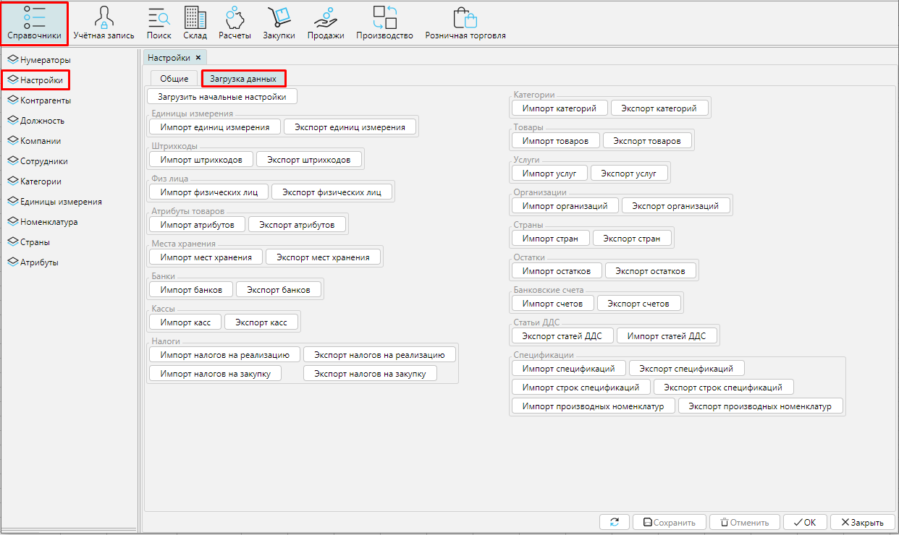

Чтобы начать работать в MyCompany необходимо загрузить в систему основные данные, например товары и услуги, с которыми вы работаете, их характеристики, список партнеров, банков, счетов и т.д. Все данные можно ввести в ручную, создавая объекты как описано далее в инструкциях.  Но можно существенно сэкономить время и использовать возможности импорта/экспорта данных.

Чтобы импортировать данные в MyCompany необходимо перейти в **Справочники** - **Настройки** - **Загрузка данных**.

Нажмите кнопку **Импорт** нужного объекта, выберите файл с данными и нажмите **ОК**. 

### Чтобы данные были корректно импортированы, необходимо использовать файл xlsx заданного формата. Примеры файлов для каждого импортируемого объекта приведены ниже.

Вы можете использовать приведенные файлы для загрузки в свою систему и обучения на реальных данных. 

Чтобы перенести свои данные из другой системы, выгрузите их в формате ниже приведенных файлов, и легко загрузите в MyCompany.

-   [Единицы измерения](attachments/12812623/12812640.xlsx)
-   [Категории товаров](attachments/12812623/12812638.xlsx)
-   [Товары](attachments/12812623/12812632.xlsx)
-   [Услуги](attachments/12812623/12812631.xlsx)
-   Штрихкоды 
-   Атрибуты
-   Налоги на реализацию
-   Налоги на закупку
-   Места хранения
-   Остатки
-   Организации
-   [Физические лица](attachments/12812623/12812630.xlsx)
-   [Банки](attachments/12812623/12812642.xlsx)
-   [Банковские счета](attachments/12812623/12812641.xlsx)
-   [Кассовые счета](attachments/12812623/12812639.xlsx)
-   [Статьи ДДС](attachments/12812623/12812634.xlsx)
-   [Страны](attachments/12812623/12812633.xlsx)
-   [Спецификации](attachments/12812623/12812625.xlsx)
-   [Строки спецификаций](attachments/12812623/12812624.xlsx)
-   [Производственные номенклатуры спецификаций](attachments/12812623/12812626.xlsx)

  

  

