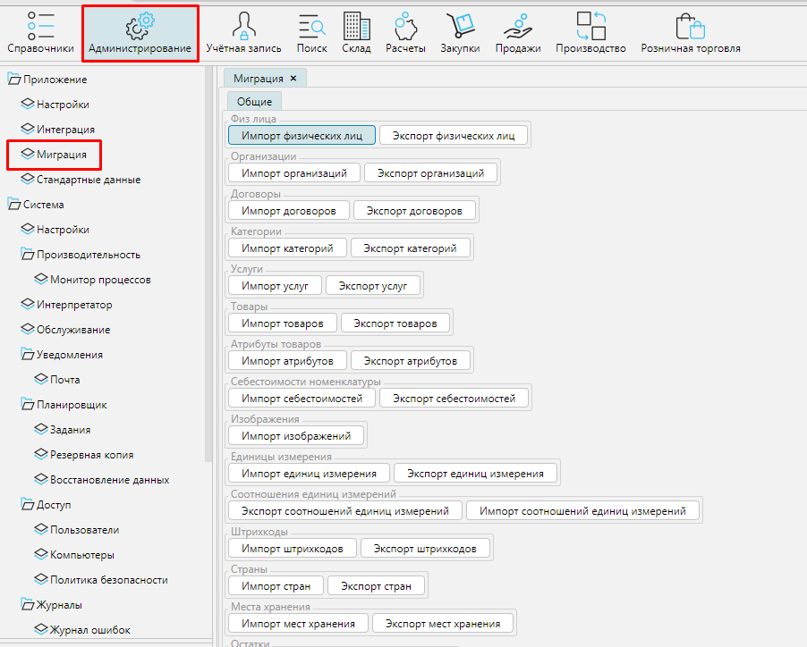
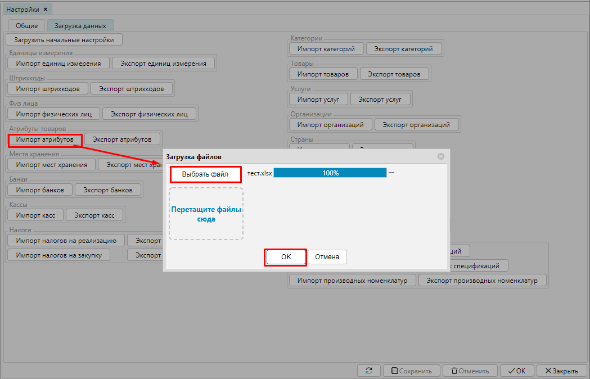

Чтобы начать работать в MyCompany необходимо загрузить в систему основные данные, например товары и услуги, с которыми вы работаете, их характеристики, список партнеров, банков, счетов и т.д. Все данные можно ввести в ручную, создавая объекты как описано далее в инструкциях. Но можно существенно сэкономить время и использовать возможности импорта/экспорта данных.

Чтобы импортировать данные в MyCompany необходимо перейти в **Администрирование**- **Миграция** - **Общие**.

Нажмите кнопку **Импорт** нужного объекта, выберите файл с данными и нажмите **ОК**.

Чтобы данные были корректно импортированы, необходимо использовать файл xlsx заданного формата. Примеры файлов для каждого импортируемого объекта приведены ниже.

Вы можете использовать приведенные файлы для загрузки в свою систему и обучения на реальных данных.

Чтобы перенести свои данные из другой системы, выгрузите их в формате ниже приведенных файлов, и легко загрузите в MyCompany.

-   [Единицы измерения](attachments/1802577.xlsx)
-   [Категории товаров](attachments/1802579.xlsx)
-   [Товары](attachments/1802587.xlsx)
-   [Услуги](attachments/1802588.xlsx)
-   [Штрихкоды](attachments/1802590.xlsx)
-   [Атрибуты](attachments/1802574.xlsx)
-   [Налоги на реализацию](attachments/1802581.xlsx)
-   [Налоги на закупку](attachments/1802581.xlsx)
-   [Места хранения](attachments/1802580.xlsx)
-   [Остатки](attachments/1802584.xlsx)
-   [Организации](attachments/1802583.xlsx)
-   [Физические лица](attachments/1802589.xlsx)
-   [Банки](attachments/1802575.xlsx)
-   [Банковские счета](attachments/1802576.xlsx)
-   [Кассовые счета](attachments/1802578.xlsx)
-   [Статьи ДДС](attachments/1802585.xlsx)
-   [Страны](attachments/1802586.xlsx)
-   [Спецификации](attachments/1802596.xlsx)
-   [Строки спецификаций](attachments/1802597.xlsx)
-   [Производственные номенклатуры спецификаций](attachments/1802595.xlsx)

  

  

