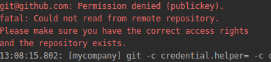

MyCompany - is a free open-source business management system.   We welcome developers who want to contribute to the evolution of the product!

**To add your developments to the [MyCompany](https://mycompany.lsfusion.org/en/) code you need to follow the below steps.**

  

### 1. Create a fork of the MyCompany repository for your GitHub account

Log in to **GitHub**, go to the MyCompany repository **<https://github.com/lsfusion-solutions/mycompany.git>** under your user, and click **Fork**.
 

This automatically creates a linked copy of the MyCompany repository in your account.
  

### 2. Create a new project in Intellij IDEA from the GitHub repository

Choose the MyCompany fork from available on your GitHub account if detected by IntelliJ IDEA

Or

Insert the address of the repository created in your GitHub account into the connection string

  
:::caution
Make sure you connect to your repository
:::
### 3. Select a task to implement on the primary repository

Navigate to the primary repository and select from the ISSUES list the task you want to implement, and then examine its statement.

  

### 4. Create a branch in the IntelliJ IDEA for the selected issue

Select **Branches** from the Git IntelliJ IDEA menu.

  

  
:::caution
If you already have several branches in your repository, you need to create them only from the Local master branch. Otherwise, there will be a lot of files in the changes and the architect who will revise the code will simply reject your changes!
::: 

### 5. Make code changes

Make sure you're in your new branch.

Make your changes to the code.

### 6. Commit

Once you have made the changes, you should commit them.

  

  

It is obligatory to add a commit message.

  

### 7. Replace code from parent repository

In the process of your development, the source code of the project (upstream) could be changed by other participants and your "commit" can be greatly increased due to other people's changes, so before sending the changes, it is necessary to replace the code from the parent repository **Rebase my GitHub Fork**, choose upstream: <https://github.com/lsfusion-solutions/mycompany.git>  and make "push" of your changes.

  

### 8. Request to attach changes to the main project

In order to request the attachment of your changes(Commit) to the main project (Pull Request), you must go to (VCS)**Git** - **GitHub**, select **Create Pull Request**, select the remote repository **upstream**: <https://github.com/lsfusion-solutions/mycompany.git>

  

  

Base fork: lsfusion -solutions: mycompany

Base branch: master

If you set other "pull request" parameters, your request will be denied.

### 9. Check if the request has reached

To make sure that your request has reached, go to  https://github.com/lsfusion-solutions/mycompany/pulls and check if it is there.

After the code revision by the technical manager, it will be added to the main project, or rejected, or requested for revision.

### 10. Problems that may arise

-   There is no upstream repository when you select Rebase or Pull Request

It should be added via Remotes

  

-   There is no access to **upstream**

You need to reassign the **upstream** link to https://github.com:/lsfusion-solutions/mycompany.git

### Learn the lsFusion language and install all necessary developer tools

MyCompany is developed on the [lsFusion](https://lsfusion.org/) platform.

All the necessary documentation on the platform and the lsFusion language can be found [here](https://docs.lsfusion.org/) 

 