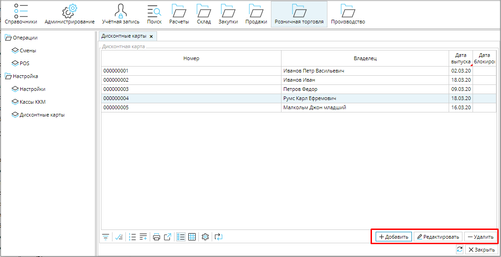
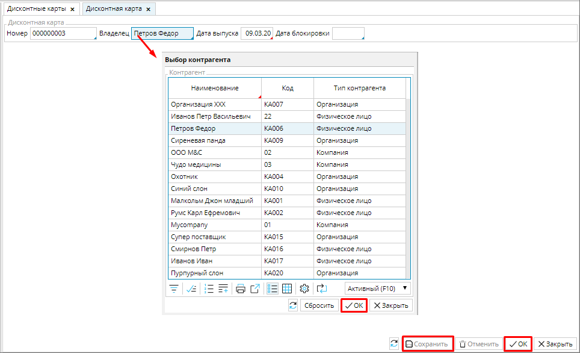

Вы можете использовать программу дисконтных карт, чтобы повысить лояльность своих клиентов.  

Дисконтные карты, которые вы выдаете своим клиентам регистрируются в **Розничная торговля** - **Дисконтные карты**. 

### Рис. 1 Список дисконтных карт

  

Чтобы выдать дисконтную карту клиенту, необходимо нажать кнопку **Добавить**. В открывшейся форме дисконтной карты надо ввести **Номер** выдаваемой карты и выбрать **Владельца** из списка контрагентов. Если в списке контрагентов еще нет этого клиента, его можно добавить в **Справочники** - [**Контрагенты**](Partners_directory.md). 

**Дата выпуска** автоматически устанавливается равной дате создания карты в системе, ее можно изменить.  

**Дата блокировки** - с установленной даты включительно карта перестанет действовать.

Новую дисконтную карту в системе необходимо **Сохранить**. 

### Рис. 2 Добавление дисконтной карты

  

Чтобы скидка по дисконтной карте применялась, ее необходимо настроить в **Продажи** - [**Скидки**](Discount_settings.md) и **[ввести дисконтную карту](POS.md#вводдисконтнойкарты)** при продаже.

  

  

