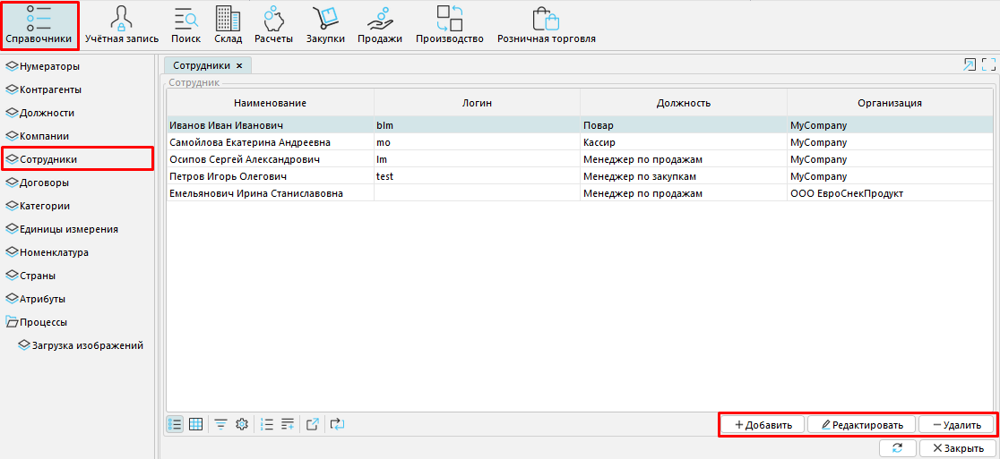
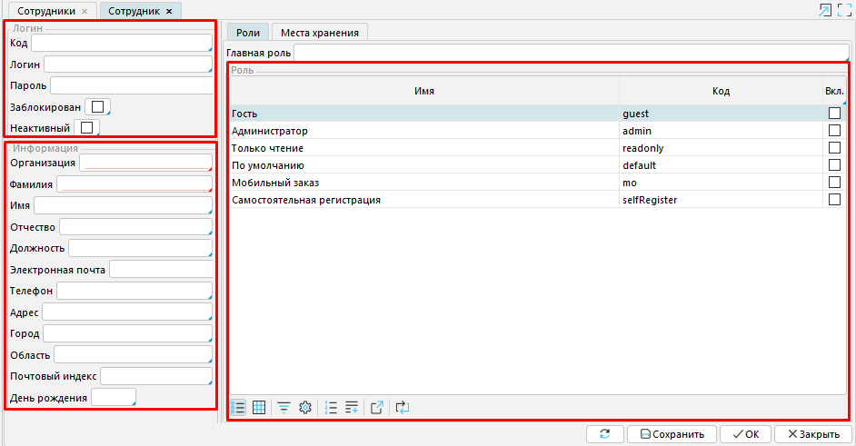
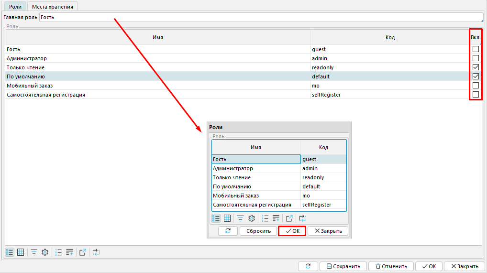
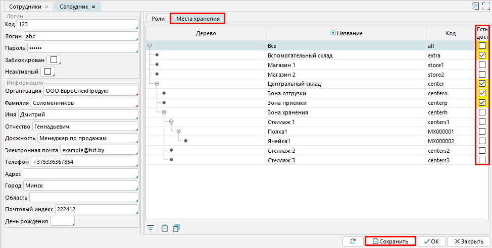

*Сотрудник* в MyCompany - это объект, который содержит информацию о человеке, работающем в конкретной организации. При этом, *Сотрудником* признается отдельный пользователь, наделенный определенной ролью и имеющий особые права. То есть, не всякий пользователь может являться таковым.

Система может хранить информацию о собственных сотрудниках, а также о сотрудниках организаций-партнеров. Список сотрудников формируется в **Справочники - Сотрудники.**

  
  
Рис. 1 Вкладка Сотрудники

  

В правом нижнем углу расположены кнопки, которые позволяют добавлять и удалять сотрудников, а также редактировать информацию о них. Для того, чтобы добавить новый элемент в систему, кликните **Добавить. **Откроется окно формы Сотрудники, состоящее из трех блоков: ***Логин, Информация*** и ** ***Роль***.

###   Рис. 2 Форма Сотрудник

  

Каждый [пользователь](Users.md) имеет заданные для него индивидуально **Логин** и **Пароль**, с помощью которых осуществляется вход в систему. Доступ сотрудника к системе может быть ограничен применением одного из двух статусов: **Заблокирован** и **Неактивный**.

При этом, обязательным условием является принадлежность пользователя к какой-либо **Организации**, а также заполнение поля **Фамилия.**

В блоке **Информация** представлены также поля, предусматривающие указание более подробных сведений о сотруднике, такие как **Имя, Отчество, Должность, Электронная почта, Телефон, Адрес** и пр. Однако обязательному заполнению они не подлежат.

  

  

  

  

  

В зависимости от заданной **Главной роли** сотруднику будут доступны определенные функции, объекты и документы в системе. [Настройка ролей](User_roles.md) и [редактирование прав](Role_permissions.md) пользователей осуществляются в **Администрирование - Политика безопасности**.

При выполнении сотрудником обязанностей нескольких, ему могут быть назначены и дополнительные роли.

###  Рис. 3 Выбор ролей Сотрудника

###   Рис. 4 Места хранения

  

  

Также возможна настройка доступа сотрудника к [местам хранения](Location_settings.md). Для этого необходимо кликнуть на значение и отметить галочками категории, которые будут для него открыты.

В **Склад - Места** **хранения** можно найти список существующих мест хранения и создать новые.

  

Не забудьте сохранить нового сотрудника или внесенные изменения.

  

  

