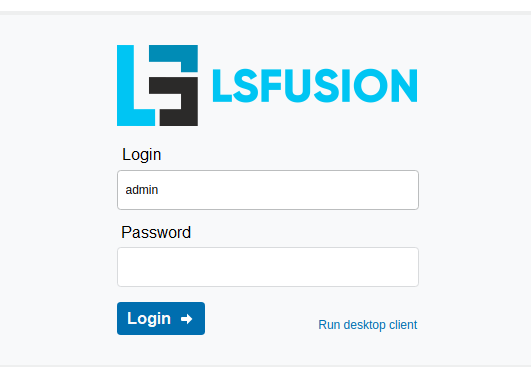

To install the solution, you will need a server running a Linux or Windows operating system that is connected to the Internet. 

It must have a minimum of 2 gigabytes of RAM and open ports 8080 for web client operation and 7652 for desktop client operation.

(The commands listed below are provided to install  in a Centos7 environment with root privileges)

Install Server and Client lsFusion:

#### `root@centos7: localectl set-locale LANG=ru_RU.UTF-8`

#### `root@centos7: source <(curl -s https://download.lsfusion.org/yum/install-lsfusion4)`

Install MyCompany business logic:

#### `root@centos7: yum install -y wgetroot@centos7: wget http://download.lsfusion.org/solutions/mycompany-1.0.jar -O /var/lib/lsfusion/mycompany.jar`

#### `root@centos7: echo "logics.topModule = MyCompanyRu" >> /etc/lsfusion4-server/settings.properties`

Restart lsFusion Server:

#### `root@centos7: systemctl stop lsfusion4-serverroot@centos7: systemctl start lsfusion4-server`

  

## You can use the scripts below:

  

CentOS 8 installation

[install-mycompany-centos8.sh](attachments/1802690/1802691.sh)

Download the installation script:

  

#### `root@centos8: dnf install -y wget`

  

#### root@centos8: wget "[https://mycompany-docs.lsfusion.org/download/attachments/1802288/install-mycompany-centos8.sh](https://mycompany-docs.lsfusion.org/download/attachments/1802288/install-mycompany-centos8.sh?version=14&modificationDate=1610475776689&api=v2)" -P /tmp

Allow to run the downloaded installation script :

#### `root@centos8: chmod +x /tmp/install-mycompany-centos8.sh`

Run script:

#### `root@centos8: /tmp/install-mycompany-centos8.sh`

Ubuntu 18/ Debian 9 installation

[install-mycompany-ubuntu18.sh](attachments/1802690/1802695.sh)

Download the installation script:

#### `root@ubuntu18: wget "https://mycompany-docs.lsfusion.org/download/attachments/1802288/install-mycompany-ubuntu18.sh" -P /tmp`

Allow the downloaded file to run with the command:

#### `root@ubuntu18: chmod +x /tmp/install-mycompany-ubuntu18.sh`

Run the installation script with the command: 

#### `root@ubuntu18: /tmp/install-mycompany-ubuntu18.sh`

Centos 7 installation

[install-mycompany-centos7.sh](attachments/1802690/1802705.sh)

Download the installation script:

#### `root@centos7: yum install -y wget`

#### `root@centos7: wget "https://mycompany-docs.lsfusion.org/download/attachments/1802288/install-mycompany-centos7.sh" -P /tmp`

Allow the downloaded file to run with the command:

#### `root@centos7: chmod +x /tmp/install-mycompany-centos7.sh`

Run the installation script with the command: 

#### `root@centos7:/tmp/install-mycompany-centos7.sh`

  

Windows installation

Download and run the installer [MyCompany-1.0-x64.exe](https://download.lsfusion.org/solutions/MyCompany-1.0-x64.exe) or [MyCompany-1.0.exe](https://download.lsfusion.org/solutions/MyCompany-1.0.exe)

  

  

## Log in to  MyCompany

1.  Open MyCompany web interface in your browser **<u><http://your-server-ip:8080></u>**
2.  In the open window sign in using login admin  without  password.

  

