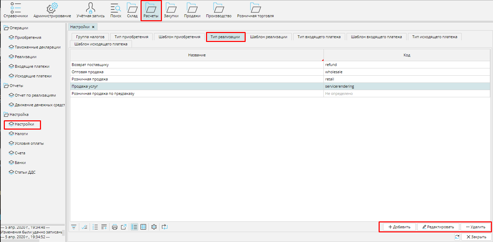
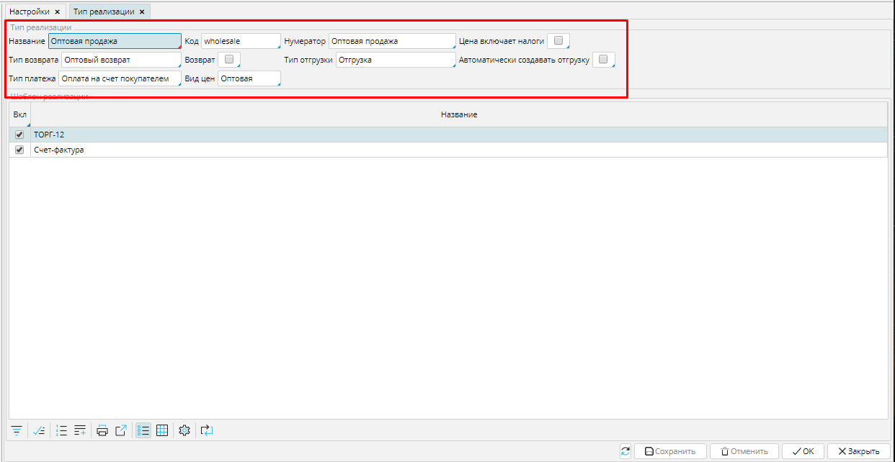

**Реализация** - это документ, который отражает в системе инвойс или накладную, т.е.  первичный документ учета. **Типы реализаций** используются для того, чтобы вы могли легко и быстро ориентироваться в своих документах, и чтобы система  могла автоматически создавать нужные вам типы документов в соответствии с заданными вами настройками. 

Вы можете создать и настроить столько типов реализаций, сколько вам нужно для деятельности. Список всех типов реализаций вы найдете в **Расчеты** - **Настройки ** вкладка **Тип реализаций**. С помощью кнопок **Добавить**, **Редактировать** и **Удалить** вы можете корректировать список. 

#### Рис. 1 Список типов реализаций

  

Чтобы создать **Тип реализации**, нажмите кнопку **Добавить** и  в форме типа реализации установите подходящие настройки.

#### Рис. 2 Настройка типа реализации

  

**Название** -используйте понятное вам и сотрудникам имя для типа реализации. 

Код - введите код типа реализации, который поможет ориентироваться в списках реализаций.

**Нумератор** - укажите нумератор, который будет использоваться для создания уникального номера реализации. О настройке нумераторов читайте [**здесь**](http://documentation.luxsoft.by/pages/viewpage.action?pageId=72942230). 

**Цена включает налоги** - включите этот признак (поставьте галочку), если вы указываете в системе цену товара, которая уже включает в себя налог, тогда итоговая стоимость в документе будет выглядеть так: , если  этот признак выключен (галочка не стоит), то итоговая стоимость заказа будет выглядеть так: . Обратите внимание, что эта настройка не должна противоречить настройке налога в виде цен, используемом для данного типа реализации.

### Тип  возврата - ** выберите из списка **[тип приобретения](Bill_type.md).** Документ **Приобретение **этого типа будет автоматически создан, если вы будете создавать возврат по **Реализации **данного типа (кнопка **Вернуть **в **Реализации). 

**Возврат** - включите этот  признак, если настраиваемый тип реализации является возвратом товара поставщику. 

**Тип отгрузки** - выберите из списка тип отгрузки. Документ **Отгрузка** данного типа будет автоматически создан на основе **Реализации** данного типа (кнопка **Создать отгрузку** в **Реализации**). 

**Автоматически создавать отгрузку** - если вы включите этот признак, то при переводе **Реализации** в статус ***К оплате*** (кнопка **В работу** в **Реализации**), будет автоматически создана **Отгрузка** на количество товара в **Реализации** в статусе ***Отгружен***.

**Тип платежа** - выберите из списка **[тип входящего платежа](Payment_type.md)**. Документ оплаты данного типа будет автоматически создан при приеме оплаты (кнопка **Оплатить** в **Реализации**). 

**Вид цен** - выберите из списка [**вид цен**](Price_type_settings.md), который будет использован в **Реализации** данного типа.

Сохраните созданный тип реализации.

  

  

  
