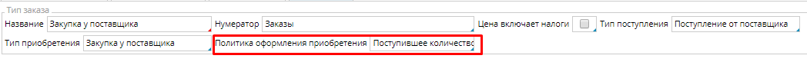
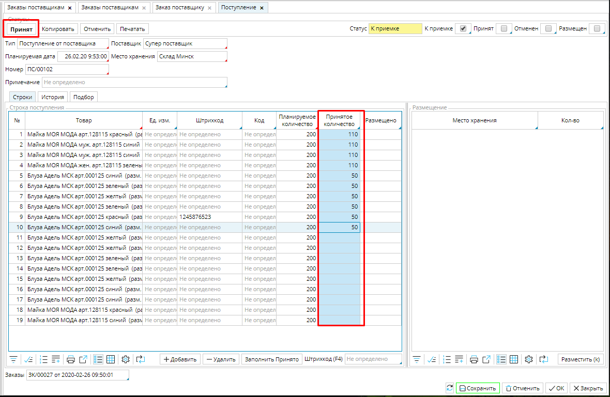
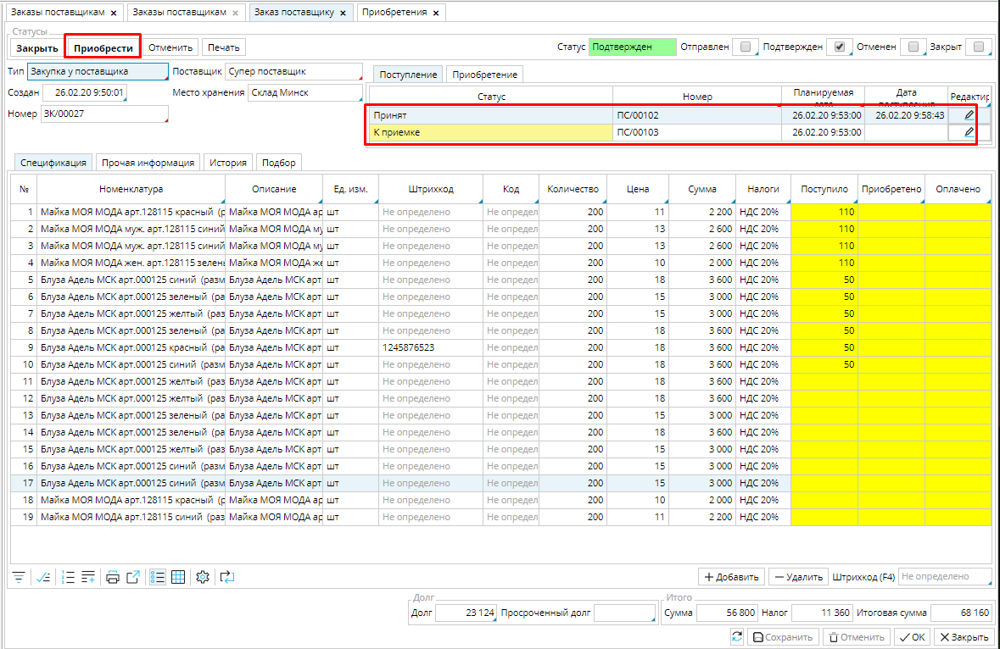
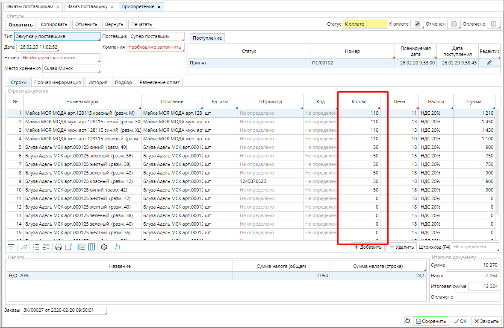

Заказ может отражать длительный договор с поставщиком, по которому вы получаете товар несколькими партиями. В таком случае на каждую поставку создается **Поступление** и **Приобретение**.

Для того, чтобы это было возможно, необходимо в настройках [**Типа заказа**](Purchase_order_type.md) (**Закупки - Типы заказов**) обязательно указать **Политику оформления приобретения** ***Поступившее количество***. 

### Рис. 1 Настройки типа заказа

  

Когда **Заказ** переведен в статус ***Подтвержден***, автоматически создается **Поступление** в статусе ***К приемке ***на заказанное количество товара. 

### Рис. 2 Подтвержденный заказ

  
Когда вы получаете первую поставку, в **Поступлении** в столбце **Принятое количество** указываете поступившее количество товара, нажимаете **Принят**. Товар поступает на указанный склад, в **Заказе** будет создано еще одно  **Поступление** ***К приемке*** на оставшееся количество товара и станет доступна функция **Приобрести** для [оприходования и оплаты товара](Vendor_payments.md). **Приобретение** создается на количество поступившего товара. 

### Рис. 3 Поступление на принятое количество товара

  

### Рис. 4 Заказ после поступления первой партии товара

  

### Рис. 5 Приобретение на поступившее количество

Таким образом,  вы получаете и приходуете товар, создавая документы для каждой поставки, пока не получите все заказанное количество. 

  

  
