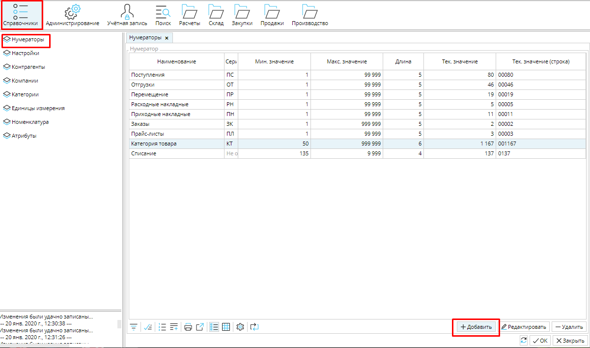
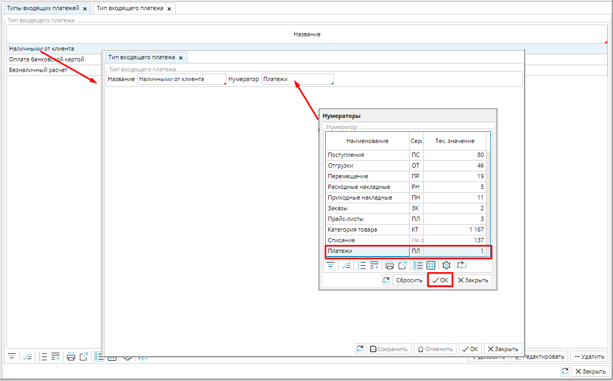

Нумераторы позволяют автоматически создавать уникальные идентификаторы документов, товаров, услуг и т.д.  Вначале необходимо создать перечень нумераторов, а затем назначить определенный нумератор конкретному объекту в системе.

  

Рис.1 Список нумераторов

### Рис. 2 Форма нумератора 

Например, все платежи организации имеют сквозную нумерацию, независимо от вида платежа.   Создадим нумератор для платежей.

  

В **Справочники - Нумераторы** нажмите кнопку  **Добавить ** и заполните поля в открывшейся форме нумератора:

**Наименование** - имя нумератора. В данном случае *"Платежи".*

**Серия** - часть уникального номера объекта. Может состоять максимум из двух символов (могут быть использованы буквы и/или цифры).  Укажем серию *"ПЛ"*.

**Мин.значение** - это первое числовое значение после серии номера, с которого начнется автоматическая нумерация объектов.  Укажем *"1".* 

**Макс.значение** - это значение после серии номера, которым закончится автоматическая нумерация объекта. Предположим, что для нашей организации *"99999"* будет достаточно. 

**Длина** - это количество отображаемых цифр после серии номера. Установим *"5"*

**Тек. значение** - это количество пронумерованных на данный момент объектов.  

**Тек. значение (строка)** -  отображает количество пронумерованных объектов с учетом заданной длины.

Сохраните нумератор.

  

  

  

  

Чтобы нумератор работал, его необходимо связать с объектом.  Чтобы платежи нумеровались автоматически, необходимо  указать нумератор *"Платежи"* для всех платежей. Для этого открываем модуль **Расчеты** вкладку **Типы входящих или исходящих платежей**, открываем каждый тип платежа и  устанавливаем нумератор "*Платежи"*. По клику в поле откроется список нумераторов, выбираем нужный, нажимаем **ОК**. Сохраните настройки расчетов. 

  

  

### Рис. 3 Назначение нумератора объекту

Примите во внимание, что для того, чтобы документ в системе создавался автоматически, для него, в большинстве случаев, необходимо настроить нумератор.

  

 

  
