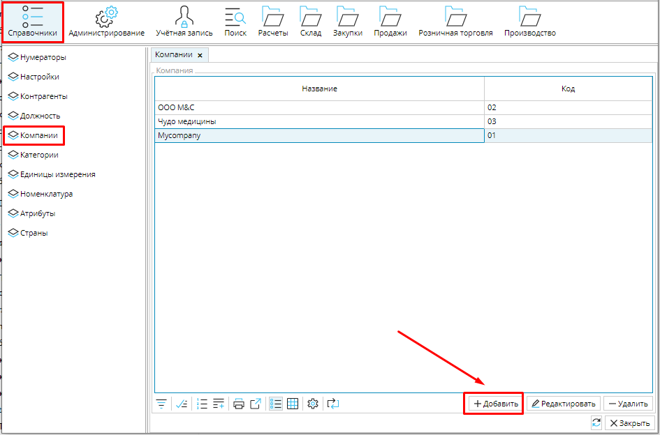
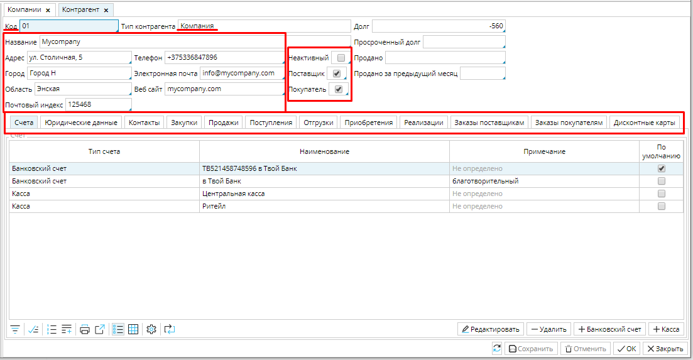
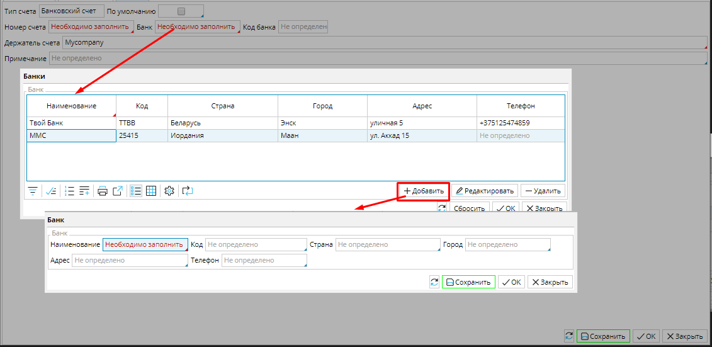

В  MyCompany "Контрагент" - это любое физическое или юридическое лицо, с которым взаимодействует ваша компания, включая саму вашу компанию или компании. MyCompany предоставляет возможность управлять всеми организациями пользователя в одной системе, при этом вести общую базу партнеров (клиентов, поставщиков, покупателей, подрядчиков и т.д.), отслеживать и анализировать взаимодействия с ними.  Это позволяет не только эффективно распределять ресурсы в каждой из компаний, но и иметь полное представление об общем состоянии дел, независимо от того, функционируют компании в одной сфере или независимо друг от друга. 

Система работает с тремя видами контрагентов:

Компания -это ваше предприятие, независимо от формы собственности и организации. 

Организация - это юридическое лицо ваш партнер.

Физическое лицо - это ваш партнер-физическое лицо или контактное лицо вашей компании или организации партнера.

Компании настраиваются в **Справочники - Компании**. Нажмите кнопку **Добавить** и откроется форма контрагента с установленным типом *Компания*.

  

### Рис. 1 Добавление компании 

Рис. 2 Заполнение информации о компании

При необходимости установите код для компании вручную или с помощью [нумератора](Numerators.md). Заполните название и контактные данные компании.

В правой части шапки формы укажите, является ли компания поставщиком или покупателем,  или выполняет обе функции. Здесь же можно сделать компанию неактивной, если она временно прекратила работать.

В зависимости от выбранных функций в форме дополнительно отображаются вкладки **Закупки **и **Продажи**.

  

Вкладка **Счета** -  служит для отображения и настройки счетов контрагентов.

Добавление банковского счета: нажмите кнопку +Банковский счет. Появиться окно счета.  Укажите банк. Для этого кликните в поле Банк и выберите его из появившегося списка . Если списка банков еще нет, в открывшемся окне нажмите кнопку Добавить, в форме банка введите название, выберите страну, укажите код и контактные данные и нажмите ОК. Банк появится в списке (банки можно настроить в Расчеты - Банки). Выбирайте  и нажимайте ОК.   Далее введите Номер счета, при  необходимости внесите Примечание.  Если этот счет является основным счетом компании и используется чаще остальных, то вы можете назначить его счетом по умолчанию, поставив галочку в поле По умолчанию. Тогда он автоматически будет указываться в документах. 

Добавление счета кассовых операций: нажмите кнопку +Касса. В окне счета заполните Номер счета, при необходимости добавьте Примечание и установите счет По умолчанию. 

### Рис. 3 Добавление счетов компании

Рис. 4 Добавление и установка банка в банковском счете

Рис. 5 Форма счета кассовых операций

  

На вкладке **Юридические данные** введите номер ***ИНН*** и ***ОКПО***, они автоматически будут применяться в документах. 

### Рис. 6 Юридическая информация

  

### Рис. 7 Добавление контактного лица

  

Вкладка **Контакты **- служит для отображения контактных лиц контрагентов. 

<u>**Добавление контакта:**</u> нажмите кнопку **Добавить**. В таблице контактов появиться пустая строка. Заполните контактные данные в этой строке. Чтобы указать **Должность**, кликните в поле и выберите должность из списка и нажмите **ОК**. Список должностей формируется в **Справочники** - **Должность**. **Сохраните** контакт. 

Учитывая, что один человек может выступать одновременно как контактное лицо предприятия и как самостоятельный контрагент, все контакты  отображаются в списке контрагентов.

  

  

Вкладка  **Закупки **-  в этой вкладке будут отображаться все прайс-листы данного поставщика, и можно установить условия оплаты по умолчанию.

<u>**Установка условия оплаты:**</u>  кликните в поле **Условия оплаты** и выберите подходящее условие из списка в открывшемся окне. Если в вашей системе еще не заданы  условия оплаты, создайте их из этого окна. Нажмите кнопку **Добавить** и введите название условия и количество дней, в течение которых после поставки оно должно быть выполнено.  Сохраните созданное(ые) условия и выбор для контрагента. Установленные условия оплаты будут по умолчанию применяться для документов данного контрагента,

  

  

### Рис. 8 Установка Условия оплаты для Поставщика

  

###  Рис. 9 Установка Вида цен для Покупателя 

  

  

Вкладка **Продажи **- служит для настройки условия оплаты и типа цен по умолчанию для данного контрагента-покупателя.

<u>**Установка условия оплаты:**</u>  условия оплаты устанавливаются аналогично с вкладкой **Закупки**. 

<u>**Установка вида цен:**</u>  кликните в поле **Вид цен** и в открывшемся окне выберите подходящее значение. Если в вашей системе еще не настроены виды цен, это можно сделать в модуле **Продажи**, вкладка **Виды цен**.  Установленный вид цен будет по умолчанию применяться на товары и услуги в документах для данного  контрагента-покупателя,

  

  

Если у вас действует программа лояльности, на вкладке **Дисконтные карты** вы можете добавить карту своему партнеру. Для этого необходимо нажать кнопку **+Карта** и в открывшейся форме дисконтной карты указать ее ***Номер***. Поля ***Владелец*** и ***Дата выпуска*** будут заполнены автоматически. Нажмите **Сохранить**, чтобы сохранить данные дисконтной карты,  или **ОК**, чтобы сохранить карту и вернуться в карточку контрагента.

### Рис. 10 Добавление дисконтной карты

  

  

Остальные вкладки и поля в карточке контрагента носят информативный характер, что позволяет вам видеть максимальное количество удобно структурированных важных данных о своих партнерах в одном месте.

  

Все ваши партнеры и компании отображаются на вкладке **Контрагенты** в **Справочниках**.  Чтобы добавить партнера, нажмите **+Организация** или **+Физическое лицо**, в зависимости от того, кем является ваш партнер. Откроется соответствующая форма контрагента. Заполнение формы Организации и Физического лица происходит аналогично форме **[Компании](https://mycompany-docs.lsfusion.org/pages/viewpage.action?pageId=1147000#id-Настройкасправочникаконтрагентов-Company)**.

### Рис. 11 База партнеров 

### Рис. 12 Форма Организации

### Рис. 13 Форма Физического лица

  

  

