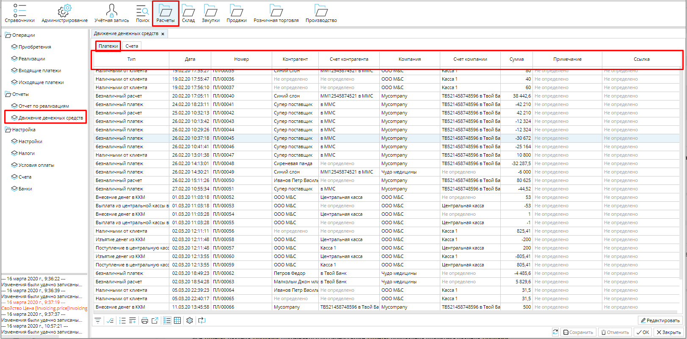
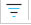
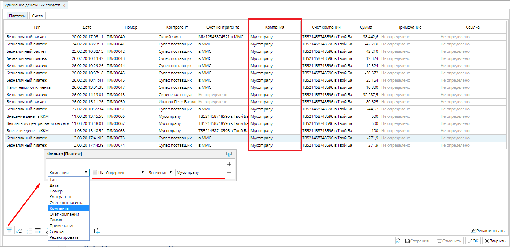
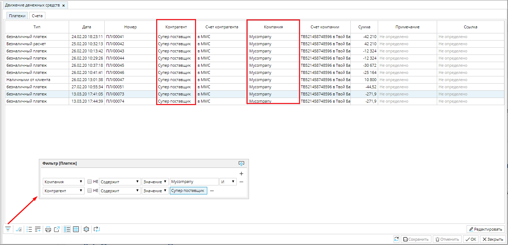
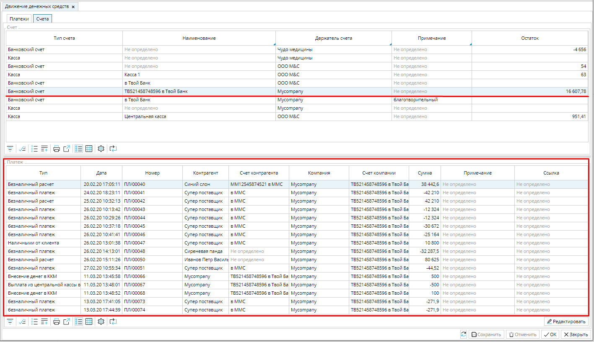

Отчет **Движение денежных средств** позволяет проследить денежные потоки в разрезе ***платежей*** или ***счетов***. 

## **Платежи**

### Рис. 1 Движение денежных средств в разрезе платежей

  

В **Расчеты- Движение денежных средств** вкладка **Платежи** отображаются все совершенные и принятые платежи ваших компаний. По каждому платежу предоставлена информация о типе, дате и номере, компании и контрагенте, между которыми был совершен платеж, о счетах и сумме платежа. 

При необходимости проанализировать определенные данные,  можно воспользоваться фильтром. Например, если у вас несколько компаний, а вы хотите видеть движение средств лишь одной из них, воспользуйтесь кнопкой **Отбор** и установите фильтр по колонке ***Компания***.  Для этого нажмите на кнопку   и в окне фильтра выберите колонку и укажите ее значение.

### Рис. 2 Движение денежных средств выбранной компании

  

Если вас интересуют расчеты с определенным партнером, добавьте фильтр по Контрагенту.   

### Рис. 3 Движение денежных средств между выбранными компанией и контрагентом

  

Таким образом вы можете выбирать данные в соответствии с интересующими вас значениями  любой колонки или нескольких колонок  формы.

  

## **Счета** {#Движениесредствсчета}

В **Расчеты- Движение денежных средств** вкладка **Счета **отображены остатки средств на текущий момент по каждому счету всех компаний в системе.  В блоке ***Платежи*** представлена детализация платежей, формирующих остаток по выбранному счету.   

### Рис. 4 движение денежных средств в разрезе счетов

  

  

