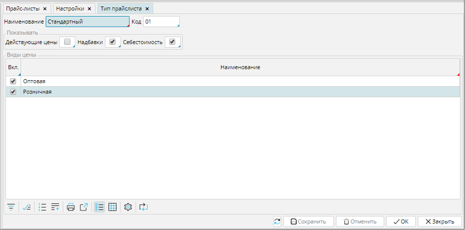

Типы прайс-листов можно настроить в **Продажи** - **Настройки** - **Тип прайс листа**. Чтобы управлять списком типов прайс-листов используют кнопки в правом нижнем углу. 

### Рис. 1 Список типов прайс-листов

  

Чтобы создать новый тип, надо нажать кнопку **Добавить** и в открывшейся форме указать его свойства.

Введите **Название** и **Код** типа прайса, чтобы его было легко идентифицировать.

В блоке ***Показывать*** отметьте галочкой данные, которые будут отображаться в прайсе: **Действующие цены**, **Надбавки**, **Себестоимость**. Вы можете выбрать для отображения любую комбинацию данных.

В блоке ***[Виды цен](Price_type_settings.md)*** отметьте, какие цены будут отображены в прайсе. 

**Сохраните** настройки

### Рис. 2 Тип прайс-листа

  

  

  

