On the form **Projects - 
Configuration - Settings** the parameters that affect working with projects are configured. The form
consists of a number of tabs, each for a set of related parameters (pic. 1).

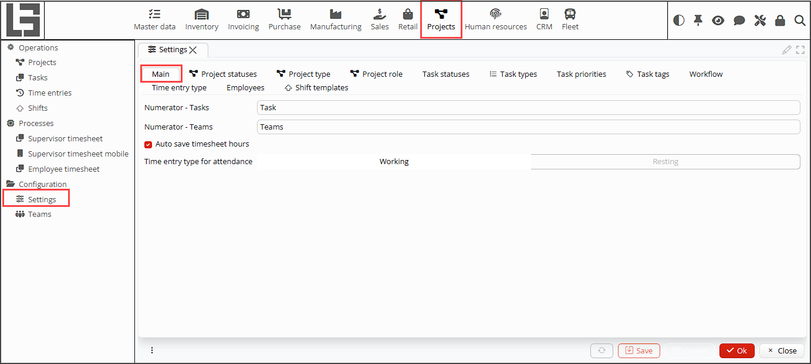
*Pic. 1 Project Settings form*

## Main tab
Here you can set numerators to generate IDs for tasks and teams in the fields **Numerator -
Tasks**,
**Numerator - Teams** respectively (pic. 1).

**Auto save timesheet hours** - The [**Human Resources**](HR.md) module provides the possibility of automatic 
registration of the start and the end of the employee's working hours (attendance). If this property is checked, the 
recorded time will be
automatically added to the employee's timesheet. 

**Time entry type for attendance** - the auto saved employee attendance hours must be added to a timesheet as a certain 
type of 
a time entry, e.g. working or resting hours. This type of time entry must be specified here.

## Project statuses tab
Here you can create project statuses that reflect the life cycle of a project (pic. 2).  
Use the **+Add** button to create as many statuses as you need. In the new form, that opens, fill the fields (pic. 3):
- **Name** - status name
- **ID** - status unique ID
- **Closed** - tick the property to indicate, that the project with this status is inactive, e.g. complete or 
  canceled. Projects with **Closed** statuses are not shown on the lists of projects.

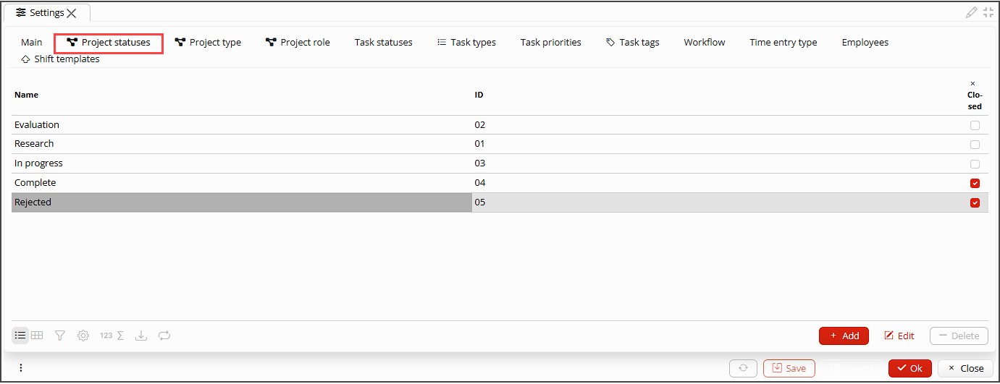
*Pic. 2 Project statuses tab*

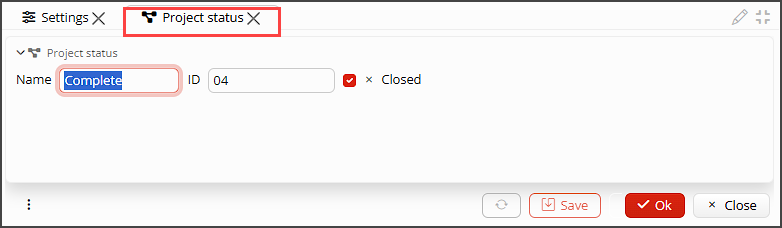
*Pic. 3 Project status settings*

## Project type tab
You may set up as many project types as you need (pic. 4). Project types differ by the details of purchasing, 
manufacturing or service rendering within a project, life-cycle and other details. The following parameters can be 
set up for each project type (pic. 5):
- **Name** - project type name.
- **ID** - project type ID.
- **Numerator** - project type numerator makes it possible to generate different types of IDs for projects of 
  each type.
- **Purchase order type**, **Bill type**, **Receipt type**, **Sale order type**, **ТInvoice type**,
  **Shipment type**, **Manufacturing order type** - in these fields you can set the type for each kind of document, 
  that can be linked to or created from a project. When a document is created from a projects it automatically gets 
  the setup type. 

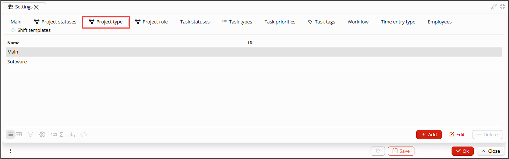
*Pic. 4 Project type tab*

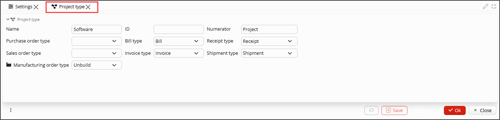
*pic. 5 Project type settings*

## Project role tab
You may set up as many project roles as you need for your employees or other uses in the project
(pic. 6).
To add a role you should specify only the **Name** and **ID** (pic. 7).

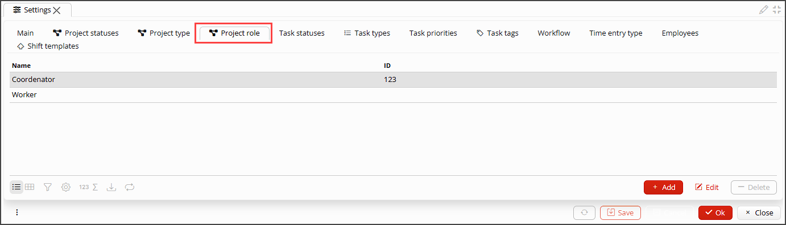
*Pic. 6 Project role tab*

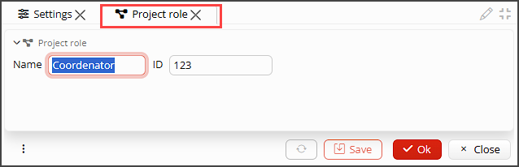
*Pic. 7 Project role settings*

## Task statuses tab 
Here you can set up task statuses that reflect a task life cycle. Pay attention, that each task type can have its 
own life cycle, but all the statuses that are used through out all the task types must be set up here (pic. 8).
Please, specify the following for a task type (pic.9):
- **Name** - status name.
- **ID** - status unique ID.
- **Sorting order** - the order statuses are shown on the list.
- **Closed** - tick the property to indicate, that the task with this status is inactive, e.g. complete or
  canceled. Tasks with **Closed** statuses are not shown on the lists of tasks.

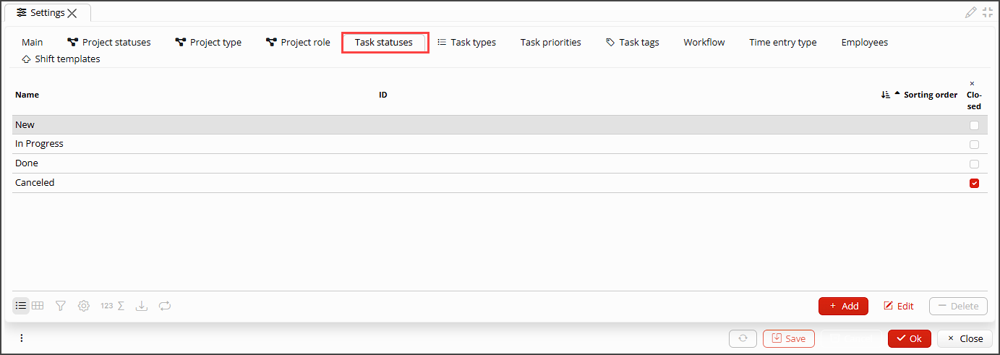
*Pic. 8 Task statuses tab*

*Pic. 9 Task statuses settings*

## Task types tab
The tasks may be classified by types. Set up as many task types as you need here (pic.10). Foк each task type specify  
 **Name**, unique **ID** and tick [**Statuses**](#task-statuses-tab-), that reflect its life cycle. If you do not 
tick any status? all statuses will be available for the task type.

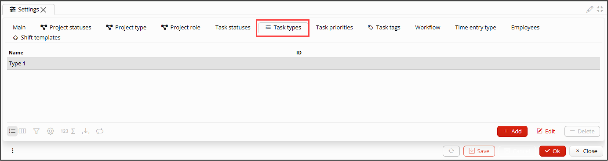
*Pic. 10 Task types tab*

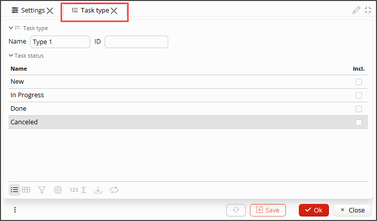
*Pic. 11 Task types settings*

## Task priorities tab
To range tasks by priority set up the priorities you need here (pic. 12).
Please, Please, specify the following for a priority  (pic. 13):
- **Name** - priority name.
- **ID** - priority ID.
- **Color** - you may choose a color from the list of available and the tasks of the current priority will be 
  colored in. 

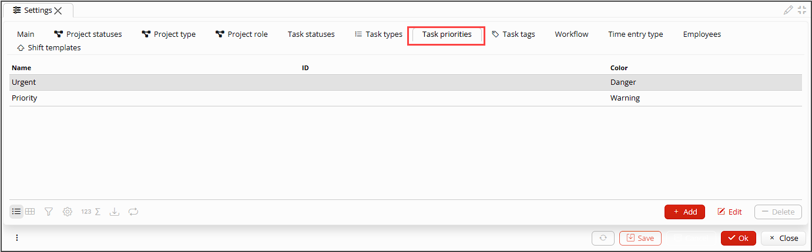
*Pic. 12 Task priorities tab*

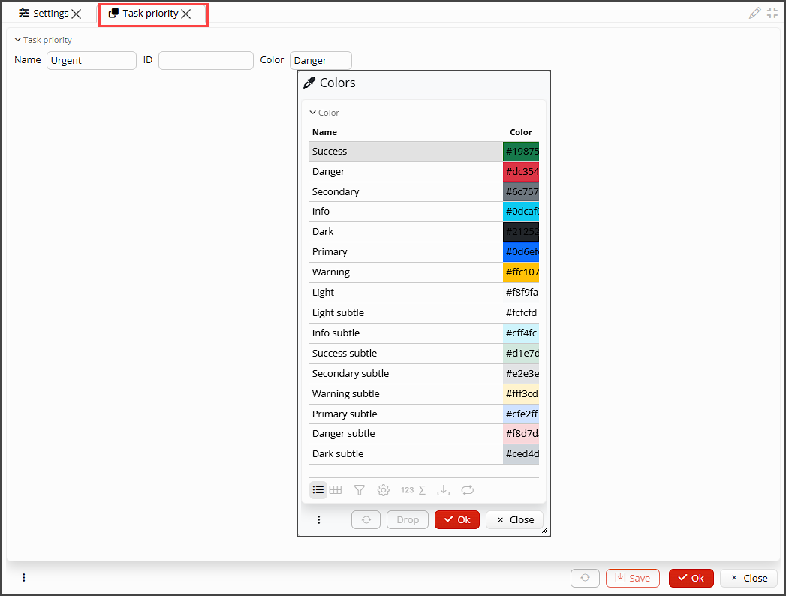
*Pic. 13 Task priorities settings*

## Task tags tab
If you are not fully satisfied with the types and priorities you can also set up tags for tasks (pic. 14).
To set up a tag you only need to specify the **Name**, **ID** and **Color** (pic. 15).

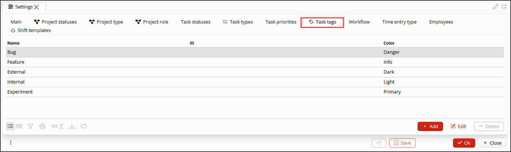
*Pic. 14 Task tags tab*

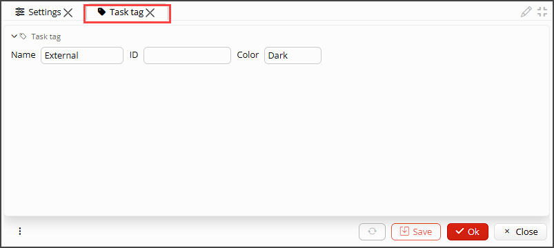
*Pic. 15 Task tags settings*

## Вкладка Последовательность действий
На вкладке настраивается, через какие статусы проходит задача в процессе выполнения, в зависимости от типа задачи и
роли сотрудника, который ее создает или назначает.

В первую очередь нужно выбрать **Роль на проекте** и **Тип задачи**, для которых настраивается последовательность.

Далее, в таблице статусов задач нужно отметить для каждого статуса, на какой статус он может быть изменен. Эта
настройка будет действовать для выбранного типа задач для всех пользователей с заданной ролью на проекте.

Если для автора и исполнителя задачи последовательность изменения статусов должна различаться, то последовательность
для автора настраивается в блоке **Автор**, а последовательность для исполнителя настраивается в блоке **Назначена на**.

Если ни в одном блоке не отмечены настройки, значит и автор и исполнитель с заданной ролью могут переводить задачи с
выбранным типом в любой статус в любой последовательности.

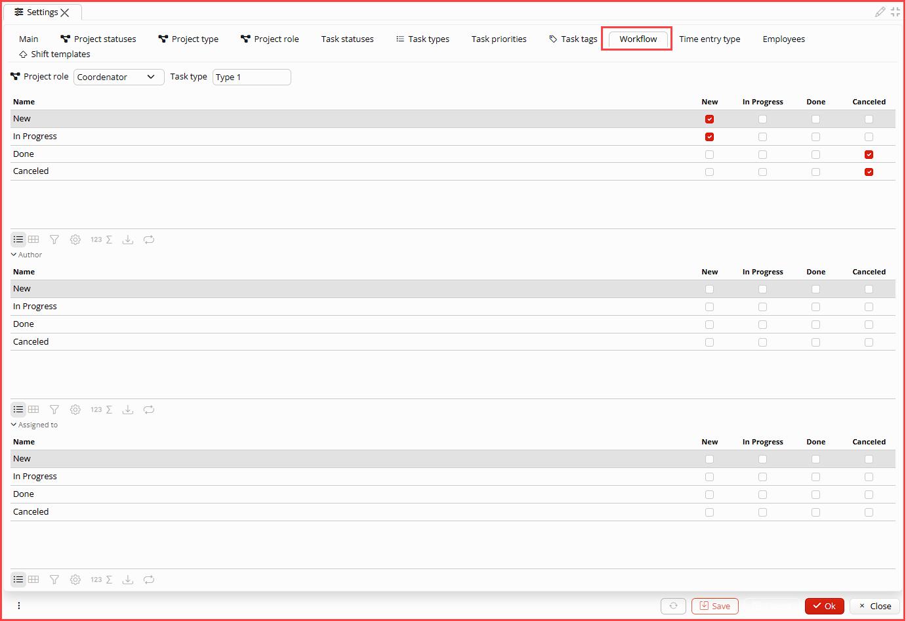
*Pic. 16 Настройка последовательности работы с задачами*

## Вкладка Тип отметки времени
В программе есть возможность отмечать (фиксировать) время сотрудника, затраченное на работу, отдых или иной значимый
вид
деятельности. Чтобы вести учет, сколько часов каким видом деятельности занимался сотрудник, нужно определить и
настроить типы отметки времени (pic. 17).

Для типа отметки времени нужно указать(pic. 18):
- **Имя** - название приоритета.
- **Код** - уникальный идентификатор.
- **По умолчанию** - такая отметка времени будет заполнятся автоматически на основании данных по регистрации  
  рабочего времени.

[//]: # (todo: добавить ссылку на описание регистрации рабочего времени)

- **Цвет** - вы можете выбрать цвет из доступной палитры, которым будут выделены отметки времени данного типа.
- **Символ** - укажите символ, которым сокращенно будет обозначаться тип отметки времени.
- **Обязательный проект** - если отмечено флажком, то для сохранения отметки времени обязательно должен быть указан
  проект, к которому относится вносимая отметка времени
- **Часы отметки времени** - здесь можно сформировать список наиболее часто используемых отметок времени текущего
  типа, чтобы вносить их в табель одним кликом. Для создания стандартных часов отметки времени:
    - нажмите кнопку **+Добавить**, появится пустая строка
    - заполните **Имя** стандартных часов отметки времени
    - укажите количество отработанных **Часов**
    - при желании выберите **Цвет**, которым они будут отображаться в табеле.

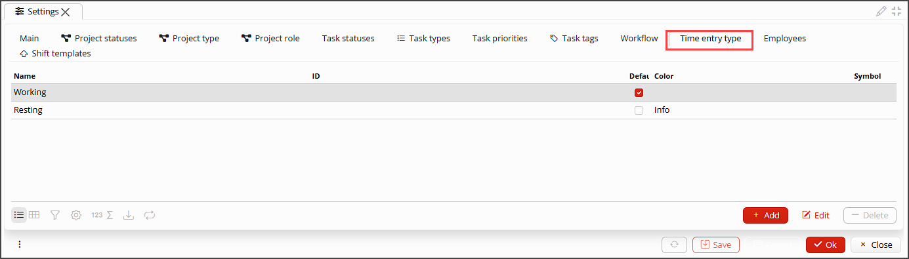
*Pic. 17 Вкладка Типы отметки времени*

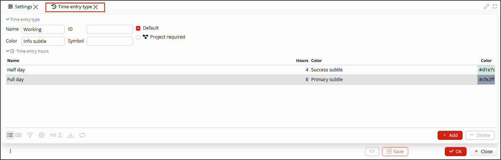
*Pic. 15 Настройка типов отметки времени*

## Вкладка Сотрудники
На этой вкладке (pic. 19) отображается список всех сотрудников. Для каждого сотрудника можно указать **Услугу**,
которую они  
оказывают заказчикам. В этом случае, время, которое сотрудник отработал на проекте, будет выставлено заказчику в
реализации как стоимость оказанных услуг.

[//]: # (todo - вставить ссылку на создание реализации в проекте)

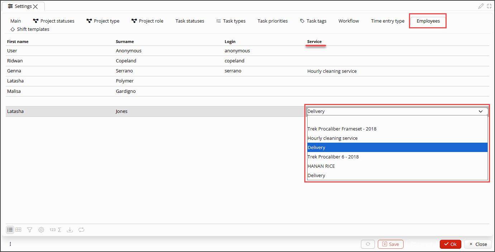
*Pic. 19 Настройка оказания услуг сотрудниками*

## Вкладка Шаблон смен
На вкладке можно задать стандартные смены, с помощью которых при планировании рабочего времени назначение смен
сотрудникам производится в один клик.

Чтобы создать стандартную смену, нажмите кнопку **+Добавить** и в появившейся строке внесите время начала и окончания смены.

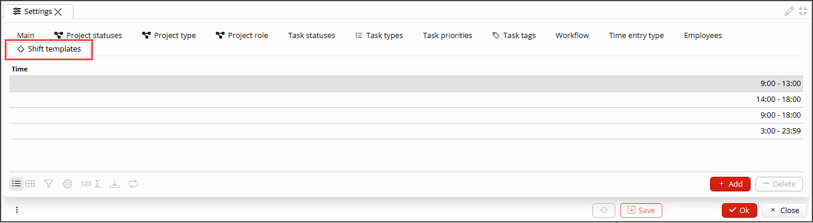
*Pic. 20 Настройка шаблонов смен*
