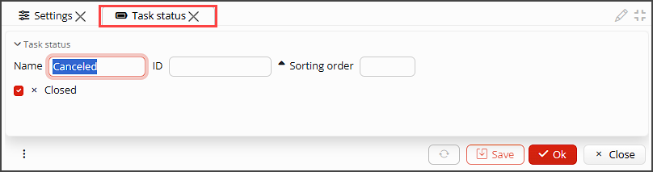

On the form **Projects - 
Configuration - Settings** the parameters that affect working with projects are configured. The form
consists of a number of tabs, each for a set of related parameters (pic. 1).

*Pic. 1 Project Settings form*

## Main tab
Here you can set numerators to generate IDs for tasks and teams in the fields **Numerator -
Tasks**,
**Numerator - Teams** respectively (pic. 1).

**Auto save timesheet hours** - The [**Human Resources**](HR.md) module provides the possibility of automatic 
registration of the start and the end of the employee's working hours (attendance). If this property is checked, the 
recorded time will be
automatically added to the employee's timesheet. 

**Time entry type for attendance** - the auto saved employee attendance hours must be added to a timesheet as a certain 
type of 
a time entry, e.g. working or resting hours. This type of time entry must be specified here.

## Project statuses tab
Here you can create project statuses that reflect the life cycle of a project (pic. 2).  
Use the **+Add** button to create as many statuses as you need. In the new form, that opens, fill the fields (pic. 3):
- **Name** - status name
- **ID** - status unique ID
- **Closed** - tick the property to indicate, that the project with this status is inactive, e.g. complete or 
  canceled. Projects with **Closed** statuses are not shown on the lists of projects.

*Pic. 2 Project statuses tab*

*Pic. 3 Project status settings*

## Project type tab
You may set up as many project types as you need (pic. 4). Project types differ by the details of purchasing, 
manufacturing or service rendering within a project, life-cycle and other details. The following parameters can be 
set up for each project type (pic. 5):
- **Name** - project type name.
- **ID** - project type ID.
- **Numerator** - project type numerator makes it possible to generate different types of IDs for projects of 
  each type.
- **Purchase order type**, **Bill type**, **Receipt type**, **Sale order type**, **ТInvoice type**,
  **Shipment type**, **Manufacturing order type** - in these fields you can set the type for each kind of document, 
  that can be linked to or created from a project. When a document is created from a projects it automatically gets 
  the setup type. 

*Pic. 4 Project type tab*

*pic. 5 Project type settings*

## Project role tab
You may set up as many project roles as you need for your employees or other uses in the project
(pic. 6).
To add a role you should specify only the **Name** and **ID** (pic. 7).

*Pic. 6 Project role tab*

*Pic. 7 Project role settings*

## Task statuses tab 
Here you can set up task statuses that reflect a task life cycle. Pay attention, that each task type can have its 
own life cycle, but all the statuses that are used through out all the task types must be set up here (pic. 8).
Please, specify the following for a task type (pic.9):
- **Name** - status name.
- **ID** - status unique ID.
- **Sorting order** - the order statuses are shown on the list.
- **Closed** - tick the property to indicate, that the task with this status is inactive, e.g. complete or
  canceled. Tasks with **Closed** statuses are not shown on the lists of tasks.

*Pic. 8 Task statuses tab*

*Pic. 9 Task statuses settings*

## Task types tab
The tasks may be classified by types. Set up as many task types as you need here (pic.10). Foк each task type specify  
 **Name**, unique **ID** and tick [**Statuses**](#task-statuses-tab-), that reflect its life cycle. If you do not 
tick any status? all statuses will be available for the task type.

*Pic. 10 Task types tab*

*Pic. 11 Task types settings*

## Task priorities tab
To range tasks by priority set up the priorities you need here (pic. 12).
Please, Please, specify the following for a priority  (pic. 13):
- **Name** - priority name.
- **ID** - priority ID.
- **Color** - you may choose a color from the list of available to highlight the tasks of the current priority. 

*Pic. 12 Task priorities tab*

*Pic. 13 Task priorities settings*

## Task tags tab
If you are not fully satisfied with the types and priorities you can also set up tags for tasks (pic. 14).
To set up a tag you only need to specify the **Name**, **ID** and **Color** (pic. 15).

*Pic. 14 Task tags tab*

*Pic. 15 Task tags settings*

## Workflow tab
On the tab you can configure what statuses a task goes through depending on the task type and the role of the 
employee that creates or fulfills the task. 

First, select the **Project role** and **Task type** you configure the workflow for.  

Next, for each status in the first table tick the status it can be changed for. These settings will work for the 
selected task type and project role. 

If you want a different workflow for the task author and the task executor, configure settings in the table **Author** 
and **Assigned to** respectively. 

If none of the tables has any selected options, the author and the assignee will be able to change task statuses as 
they wish.  

*Pic. 16 Workflow settings*

## Time entry type tab
The application makes it possible to register the time (hours) an employee spends resting, working, or making anything 
else. To keep a record of employees' occupation you need to decide on and configure time entry types.
(pic. 17).

Please, specify the following for a time entry type(pic. 18):
- **Name** - name of the entry type (occupation).
- **ID** - unique ID.
- **Default** - this time entry type will be used for the entries made automatically on the bases of the 
  registered attendance. 

[//]: # (todo: добавить ссылку на описание регистрации рабочего времени)

- **Color** - you may choose a color from the list of available to highlight the time entry type.
- **Symbol** - Specify the character to abbreviate the time entry type.
- **Project required** - if ticked, project must be specified to save a time entry. 
- **Time entry hours** - here you can list the most frequently used hours (duration) of the current
  type to add them to the timesheet with one click:
    - click the button **+Add**, an empty line will appear,
    - fill in the **Name** of commonly used hours,
    - set the quantity of **Hours**,
    - select the **Color** to highlight the time entry on the timesheet if applicable.

*Pic. 17 Time entry type tab*

*Pic. 15 Time entry type settings*

## Employees tab
The list of all employees is displayed here (pic. 19). For each of them you can set a **Service** they provide to a 
customer. If the service is set, the time the employee was working on the project, will be charged as the amount of 
rendered services in the invoice to the customer. 

[//]: # (todo - вставить ссылку на создание реализации в проекте)

*Pic. 19 Service rendering settings*

## Shift templates tab
Here you can define standard shifts that can be assigned to employees in one click when drafting working schedule.  

To create a shift template click +Add and set the start and end time. 

*Pic. 20 Shift templates tab*
