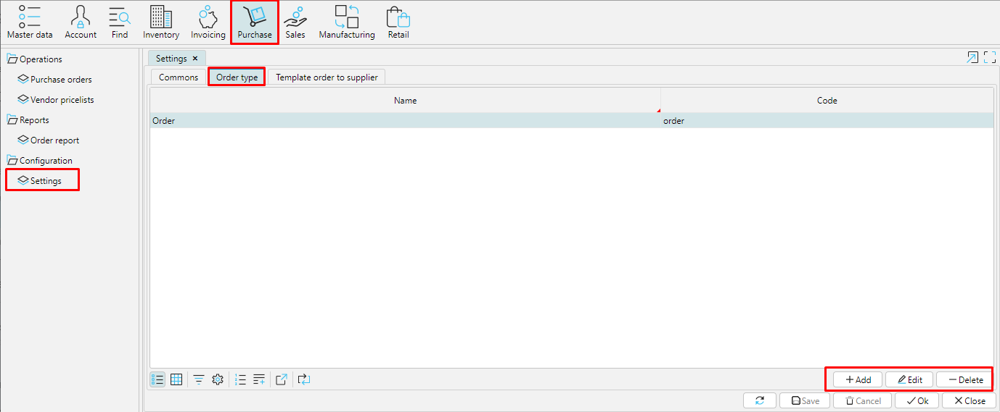
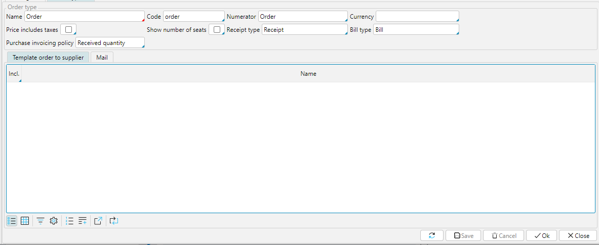
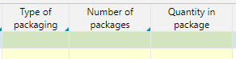

In **Purchasе** - **Settings**, on the **Order types** tab, you can set up all purchase order types that you use. For example,  let us call a regular purchase from a vendor  ***Order.***

  
Pic.1 List of purchase order types

  

To create an order type, click **Add** and set the appropriate settings.

  
Pic.2  Order type settings

  

**Name** - for the order type use the name you and your employees understand.

**Code** - unique identifier of the order type.

**Numerator** - specify the numerator to be used to create a unique order number. Read about configuring  numerators  [**here**](http://documentation.luxsoft.by/pages/viewpage.action?pageId=72942230). 

**Currency** - you may specify the currency to be uased by defoult in this type of orders

Price includes taxes - tick this property, if you specify in the system the price of an item that already includes tax, then the total order value will look like this: , otherwise the total order value will look like this: .

**Show number of places -** if enabled, the following columns will be available in the order 

**Receipt type **- select a receipt type from the list. The document Receipt of this type will be created automatically when the order is Confirmed. If you leave this field blank, a receipt will not be created automatically. Read more about receipt types [**here**](Receipt_type.md). 

**Bill type **- Choose the appropriate type from the list.  **[Bill ](Vendor_payments.md)**of this type will be created for this type of order.  Read more about bill types  [**here**](Bill_type.md). 

**Bill control  **- if you set  ***Received quantity***, the  **Bill** will be created for the quantity specified in the **Receipt**.  If you set ***Ordered quantity***, the  **Bill** will be created for the quantity specified in the Order, irrespective of the quantyty you have recieved.  

Save the configured purchase order type.

  

  
