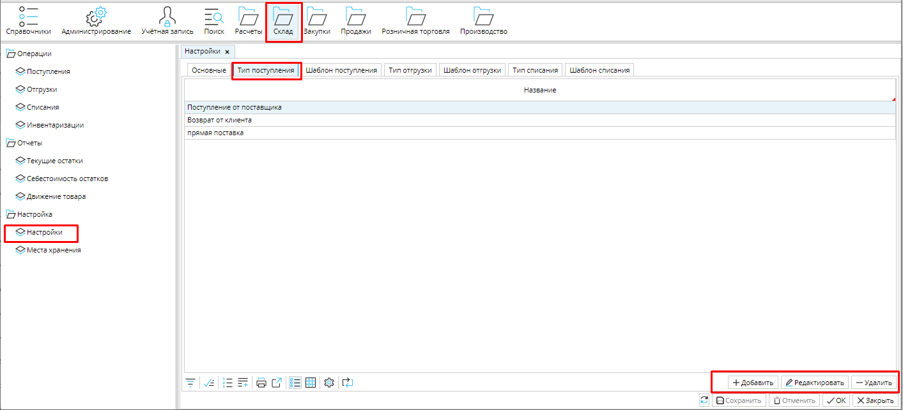
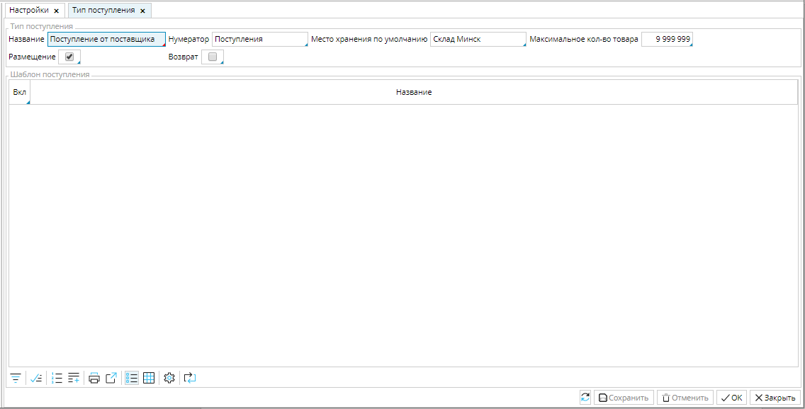

Типы поступления позволяют быстро отслеживать перемещение товаров и автоматизировать создание соответствующих документов. Список настроенных типов поступления находится в **Склад - Настройки** вкладка **Типы поступления**. Вам необходимо создать и настроить типы поступления, которые используются в вашей деятельности.

### Рис. 1 Список типов поступлений

  

Чтобы создать тип отгрузки нажмите кнопку Добавить и выберите подходящие настройки.

### Рис. 2 Настройка типа поступления

  

**Название** -  используйте понятное вам и сотрудникам имя для типа отгрузки.

Нумератор - укажите нумератор, который будет использоваться для создания уникального номера отгрузки. О настройке нумераторов читайте здесь.

Место хранения по умолчанию - выберите место хранения из списка, которое автоматически будет указано в поле Место хранение в документе Поступление этого типа.

Максимальное количество товара- в этом поле вы можете установить максимальное количество товара, которое может быть принято. Если в Поступлении будет указано большее количество, вы не сможете сохранить документ.

Размещение - включите этот признак (поставьте галочку), если хотите, чтобы в Поступлении данного типа была доступна функция размещения поступившего товара.

Возврат - включите этот  признак, если настраиваемый тип поступления является возвратом товара от клиента. 

Сохраните созданный тип реализации.

  

  
