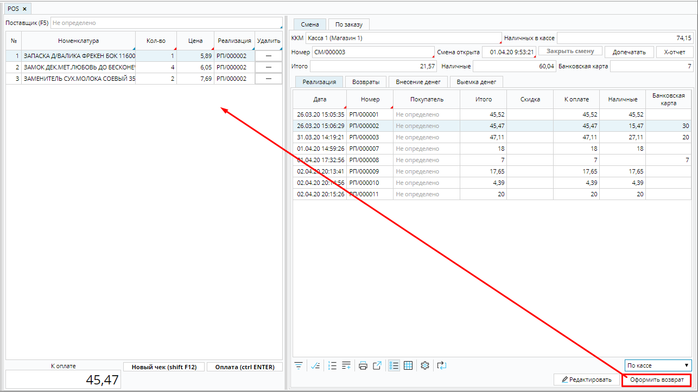
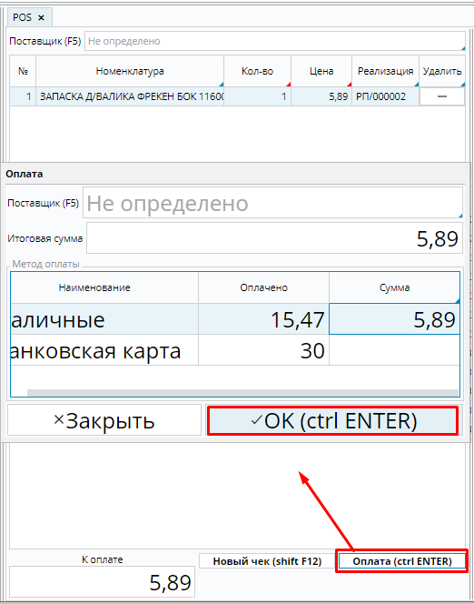
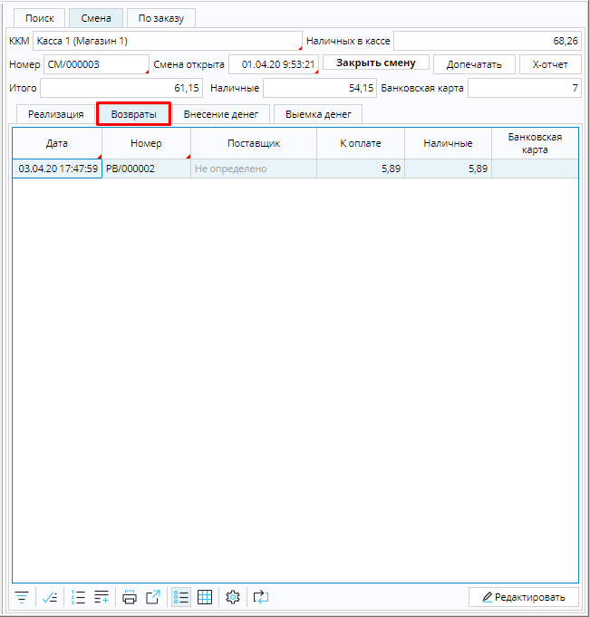

Кассир может оформить возврат товара из любого чека. Для этого необходимо перейти на вкладку **Смена** - **Реализация** и в списке чеков найти тот, по которому необходимо сделать возврат.

Чтобы было легче найти нужный чек, можно воспользоваться быстрым фильтром, чтобы отобразить *все* чеки, либо чеки по данной *кассе*, *смене* или *месту хранения*.  Также можно использовать фильтр на форме и отсортировать чеки по дате, или номеру, или другой информации, которой вы обладаете для поиска. 

### Рис. 1 Выбор чека для возврата

  

Когда нужный чек найден, надо  поставить на него курсор и нажать кнопку **Оформить возврат**. Все позиции чека отобразятся в блоке формирования чека.

### Рис. 2 Позиции чека к возврату

  

С помощью кнопок в колонке **Удалить** оставьте в чеке только позиции для возврата. 

### Рис. 2 Формирование списка товаров к возврату

  

Когда в чеке остались только те товары, которые покупатель возвращает, нажмите кнопку **Оплата**, в открывшемся окне оплаты будет выставлена итоговая сумма к возврату. Если возврат денежных средств производится наличными, необходимо сумму возврата указать в  поле **Сумма** строки **Наличными**, если возврат происходит по карте, сумма указывается в строке **Банковской картой**. Нажмите **ОК**. В системе автоматически будет создано приобретение на данные товары, которое будет отображено также в **Расчеты** - **Приобретения**. 

### Рис. 3 Возврат денежных средств покупателю

  

Все возвраты в течение смены отображаются на вкладке **Смена** - **Возвраты**.

### Рис. 4 Список возвратов кассовой смены

  

  

