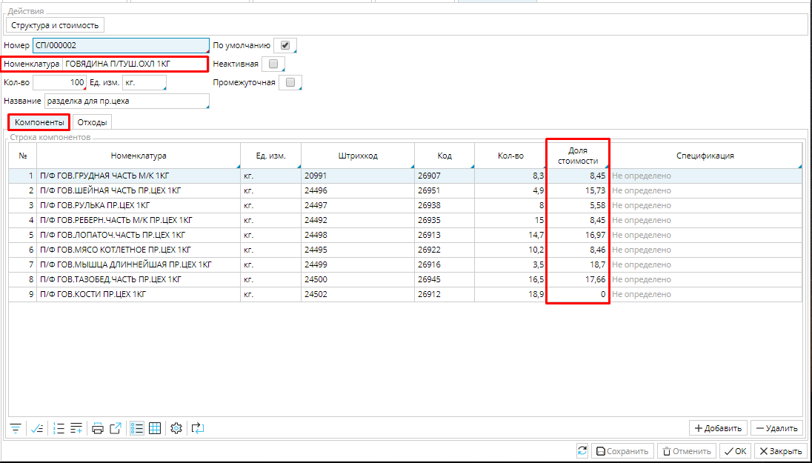
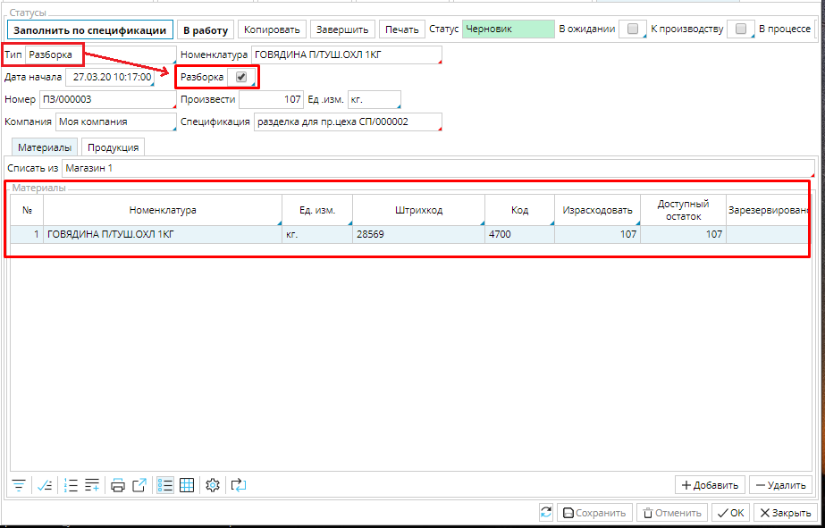
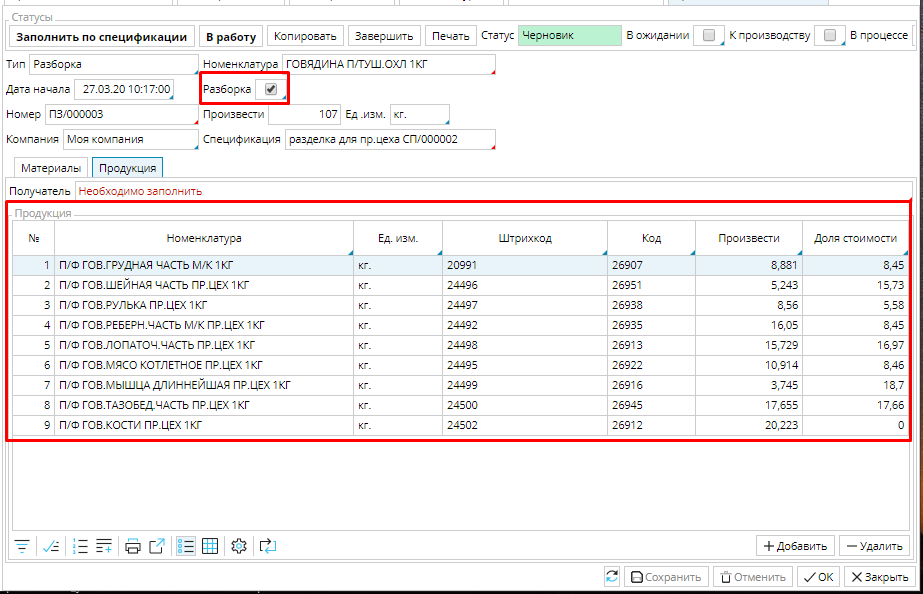

Когда необходимо не собрать продукт из компонентов, а разобрать целое на части, используется заказ на разборку. Также, он используется, если необходимо снова разобрать на составные части то, что было собрано, например, если произведенная продукция оказалась с браком или ее произвели больше необходимого, а компоненты могут быть использованы в другом производстве.

Заказ на разборку работает по такой же **[спецификации](Bills_of_Materials.md)**, как и заказ на сборку, но в поле **Номенклатура** указывается исходный материал, из которого в процессе производства получают **Компоненты**.  Кроме того, важно указать в колонке **Доля стоимости** вес каждого компонента в стоимости исходного материала, чтобы после производства товар был оприходован на склад по актуальной себестоимости. Если доля стоимости не указана, то произведенные товары будут оприходованы по [**плановой себестоимости**](Items_directory.md#Плановаясебестоимость-broken), указанной в карточке товара.  

### Рис. 1 Заполнение колонки Доля стоимости

  

Создание производственного заказа на разборку идет по тому же алгоритму, что и  **[заказа на сборку](Manufacturing_order.md)**, но необходимо использовать [**тип заказа**](Manufacturing_order_type.md) для разборки. Чтобы пользователь видел, с каким заказом он работает, в шапке заказа на разборку отмечена галочка **Разборка. ** При заполнении таких заказов по спецификации ***компоненты*** будут указаны как ***продукция***, а ***изделие*** - как ***материалы***. 

### Рис. 2 Вкладка Материалы заказа на разборку

  

### Рис. 3 Вкладка Продукция заказа на разборку

  

При необходимости, вы можете корректировать долю стоимости готовой продукции уже в самом заказе.

  

  

