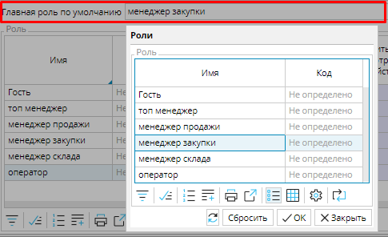

Количество Ролей, которые необходимо создать в системе, зависит от размера вашей организации, численности и разнообразия функциональных  обязанностей сотрудников. 

Для руководителей организации удобно создать отдельную Роль, которая будет предусматривать наиболее обширные Права и доступ ко всем документам и инструментам анализа, что позволяет принимать обоснованные управленческие решения. 

Отдельные Роли могут быть предназначены для работы с поставщиками и/или заказчиками, соответствующей документацией, для управления производственными процессами, или просто для ввода данных.

  

### Рис. 1 Создание роли 

Для создания роли в модуле  **Администрирование** выберите вкладку  **Политика безопасности** и перейдите в закладку **Роли**. Нажмите кнопку **Добавить** и в появившейся строке в соответствующем столбце введите имя . Выбирайте краткое наименование, которое даст представление о сути роли. Рекомендуем также сразу включить опцию **Открывать форму один раз**. Это позволит пользователю с этой ролью не открывать несколько одинаковых вкладок, а вернуться в уже открытую вкладку при повторном выборе ее в Навигаторе. Нажмите Сохранить. 

Созданная таким образом роль по умолчанию обладает максимальным количеством прав и доступов. Для разграничения функционала ролей необходимо [назначить Права](Role_permissions.md) для каждой роли.

Добавить роль можно также с помощью кнопки **Копировать**. В этом случае копируются также права, назначенные роли.

  

Одну из существующих ролей можно назначить **Главной ролью по умолчанию**. Она будет автоматически присваиваться новому [Пользователю](Users.md). Это удобно, если в вашей организации много сотрудников с одинаковыми или схожими обязанностями, которые требуют одного уровня допуска.

Чтобы установить главную роль по умолчанию кликните в одноименном поле и в открывшемся окне выберите нужную роль. Нажмите **ОК**.

### Рис.2 Назначение роли по умолчанию

