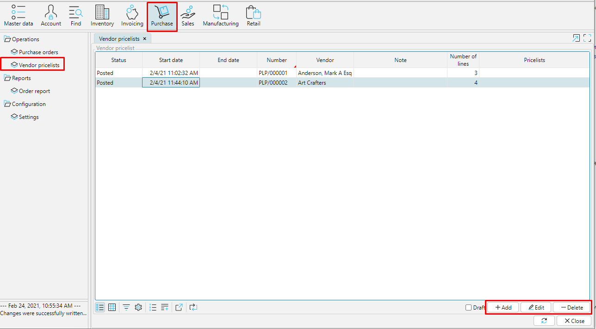
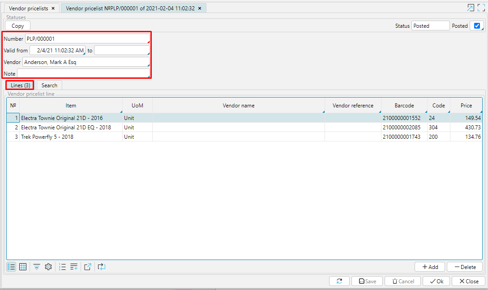
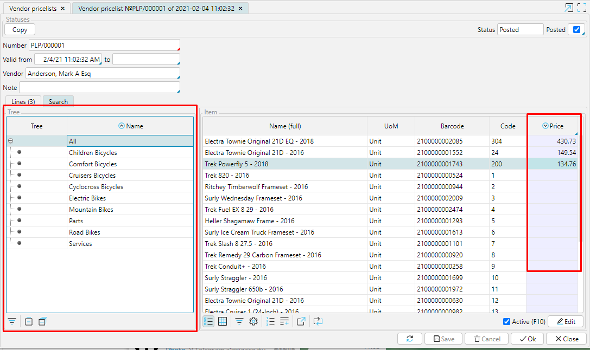
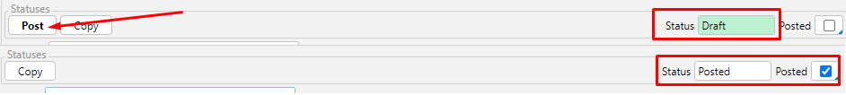

Price lists significantly save your time when ordering, and if you have vendors and goods that you work with for a long time, this tool becomes indispensable. You can quickly determine who offers the product at a better price, and when creating an order you will not waste time entering prices, they will be automatically placed.

  
*Pic. 1 Item prices from different vendors*

  
*Pic. 2 Item price in a purchase order*

Pricelists of all your vendors are displayed in **Purchase** - **Vendor pricelists**. They are easy to navigate, as you immediately see the validity period, status and ownership of f pricelist. In addition, if there are specific aspects of dealing with certain pricelists, you can indicated them in the **Notes**, so that your team could see and bear those aspects in mind.

  
*Pic. 3 Vendor pricelists*

  

To create a new pricelist in the system, click **Add** and complete all the required fields:

**Number** - enter the number manually or configure the [**numerator**](Numerators.md).

**Valid from** \_\_\_\_\_\_ **to** \_\_\_\_\_\_ - set the validity period of the pricelist. The effective date is automatically set to the date and time when the pricelist iscreated. You can change it if necessary. If the closing date is not set, the pricelist will be valid until a new one for the listed items of the vendor becomes effective.

**Vendor** - сlick in the field and select the vendor from the list of [**partners**](Partners_directory.md).

**Note** - if there areaspects of dealing with this price list, specify them in this field and they will be visible in the general list of pricelists. 

The next step is to enter a list of items on the **Lines** tab. You can use the **Add** button and enter one item at a time, but price lists usually contain a large number of items, so it's easier to use the **Search** tab and enter a list of items.

Go to the **Search** tab. The right block displays all items from the **Category** selected in the left block. All items for which you specify **Price** will be automatically displayed on the **Lines** tab.

The item **Code** and **Barcode** columns are filled in automatically if specified in the item card. It often happens that the vendor's item name does not match the names in your merchandise accounting system. It is therefore may be useful to fill in the **Vendor name** and/or **Vendor reference** columns. This avoids confusion and misunderstandings.

  
*Pic. 4 Configuring a pricelist*

  

  
*Pic. 5 Entering items via Search tab*

  

The new pricelist has the status ***Draft***. You can save it at any stage of filling and return to it later. In order for the data from the price list to be used in the system, you need to **Post** it, the status will change to ***Posted***.

  
*Pic. 6 Pricelist statuses*

  

**Copy** - by clicking this button, you create a new price list that stores all the information from the copied one except for the number. This is convenient when you purchase the same items from multiple vendors. Thus, you do not need to create lists of items several times, it is enough to change the **Vendor** and the **Price**, for example.

  

  
