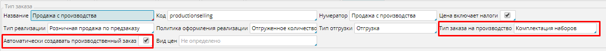
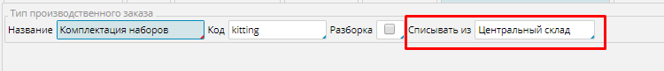
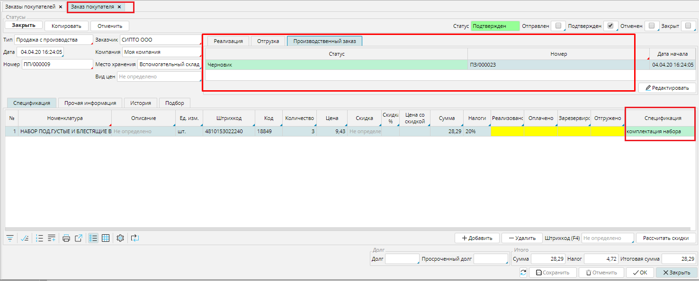

Получив заказ от покупателя на товар собственного производства, с MyCompany вы можете не тратить время на  формирование производственного заказа. Программа сделает это сама, вам нужно только установить несколько настроек. 

  

**1.** Необходимо создать **[тип заказа на продажу](Customer_order_types.md)**, который будет использоваться в таких случаях.  В нем обязательно надо указать:

**Тип заказа на производство**, который будет создан при отсутствии товара на складе;  
включить функцию **Автоматически создавать производственный заказ** (отметить галочкой). 

### Рис. 1 Настройки типа заказа на продажу для автоматизации постановки задач на производство

  

**2.** Чтобы производственный заказ создавался автоматически, в [**типе производственного заказа**](Manufacturing_order_type.md), который указан в настройках заказа на продажу, обязательно надо указать место хранения материалов для производства в поле **Списывать из**.

### Рис. 2 Обязательные настройки типа производственного заказа 

  

Теперь при подтверждении [**заказа на продажу**](Customer_orders.md) товаров, которые вы производите сами,  будет создан  черновик производственного заказа. Он будет указан на вкладке **Производственный заказ**. 

### Рис. 3 Заказ на продажу 

  

В таблице спецификации будет указана  используемая производственная спецификация.

Если у товара несколько производственных спецификаций, указывать ту, по которой должен будет формироваться производственный заказ необходимо до подтверждения заказа на продажу.

  

