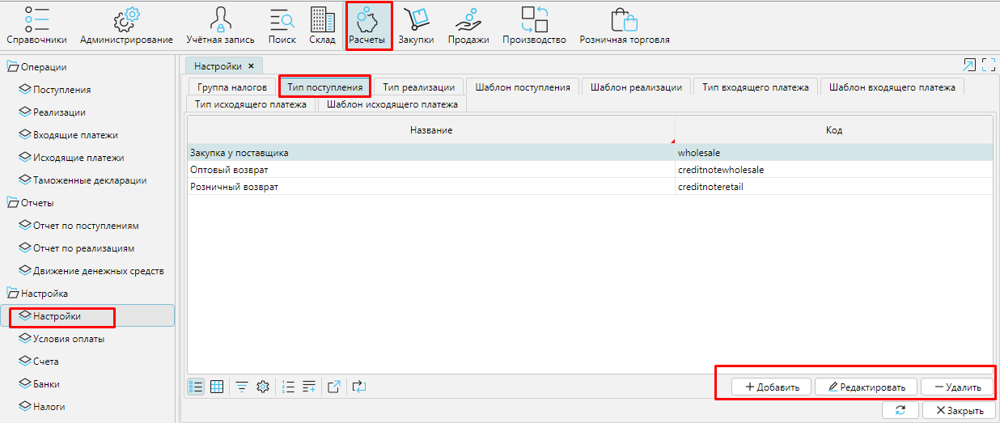
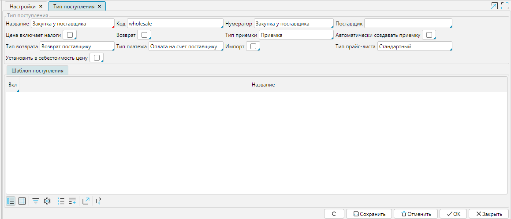

Поступление - это документ, который отражает в системе инвойс или накладную, т.е.  первичный документ учета. **Типы поступлений **используются для того, чтобы вы могли легко и быстро ориентироваться в своих документах, и чтобы система  могла автоматически создавать нужные вам типы документов в соответствии с заданными вами настройками. 

Вы можете создать и настроить столько типов поступлений, сколько вам нужно для деятельности. Список всех типов поступлений вы найдете в Расчеты - Настройки вкладка Тип поступления.  С помощью кнопок Добавить, Редактировать и Удалить вы можете корректировать список. 

  
Рис. 1 Список типов поступлений

  

Чтобы создать **Тип поступления**, нажмите кнопку **Добавить** и  установите подходящие настройки.

  
Рис. 2 Настройка типа поступления

  

**Название **-используйте понятное вам и сотрудникам имя для типа поступления. 

Код - введите код типа поступления, который поможет ориентироваться в списках поступлений.

**Нумератор** - укажите нумератор, который будет использоваться для создания уникального номера поступления. О настройке нумераторов читайте [**здесь**](http://documentation.luxsoft.by/pages/viewpage.action?pageId=72942230). 

Поставщик - если указан поставщик, то в новом поступлении такого типа поле Поставщик будет заполнено автоматически. 

Цена включает налоги - включите этот признак (поставьте галочку), если вы указываете в системе цену товара, которая уже включает в себя налог, тогда итоговая стоимость в документе будет выглядеть так: , если  этот признак выключен (галочка не стоит), то итоговая стоимость заказа будет выглядеть так: . 

Импорт - включите этот признак (поставьте галочку), если вы производите закупку у зарубежного поставщика.

Возврат - включите этот  признак, если настраиваемый тип поступления является возвратом товара покупателем. 

**Тип приемки**- выберите из списка **[тип приемки](Receipt_type.md)**. Документ **Приемки **данного типа будет автоматически создан на основе этого типа приобретения (кнопка **Принять **в **Поступлении**). 

**Автоматически создавать приемку **- если вы включите этот признак, то при переводе Поступления в статус ***К оплате*** (кнопка **В работу** в **Поступлении**), будет автоматически создана Приемка на количество товара в Поступлении в статусе ***Принят***.

**Тип платежа** - выберите из списка **[тип исходящего платежа](Payment_type.md)**. Документ оплаты данного типа будет автоматически создан при оплате поставки (кнопка **Оплатить** в Поступлении). 

Тип  возврата -  выберите из списка тип реализации. Документ Реализация этого типа будет автоматически создан, если вы будете создавать возврат по Поступлению данного типа (кнопка Вернуть в Поступлении). 

Тип прайс-листа - в этом поле можно выбрать тип прайс-листа из настроенных в системе, тогда в Поступлении данного типа станет доступна опция Расценить, по которой сформируется прайс заданного типа на все товары в документе.  

Установить в себестоимость цену - включите этот признак, если хотите, чтобы цена товара в Поступлении была использована как себестоимость при расценке.

  

Сохраните созданный тип поступления.

  

  

  
