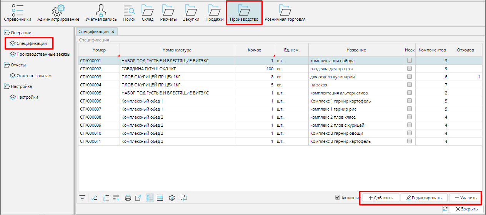
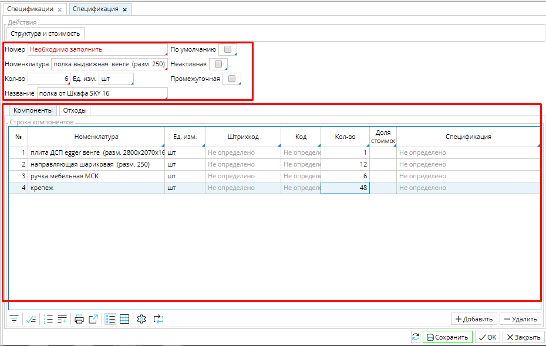
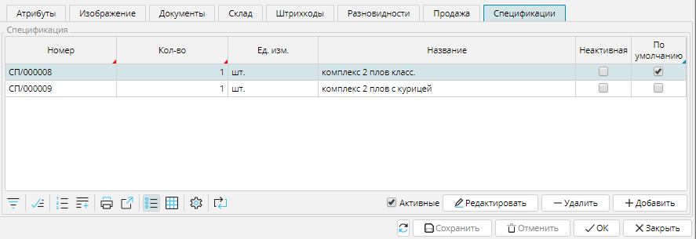
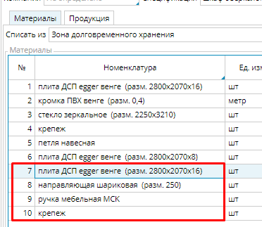
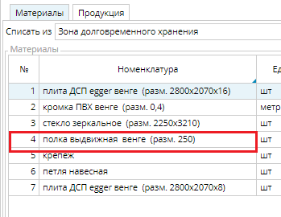
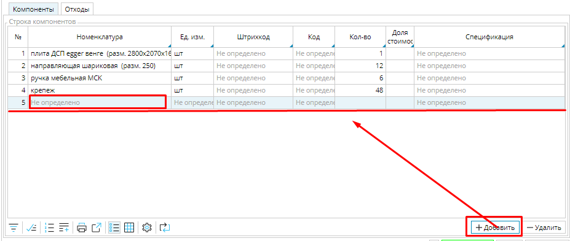
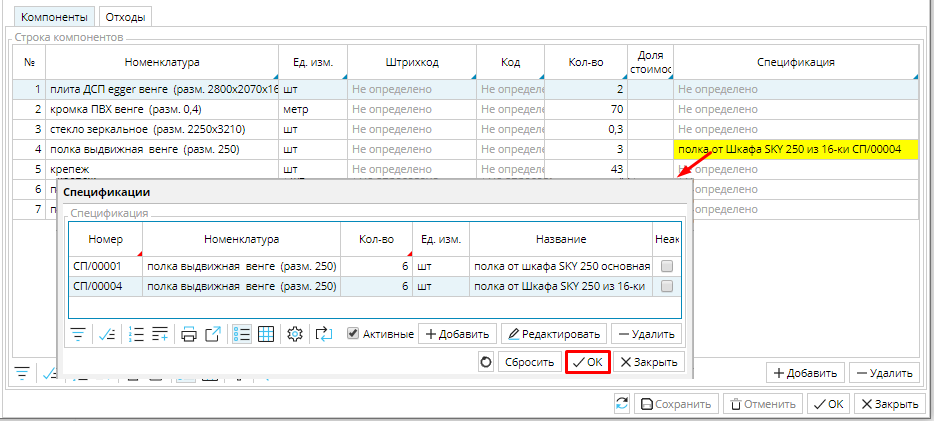
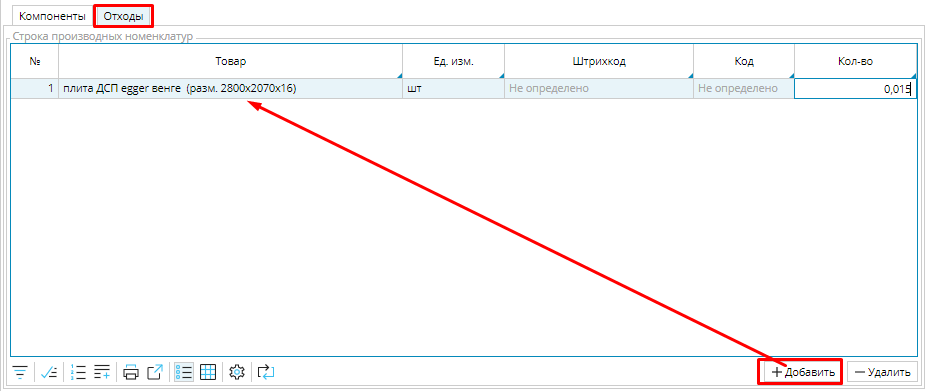

Спецификация составляет основу производственного заказа. Она представляет собой перечень компонентов, из которых состоит конечный продукт. Компонентами могут быть  как материалы, так и заготовки, которые в свою очередь должны быть предварительно произведены. Соответственно и спецификации могут быть *простыми*,  и *составными*, имеющими вложенные спецификации.   

### Рис. 1 Список спецификаций

  

Все спецификации, которые есть в системе отображаются в модуле **Производство** на вкладке **Спецификации**. Чтобы создать новую,  необходимо нажать кнопку **Добавить** и заполнить поля открывшейся формы спецификации.

  

### Рис. 2 Создание новой спецификации

  

## **Шапка спецификации**

**Номер** - уникальный номер спецификации в системе, можно вводить вручную. Если настроен [**нумератор**](Numerators.md), номер сгенерируется автоматически при первом сохранении спецификации.

**Номенклатура** - выберите из списка номенклатур товар, для производства которого создается спецификация. Для этого необходимо кликнуть в поле и в открывшемся списке  номенклатур выбрать нужную, нажать **ОК**.

**Кол-во** - укажите, на производство какого количества товара рассчитана спецификация.

**Ед. изм.** - единица измерения производимого товара, если она указана в [**карточке товара**](Items_directory.md), то при выборе номенклатуры будет заполнена автоматически.

**Название** - введите подходящее имя, чтобы легко ориентироваться в списке спецификаций.

**По умолчанию** - отметьте галочкой,  чтобы данная спецификация автоматически указывалась в заказе на производство товара. Для производства одного и того же товара может использоваться несколько спецификаций, отличающихся, например, взаимозаменяемыми материалами. Все спецификации товара отображаются на вкладке **[Спецификация](Items_directory.md#вкладкаспецификации-broken)** в карточке товара, только одна из них может быть ***по умолчанию***. 

### Рис. 3 Вкладка Спецификация в карточке товара

  

**Неактивная** - отметьте галочкой, и спецификацию  невозможно будет использовать в производственном заказе или как часть другой спецификации.

**Промежуточная** - если эта опция включена (отмечена галочкой), то при производстве товара, в спецификацию которого данная включена как компонент, будет проверяться наличие материалов для выполнения данной спецификации как части процесса производства основного товара. Если опция отключена, то при производстве товара, в спецификацию которого данная включена как компонент, будет проверяться наличие уже произведенных (в другом производственном процессе) заготовок по данной спецификации.

### Рис. 4 Функция "Промежуточная" для спецификации составного компонента включена

### Рис. 5 Функция "Промежуточная" для спецификации составного компонента отключена

##   **Вкладка Компоненты**

### Рис. 6 Добавление компонентов спецификации

  

На вкладке **Компоненты** создают список материалов и заготовок, необходимых для производства товара. Чтобы включить в список компонент, необходимо нажать кнопку **Добавить**, появится пустая строка. В ней надо кликнуть в поле  ***Номенклатура*** и выбрать компонент из списка номенклатуры, ***код***, ***штрихкод*** и ***единица измерения*** будут автоматически заполнены в соответствии с номенклатурой. Затем надо ввести количество (***Кол-во***) данного компонента, необходимое для выполнения спецификации. 

Если компонент является заготовкой и производится в соответствии со спецификацией, то она автоматически отображается в поле ***Спецификация***. Если спецификаций для выбранного компонента несколько, в поле отобразится спецификация по умолчанию, чтобы выбрать иную, необходимо кликнуть в поле, выбрать нужную спецификацию в открывшемся списке и нажать **ОК**. 

### Рис. 7 Добавление компонента со спецификацией

  

## **Вкладка Отходы**

### Рис. 8 Вкладка Отходы

  

При производстве товара бывают ситуации, когда используется не весь материал, включенный в спецификацию, или появляются отходы, которые могут быть использованы в другом производстве или для продажи. Например, при производстве мебели могут оставаться части листов ДСП, которые далее можно использовать для производства более мелких элементов, или оставаться опилки, которые могут использоваться для производства топливных брикетов или продаваться.  Такие отходы указывают  на вкладке **Отходы** , чтобы они были оприходованы на склад, как и готовый товар.  Материалы  добавляются на вкладку аналогично вкладке **Компоненты**.

  

  

