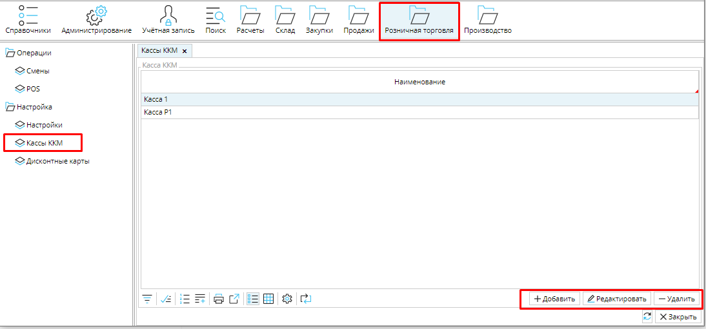
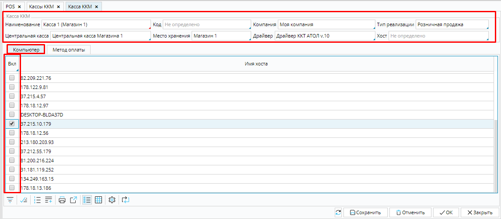
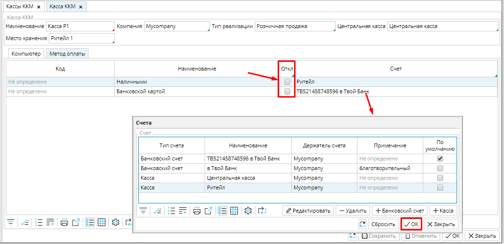

В **Розничная торговля** - **Кассы ККМ**  отображается список  ваших контрольно-кассовых машин.  Корректировать список можно при помощи кнопок **Добавить**, **Редактировать** и **Удалить**.

### Рис. 1 Список касс ККМ

  

Чтобы создать новую кассу, необходимо нажать кнопку **Добавить** , откроется форма кассы, в которой надо установить настройки. 

### Рис. 2 Настройка кассы ККМ

  

**Наименование** - идентификатор кассы.

**Компания** - укажите [**компанию**](Partners_directory.md), которой принадлежит касса.

**Тип реализации** - выберите [**тип реализации**](Invoice_type.md), которая будет сформирована для каждой проведенной по кассе покупки.

Обратите внимание, что для автоматического списания проданных товаров и оприходования возвращенных, в типе реализации должно быть настроено автоматическое создание отгрузки и для типа реализации продажи, и для типа реализации возврата.

**Центральная касса** - укажите счет на котором будут аккумулироваться средства центральной кассы. Если данного счета еще нет в системе, его можно настроить в [**карточке компании**](Partners_directory.md), либо в модуле **Расчеты**-**Счета**.  

**Место хранения** - выберите склад или магазин, с которого реализуются товары.  Если такого места хранения еще нет, его можно создать в модуле **Склад** - [**Места хранения**](Location_settings.md).

**Драйвер** - выберите  драйвер для подключения вашего кассового аппарата из списка доступных.

**Хост** - для ККМ марки Атол укажите устройство, управляющее  кассовым оборудованием. 

## **Вкладка Компьютер**

Здесь осуществляется привязка кассы к определенному компьютеру. Для этого необходимо отметить галочкой **Вкл**. для имени хоста компьютера. Если привязка создана, то с выбранного компьютера можно будет работать только на данной кассе (рис. 2).  

  

## **Вкладка Метод оплаты**

### Рис. 3 Настройка кассы вкладка Метод оплаты

  

На данной вкладке отображается список [**методов оплаты**](General_settings.md), которые могут использоваться в кассе. Если какой-либо метод не будет использоваться на данной кассе, его можно отключить, для этого необходимо отметить галочкой **Откл**.  

Для каждого активного метода оплаты необходимо указать счет, на который будут зачисляться при оплате и списываться при возвратах денежные средства. Для этого необходимо кликнуть в поле **Счет  **и выбрать нужный счет из списка.

**Сохраните** настроенную кассу ККМ.

  

  

