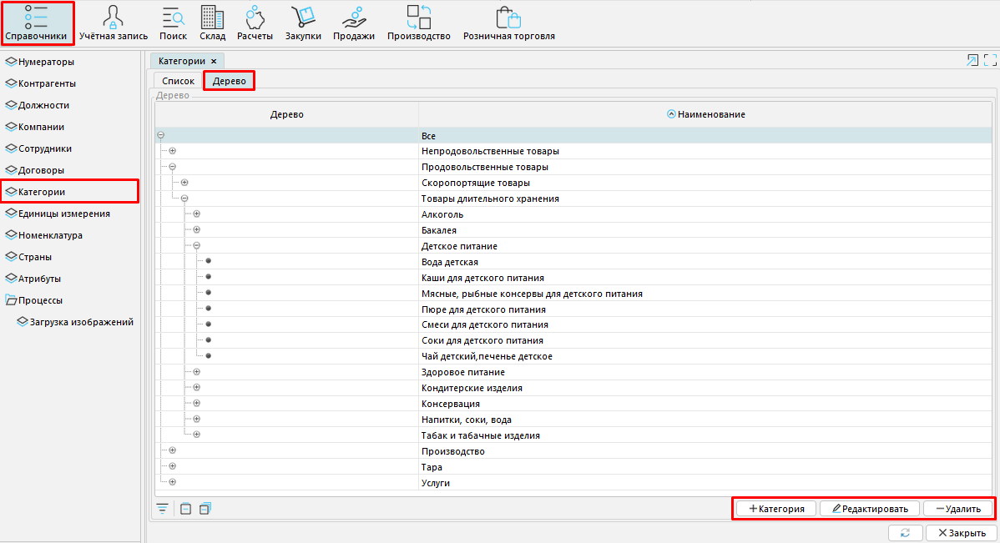
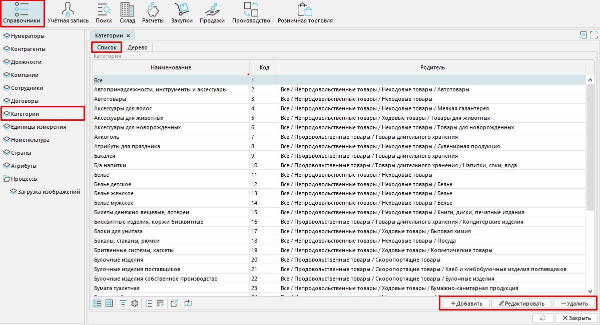
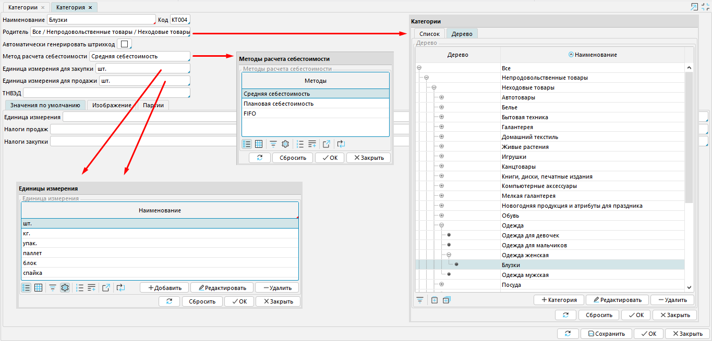

**Категории** - это классификатор товаров и услуг, которые вы покупаете, продаете, оказываете или производите. Их создают, редактируют и удаляют в **Справочники - Категории**. 

Категории имеют иерархическую структуру, но для удобства навигации в системе можно использовать как иерархическое, так и табличное отображение категорий.

Рис. 1 Категории иерархическое отображение 

Рис.2 Категории табличное отображение 

  

  

Рис. 3 Настройка новой Категории

  

Вы сами определяете принцип классификации товаров и услуг.

Чтобы создать новую категорию нажмите кнопку **+Категория** и заполните поля в открывшемся окне:

**Наименование** - введите название категории.

**Код** - можно ввести вручную или, если настроен [нумератор, ](Numerators.md)проставляется автоматически.

**Родительская группа** - по клику в этом поле откроется окно, где необходимо выбрать категорию, которая на ступеньку выше по иерархии к создаваемой, и нажать **ОК**.

**Автоматическая генерация штрихкода** - отметка позволяет автоматически формировать штрихкод, учитывая товарную группу номенклатуры.

**Метод расчета себестоимости** - по клику в этом поле откроется окно со списком методов расчета себестоимости. Выберите нужное значение и нажмите **ОК**.  Вы можете выбрать один из трех методов: 

***Средняя себестоимость*** - периодический расчет себестоимости товаров по среднему арифметическому, при котором не учитывается из какой из поступивших  партий был использован товар;

FIFO (англ. «first in, first out» — «первый пришел, первый ушел») - товары списываются по принципу очередности, в первую очередь списываются товары, которые поступили раньше;

Плановая себестоимость - при расчетах учитывается стоимость каждого конкретного товара. 

Единица измерения (для закупки/для продажи) - кликните в поле и из появившегося списка единиц измерения выберите нужную. Если в списке нет необходимого значения, создайте его с помощью кнопки Добавить.

ТН ВЭД - можно ввести вручную.

  

## **Настройка вкладок**

  

#### Рис. 4 Настройка значений по умолчанию

  

#### Рис. 5 Вкладка Изображение

  

### Значения по умолчанию

***Единица измерения*** - установленное значение будет по умолчанию применяться к позициям из данной товарной категории. В случае отсутствия необходимого значения в списке, его можно добавить самостоятельно.

Налоги продаж - по клику в поле появиться список налогов, выберите те, которые будут применяться по умолчанию при продаже товаров и услуг данной категории.  Список налогов создается в Расчеты-Налоги. 

Налоги закупки  - аналогично Налогам продаж установите налоги, которые применяются при закупке товаров и услуг данной категории. 

**Изображение** - с помощью кнопки Загрузить добавляется изображение, идентифицирующее товарную категорию, которое отображается, например, на форме POS вместе с названием категории.

**Партии** - позволяет вести партионный учет товаров обрабатываемой товарной категории и присваивать маркировку товарной  группе.

  

#### Рис. 6 Вкладка Партии

  

  
