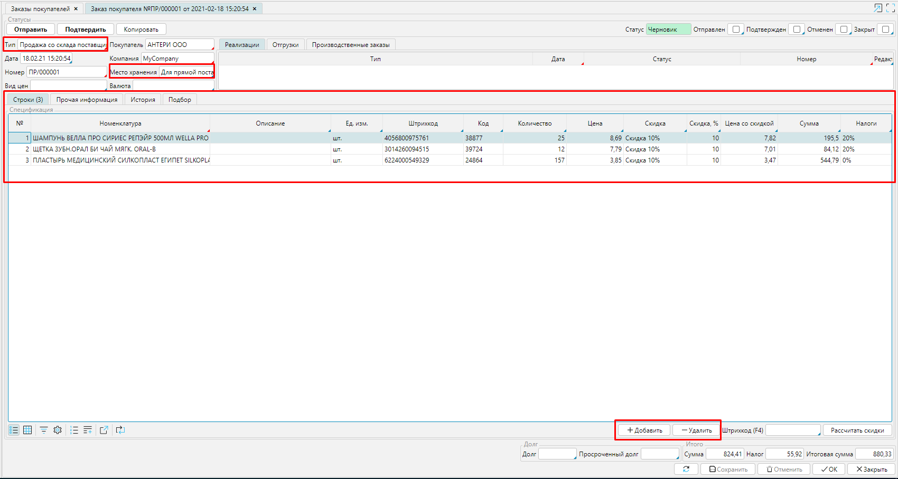
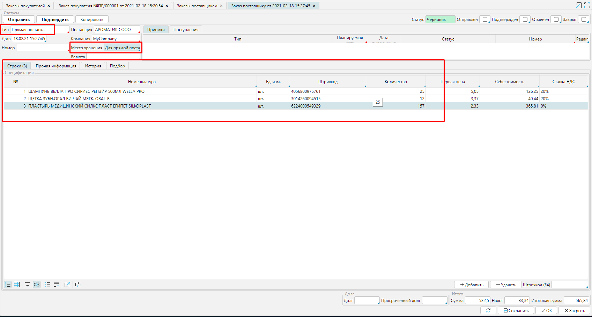
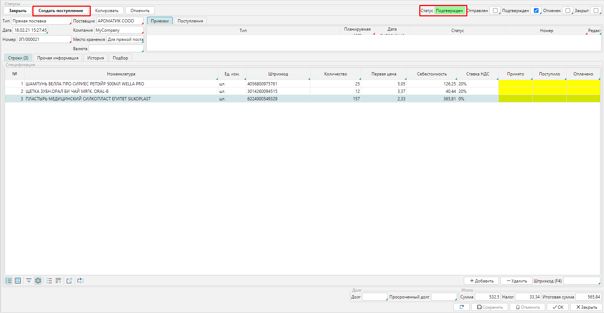
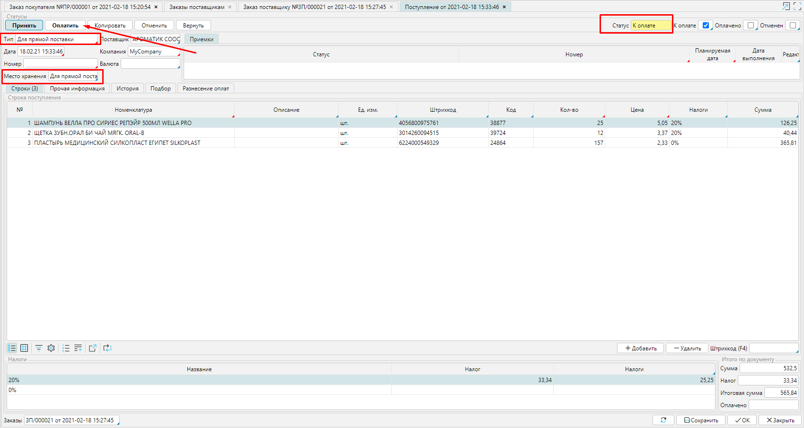
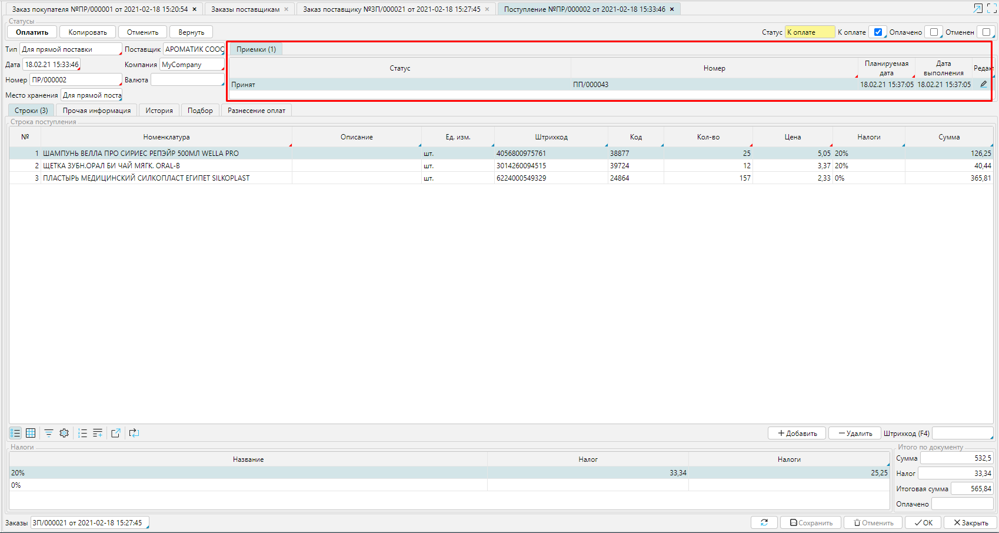
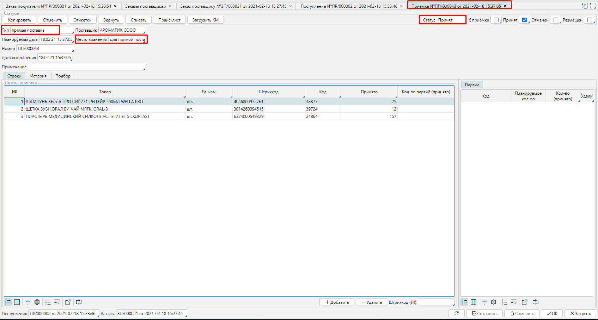
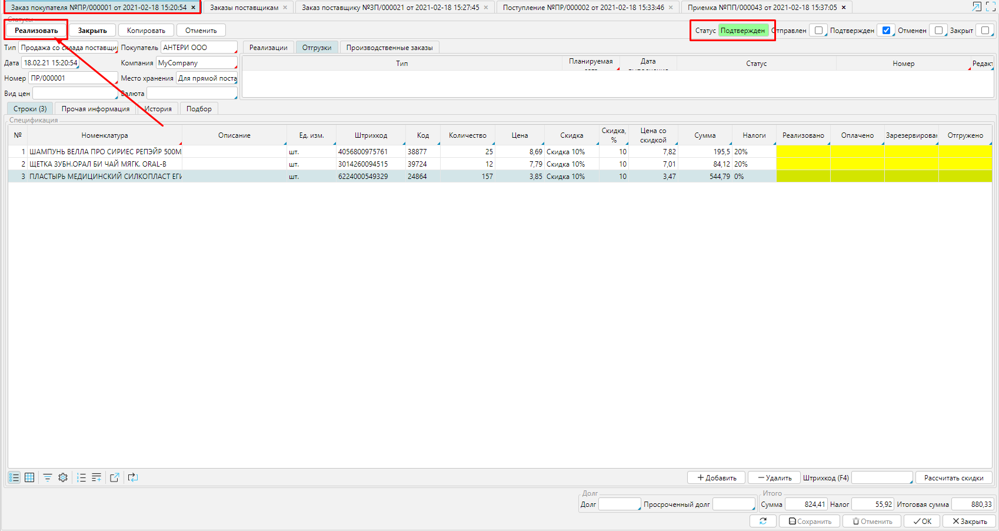
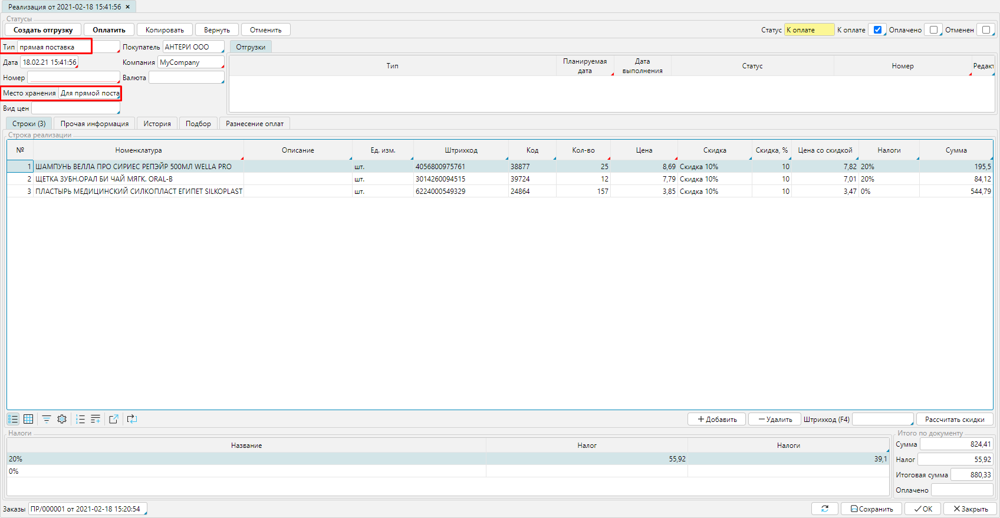
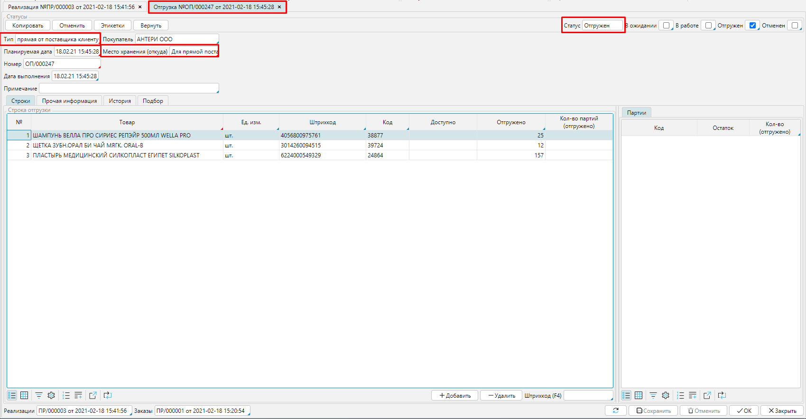

После установки всех [**настроек**](Cross-docking_settings.md) осуществляем продажу товаров со склада продавца. Сначала оформляем [**заказ от покупателя**](Customer_orders.md), тип заказа необходимо установить ***Продажа со склада поставщика***, склад - ***Для прямой поставки***. Обратите внимание, что спецификацию в данном случае необходимо создавать [**вручную**](Customer_orders.md#Добавлениетоваровпоодному-broken), т.к. на вкладке **Подбор** отображаются только товары, которые есть в наличии на складе.

  
Рис. 1 Формирование заказа покупателя

  

Согласовав все детали заказа с покупателем, необходимо произвести закупку и отправить товары покупателю. Для этого оформляем [**заказ поставщику**](Puchase_order.md), устанавливаем тип заказа ***Прямая поставка*** и склад - ***Прямая поставка. ***Введите список товаров к закупке в соответствии с заказом покупателя. 

  
Рис. 2 Составление заказа поставщику

  

  
Рис. 3 Подтвержденный заказ поставщику

  

Когда заказ переведен в статус ***Подтвержден***, в форме появится кнопка  **Создать поступление**. Нажмите на нее и откроется [**Поступление**](Vendor_payments.md) в соответствии с заказом. Проверьте, если настройки были сделаны правильно, то будет указан тип документа ***Для прямой поставки,*** и место хранения - ***Для прямой поставки***.  

### Рис. 4 Приобретение по заказу

  

При сохранении **Поступления** (при проведении оплаты или просто с помощью кнопки **Сохранить**), в системе автоматически будет создана **Приемка **приобретенного товара на склад в статусе ***Принят*.**

  
Рис. 5 Отображение Приемки в Поступлении

  

  
Рис. 6 Документ Приемка

  

После закупки необходимых товаров можно продолжить продажу. В подтвержденном заказе покупателя необходимо нажать кнопку **Реализовать**. Откроется [**Реализация**](Customer_invoice_and_Payment_collection.md), созданная в соответствии с заказом. 

  
Рис. 7 Подтвержденный заказ покупателя

  

  
Рис. 8 Реализация по заказу покупателя

  

Проверьте *тип* документа, должен быть указан ***Прямая поставка***, *место хранения* - ***Для прямой поставки***.  При сохранении **Реализации **(при проведении оплаты или просто с помощью кнопки **Сохранить**), в системе автоматически будет создана **Отгрузка** товара со склада в статусе ***Отгружен.***

  
Рис. 9 Отображение отгрузки в реализации

  

  
Рис. 10 Отгрузка проданного товара

  

После того, как товар отгружен покупателю и проведены оплаты, можно закрывать оба заказа. 

  

Сверки и взаиморасчеты

  
