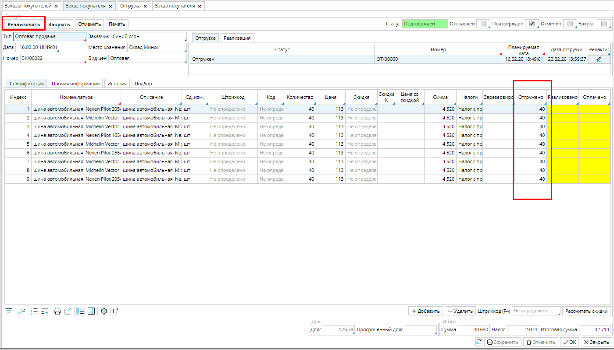
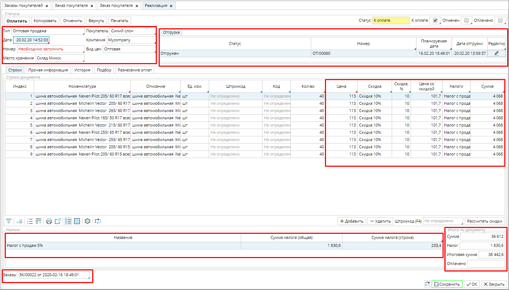
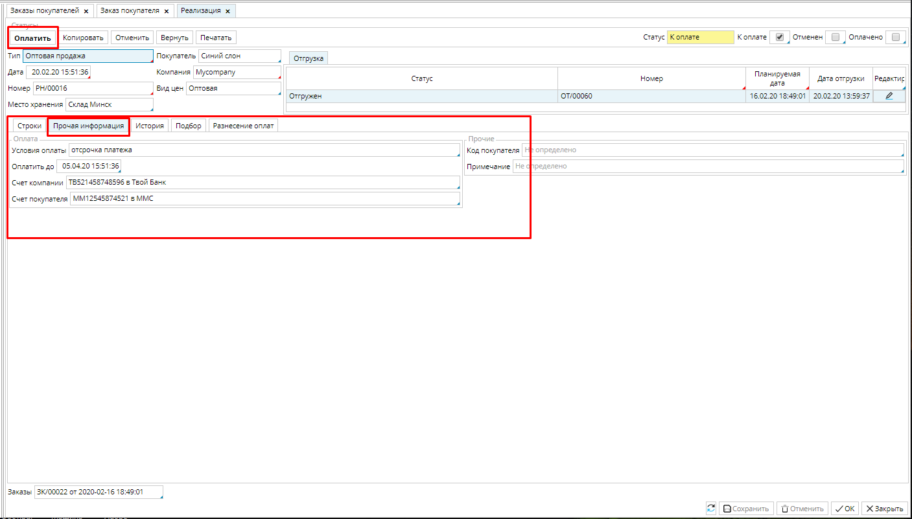
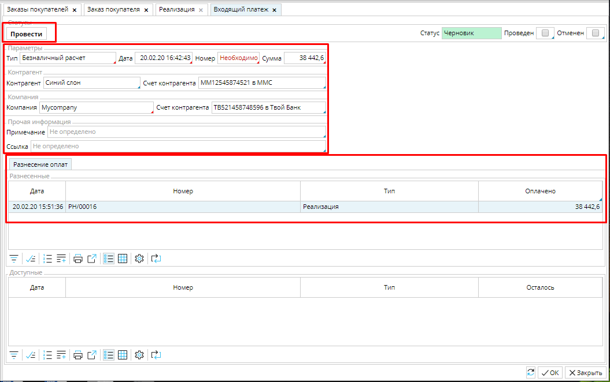
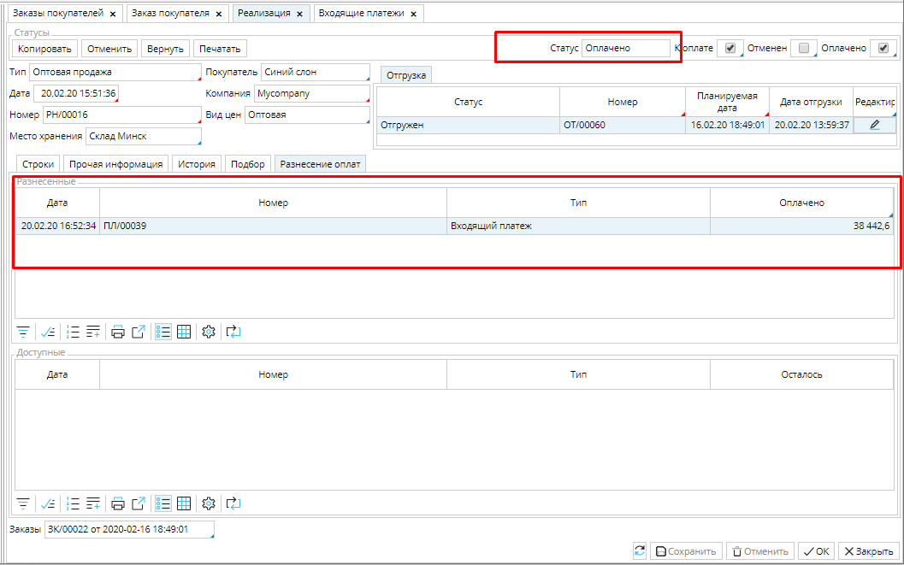

После оформления [**Отгрузки**](Shipments.md) товара покупателю, в заказе становиться доступна функция **Реализовать**. 

### Рис. 1 Заказ на продажу

  

Кликнув на Реализовать, вы создадите документ **Реализация**, который является первичным документом учета, т.е. соответствует реальной накладной или инвойсу и необходим для учета стоимости проданного товара  в балансе вашей компании и получения оплаты за товар.   

### Рис. 2 Документ Реализация

  

Документ будет создан в статусе К оплате на весь отгруженный или заказанный товар, в зависимости от настройки типа заказа.  Тип реализации, Покупатель, Вид цен, Место хранения, и стоимость товара  будут соответствовать заказу и его настройкам. Заказ, к которому относится Реализация, будет указан внизу документа, а отгрузка в поле Отгрузка. 

Вам необходимо указать, какая из ваших [**Компаний** ](http://documentation.luxsoft.by/pages/viewpage.action?pageId=72942232#id-%D0%9D%D0%B0%D1%81%D1%82%D1%80%D0%BE%D0%B9%D0%BA%D0%B0%D1%81%D0%BF%D1%80%D0%B0%D0%B2%D0%BE%D1%87%D0%BD%D0%B8%D0%BA%D0%B0%D0%BA%D0%BE%D0%BD%D1%82%D1%80%D0%B0%D0%B3%D0%B5%D0%BD%D1%82%D0%BE%D0%B2-Company)является продавцом товара, если **Компания** в системе одна, поле заполнится автоматически.  Стоимость товара отображается подробно, с разбивкой на цену, налоги, скидки и соответствует заказу.

Номер документа проставиться автоматически при его первом сохранении, если вы настроили нумератор.

Дата - по умолчанию будет установлена дата и время создания документа. Ее можно изменить, при необходимости. 

Будьте внимательны и указывайте не только дату, но и время документа, т.к. это важно при партионном учете товара. 

### Рис. 3 Вкладка Прочая информация документа Реализация

  

Во вкладке **Прочая информация** указаны **Условия оплаты**, соответствующие заказу и дата, до которой должна быть  произведена оплата товара (в соответствии с настройками условия оплаты). Также будут указаны счета по умолчанию покупателя и вашей компании. При необходимости их можно изменить.  Для этого надо кликнуть в поле счета и выбрать другой счет из  доступных. Как настраивать счета контрагентов смотрите **[здесь](http://documentation.luxsoft.by/pages/viewpage.action?pageId=72942232)**.

Для удобства можете указать, под каким номером числиться документ у покупателя, в поле **Код Покупателя **и напечатать **Примечание**, которое будет видно в общем списке реализаций (**Расчеты - Реализации**). 

Когда вы получили оплату по данному заказу, нажмите кнопку **Оплатить**, и будет создан черновик входящего платежа, в котором будут указаны **Покупатель**, **Компания** и их **Счета** из **Реализации**, а сама **Реализация** будет указана в блоке разнесенных документов. **Тип** платежа будет заполнен автоматически, если настроен в [**типе реализации**](Invoice_type.md). Чтобы платеж был учтен, его надо **Провести.**

### Рис. 4 Платеж по Реализации

  

После этого платеж будет указан во вкладке **Разнесение оплат**, а сам документ **Реализация** будет переведен в статус ***Оплачено***. 

### Рис. 5 Оплаченная Реализация

  

Возможна ситуация, когда у вас в системе уже введен платеж от данного покупателя (например, при предоплате), тогда он будет отображаться во вкладке **Разнесение оплат** в блоке **Доступные**. Для того, чтобы отнести платеж именно на эту **Реализацию**, нажмите кнопку **Разнести**, и документ перейдет в статус ***Оплачено*** (см. рис. 5)

### Рис. 6 Платежи, доступные для оплаты Реализации

  

  
