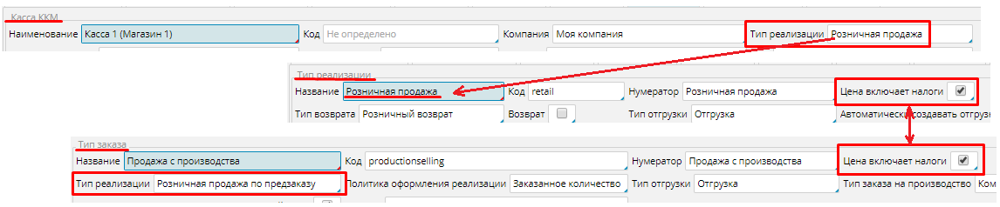
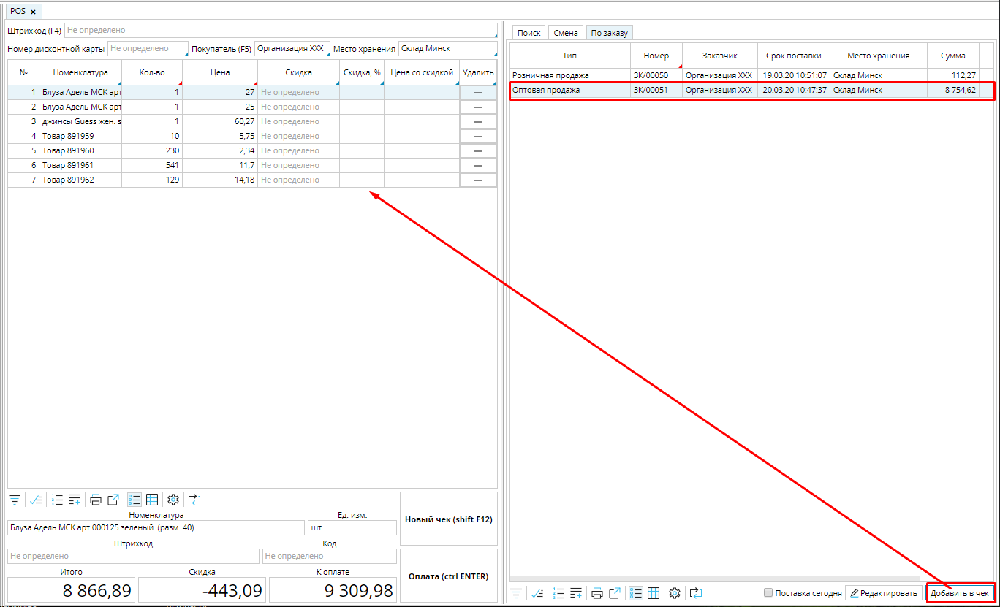

MyCompany дает возможность быстро провести по кассе и принять оплату сформированных заказов покупателя. Вам не придется вводить каждый товар по отдельности, в чек  все товары заказа будут добавлены автоматически. 

Для того, чтобы использовать этот функционал, убедитесь, что все необходимые настройки установлены и не конфликтуют.

-   Чтобы оплатить заказ по кассе, в [**типе заказа**](Customer_order_types.md) обязательно должен быть указан [**тип реализации**](Invoice_type.md). При проведении оплаты в системе автоматически создается реализация, которая настроена для заказа, а не для [**кассы ККМ**](Cash_registers.md).
-   Настройка цены (включает или не включает налоги) в заказе должна совпадать с настройкой в типе реализации кассы.

### Рис. 1 Соответствие настроек

  

Чтобы оплатить заказ по кассе в  **Розничная торговля **- **POS ** откройте вкладку  **По заказу**. В зоне чека выберите покупателя, за заказ которого необходимо принять оплату . Все подтвержденные заказы этого покупателя будут отображены во вкладке  **По заказу**. 

### Рис. 2 Список заказов покупателя

  

Чтобы добавить товары из заказа в чек, необходимо выделить заказ в списке и нажать кнопку **Добавить в чек**.  Товары из заказа  отобразятся в чеке.  Вы можете добавить в чек и принять оплату сразу за несколько заказов.

Если товары не добавляются в чек, возможны следующие причины: 

-   заказ уже оплачен
-   есть связанный с заказом невыполненный производственный заказ
-   не осуществлена отгрузка, которая согласно настройкам заказа должна предшествовать оплате.

Нажмите оплатить и [**примите оплату**](POS.md#Оплатачека). 

  

  

