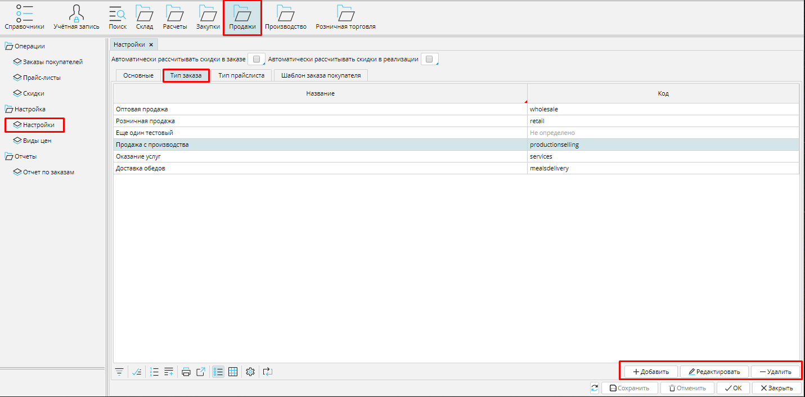
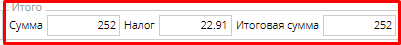
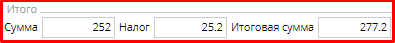

В MyCompany вы можете создать и настроить те типы продаж, которые используете в своей деятельности.  Чтобы создать тип заказа на продажу, перейдите в **Продажи- Настройки ** вкладка ** Типы заказов** и нажмите кнопку **Добавить**. 

### Рис. 1 Список типов заказов на продажу

  

В форме типа заказа установите подходящие для вас настройки.

### Рис. 2  Форма типа заказа

  

  

**Название** - используйте понятное вам и сотрудникам имя для типа заказа. 

**Код** - введите код типа заказа, чтобы облегчить идентификацию заказов.

**Нумератор **- укажите нумератор, который будет использоваться для создания уникального номера заказа. О настройке нумераторов читайте [**здесь**](Numerators.md). 

**Цена включает налоги** - включите эту опцию (поставьте галочку), если вы указываете в системе цену товара, которая уже включает в себя налог, тогда итоговая стоимость заказа будет выглядеть так: . Если  этот признак выключен (галочка не стоит), то итоговая стоимость заказа будет выглядеть так: .

**Тип реализации** - выберите тип из списка. Документ **[Реализации ](Customer_invoice_and_Payment_collection.md)**этого типа будет создаваться на основе заказа.  Подробнее о типах реализации читайте [**здесь**](Invoice_type.md). 

**Политика оформления реализации** - если вы устанавливаете ***Отгруженное количество***, то  документ **Реализации** будет создан только на то количество товара, которое отправлено покупателю по документу **Отгрузки,** и функция **Реализовать** станет доступна после отгрузки товара. Если вы устанавливаете ***Заказанное количество***,  то  документ **Реализации** будет создан  на все  количество товара, которое указано в заказе, независимо от того, сколько товара отправили покупателю, а функция **Реализовать**  будет доступна в подтвержденном заказе независимо от статуса отгрузки. 

**Тип отгрузки** - выберите тип отгрузки из списка. Документ [**Отгрузки**](Shipments.md) этого типа будет создаваться автоматически на основе заказа.  Если вы оставляете это поле пустым, отгрузка создана не будет. Подробнее о типах отгрузки читайте [**здесь**](Shipment_type.md). 

**Тип заказа на производство** - укажите [**тип производственного заказа**](Manufacturing_order_type.md), который необходимо будет создать для выполнения заказа покупателя.

**Автоматически создавать производственный заказ** - включите эту опцию, если хотите, чтобы производственный заказ [**формировался автоматически**](Auto_created_manufacturing_order_from_customer_order.md) после подтверждения заказа на продажу. Опция становится доступной после того, как указан тип производственного заказа.

**Вид цен** - выберите из списка вид цен, который будет использоваться в заказах данного типа. Мы устанавливаем ***Оптовая***. Подробнее о видах цен читайте [**здесь**](Price_type_settings.md). 

Сохраните настроенный тип заказа на продажу.

  

  
