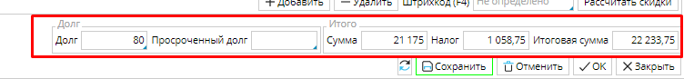

Используйте **Заказы покупателей**, чтобы фиксировать каждый этап взаимодействия с покупателем и быстро ориентироваться в продажах. Список всех заказов вы найдете в **Продажи - Заказы покупателей**. Для удобства навигации заказы на каждой стадии жизненного цикла выделяются определенным цветом.  Создание и редактирование заказов осуществляется соответствующими кнопками в правом нижнем углу.

#### Рис. 1 Список Заказов покупателей

  

Открыв форму заказа вы сразу видите всю необходимую информацию: на каком этапе реализации находится заказ, кто ваш покупатель и по какой цене вы продаете товар, состоялась ли уже отгрузка и/или оплата товара, есть ли долги за покупателем, и т.д.

#### Рис. 2 Заказ покупателя 

  

Если вы тщательно осуществили **[настройки и заполнили справочники](General_settings_and_master_data.md)**, то организация торговли через оформление заказов существенно сэкономит ваше время и не допустит потери важной информации или путаницы.  Для создания заказа нажмите **Добавить** и заполните всю необходимую информацию:

**Тип** - кликните в поле и выберите из списка. Например, для оптовой торговли выберите ***Оптовая продажа***. От выбранного  типа заказа будет зависеть, какие документы будут создаваться на основе заказа и иные параметры. Типы заказа настраиваются в **Продажи - [Типы заказов](Customer_order_types.md)**.  

**Дата** - в этом поле будет указана дата и время создания заказа. При необходимости их можно поменять, кликнув в поле и выбрав подходящие данные из календаря. 

Будьте внимательны и указывайте не только дату, но и время заказа, т.к. это важно при партионном учете товара. 

**Номер** заказа также будет автоматически создан при первом сохранении, если вы настроили **[нумераторы](http://documentation.luxsoft.by/pages/viewpage.action?pageId=72942230)**. 

Заказчик - кликните в поле и выберите заказчика из списка Контрагентов. Если его там нет, добавьте. 

Место хранения - кликните и  выберите Склад, с которого будут отгружаться товары. Если место хранения не будет указано, вы не сможете создать список товаров на продажу в спецификации.

Вид цен - будет автоматически указан в соответствии с настройками Контрагента, либо типом заказа. Если настройки Контрагента противоречат типу заказа, например, вы работали с данным контрагентом как с розничным покупателем, а данный заказ оптовый, то  кликните в поле и укажите, какие цены применяются в этом заказе. Виды цен настраиваются в Продажи - Виды цен.  Указанный вид цен будет применен в поле Цена во вкладках  Спецификация и Подбор, если настроены прайс-листы для товаров.

  

#### Рис. 3 Вкладка Прочая информация

  

Во вкладке **Прочая информация** укажите :

**Срок действия** вашего коммерческого предложения для покупателя.

**Срок поставки** автоматически устанавливается равный дате создания заказа. При необходимости его можно изменить. 

В поле **Адрес поставки** автоматически указывается адрес покупателя, если адрес поставки иной, укажите его.

**Условия оплаты** будут указаны автоматически, если настроены условия оплаты по умолчанию для покупателя.  Если не настроены, или для этого заказа действует другое условие, кликните в поле и выберите подходящее. Если такого нет, то настройте, используя кнопку **Добавить**. 

**Адрес получателя** по умолчанию соответствует адресу покупателя. При необходимости его можно изменить.

**Наш представитель** - сотрудник, который будет ответственным за этот заказ.  Выберите ** **из списка **Контрагентов**, который откроется по клику в поле.

Входящий номер заказчика - номер,за которым данный заказ учтен у покупателя.  Если вы знаете этот номер, он может существенно облегчить коммуникацию с вашим партнером при возникновении необходимости быстро идентифицировать данную партию товара, например, при сверке данных.

## **Добавление списка товаров** 

Товары, которые вы покупаете отображаются во вкладке **Спецификация**. Вы можете использовать 2 способа создания спецификации товаров : 

<u>***1. Добавление товаров по одному.** *</u>Нажмите **Добавить** во вкладке спецификации, появиться пустая строка. Кликните в столбце **Номенклатура**, и выберите товар в открывшемся окне номенклатур. Товар отобразиться в строке. Введите количество в соответствующем столбце. 

#### Рис. 4 Добавление товара в Спецификацию

  

<u>***2. Добавление товаров списком.***</u> Перейдите во вкладку **Подбор**. В правом блоке будут отображены все товары из **Категории**, выбранной в левом блоке.  Все товары, для которых вы укажете количество, будут автоматически отображены в спецификации. В столбце ***Доступно*** показано количество товаров, которые есть в вашем распоряжении, т.е. находятся на складе и не зарезервированы для других покупателей. 

#### Рис. 5 Добавление списка товаров

## **Стоимость заказа**

Стоимость заказа для покупателя зависит от цены каждого товара, начисляемых налогов и применяемых скидок. Цену, налоги и скидку можно указать вручную для каждого товара в соответствующих столбцах. Чтобы автоматизировать этот процесс, необходимо настроить **[прайс-листы](Pricelists.md)** для покупателей и применяемые **[скидки](Discount_settings.md)**.  

**Цена товара** будет заполнена автоматически, если в системе есть действующий прайс-лист на этот товар.  Причем цена будет указана в соответствии с указанным в заказе видом цен, т.е. для оптового заказа будет указана оптовая цена. Если прайс-листа нет, но в **[карточке товара](Items_directory.md)** указана цена продажи, то эта цена автоматически отобразится в колонке ***Цена***. Таким же образом отображается цена во вкладке **Подбор**.

Если вы создали список скидок, то в зависимости от настроек,  скидки применятся автоматически, либо вы сможете выбрать  нужную скидку, кликнув в поле ***Скидка.*** Также вы можете использовать кнопку **Рассчитать скидки**, чтобы в заказе применились подходящие скидки. 

### Налоги** будут указаны автоматически, если настроены в **[карточке товара](Items_directory.md).

#### Рис. 6 Стоимость заказа

  

Когда заполнены все данные, в итоговом блоке заказа отображается стоимость заказа и сумма налогов. Также отображаются взаимные задолженности между вами и покупателем.  Если сумма задолженности положительная, то это долг покупателя перед вами, если отрицательная, то это ваш долг.

#### Рис. 7 Итоговая строка заказа

  

Новый заказ по умолчанию имеет статус ***Черновик***, который отображается в блоке **Статусы**. Заказ может находиться в одном из 5 статусов, которые однозначно показывают пользователю на каком этапе находится процесс продажи. Переход между статусами осуществляется посредством выполнения определенных действий.  

|
Статус
|
Возможные действия
|
Описание 
|
|---|---|---|
|*<strong>Черновик</strong>* |
<strong>Отправить</strong> /Подтвердить /<strong>Печать </strong>
|
В статусе черновика вы указываете существенные данные для будущей сделки, например, указываете покупателя, формируете список товаров в заказе, указываете  сроки доставки и т.д. Далее вы можете отправить заказ покупателю для согласования деталей, например цены или условий оплаты, для этого выбираете действие <strong>Отправить</strong> и заказ переходит в статус *<strong>Отправлен</strong>*. 
 
Вполне вероятно, что у вас уже есть определенные договоренности с покупателем, вы точно можете указать все существенные условия, тогда заказ можно сразу <strong>Подтвердить</strong>, соответственно, он перейдет в статус *<strong>Подтвержден</strong>*.
 
<strong>Печать</strong> - позволяет вам вывести на печать или сохранить в формате pdf "бумажный" документ заказа для последующего использования.
|
|<strong>Отправлен</strong>|<strong>Подтвердить</strong> /<strong>Отменить</strong> / <strong>Печать </strong>|
Когда вы уточнили и согласовали все детали продажи с клиентом, подписали договор и внесли данные в заказ, нажимайте <strong>Подтвердить</strong>, заказ перейдет в статус *<strong>Подтвержден </strong>*и будет создано <strong>[Отгрузка](Shipments.md)</strong>. 
 
Если вы не пришли к согласию с покупателем, и сделки не будет, вы можете <strong>Отменить</strong> заказ.  По наличию/количеству отмененных и выполненных заказов вы можете анализировать своих партнеров.
|
|<strong>Подтвержден</strong>| <strong>Закрыть</strong> / <strong>Приобрести</strong>/<strong>Отменить</strong>/ <strong>Печать</strong>|
По подтвержденному заказу отправляют товар и получают оплату.  После того, как вы <strong>Отгрузили</strong> товар клиенту, вы можете <strong>Реализовать </strong>поставленные товары - система создаст документ <strong>[Реализация ](Customer_invoice_and_Payment_collection.md)</strong>на поставленное количество товара. 
 
Если, по каким-то причинам на данной стадии заказ не может быть выполнен, его можно <strong>Отменить </strong> и напечатать, например, для формирования отчетности. 
 
Выполненный заказ можно <strong>Закрыть.</strong>
|
|<strong>Отменен</strong>|<strong>Печать</strong>|Отмененный заказ можно напечатать для отчета или других нужд.|
|<strong>Закрыт</strong>|<strong>Отменить</strong>/ <strong>Печать</strong>|Выполненный заказ при необходимости можно [<strong>Отменить</strong> ](http://documentation.luxsoft.by/pages/viewpage.action?pageId=72942601)или напечатать.|

  

  
