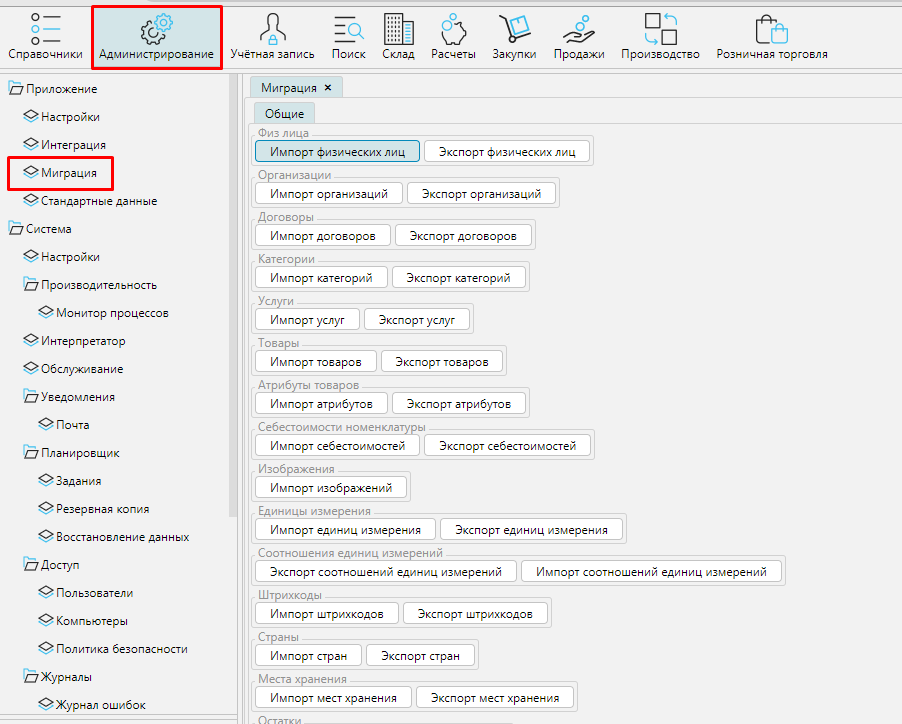

Чтобы начать работать в MyCompany необходимо загрузить в систему основные данные, например товары и услуги, с которыми вы работаете, их характеристики, список партнеров, банков, счетов и т.д. Все данные можно ввести в ручную, создавая объекты как описано далее в инструкциях. Но можно существенно сэкономить время и использовать возможности импорта/экспорта данных.

Чтобы импортировать данные в MyCompany необходимо перейти в **Администрирование**- **Миграция** - **Общие**.

Нажмите кнопку **Импорт** нужного объекта, выберите файл с данными и нажмите **ОК**.

Чтобы данные были корректно импортированы, необходимо использовать файл xlsx заданного формата. 
Формат экспорта соответствует формату импорта. Поэтому, чтобы получить шаблон для импорта данных, нажмите кнопку **Экспорт...**  соответствующего объекта и полученный xlsx файл используйте в качестве шаблона для импорта. 

[//]: # (Примеры файлов для каждого импортируемого объекта приведены ниже.)

[//]: # (Вы можете использовать приведенные файлы для загрузки в свою систему и обучения на реальных данных.)

[//]: # (Чтобы перенести свои данные из другой системы, выгрузите их в формате ниже приведенных файлов, и легко загрузите в MyCompany.)

[//]: # (-   [Единицы измерения]&#40;attachments/1802577.xlsx&#41;)

[//]: # (-   [Категории товаров]&#40;attachments/1802579.xlsx&#41;)

[//]: # (-   [Товары]&#40;attachments/1802587.xlsx&#41;)

[//]: # (-   [Услуги]&#40;attachments/1802588.xlsx&#41;)

[//]: # (-   [Штрихкоды]&#40;attachments/1802590.xlsx&#41;)

[//]: # (-   [Атрибуты]&#40;attachments/1802574.xlsx&#41;)

[//]: # (-   [Налоги на реализацию]&#40;attachments/1802581.xlsx&#41;)

[//]: # (-   [Налоги на закупку]&#40;attachments/1802581.xlsx&#41;)

[//]: # (-   [Места хранения]&#40;attachments/1802580.xlsx&#41;)

[//]: # (-   [Остатки]&#40;attachments/1802584.xlsx&#41;)

[//]: # (-   [Организации]&#40;attachments/1802583.xlsx&#41;)

[//]: # (-   [Физические лица]&#40;attachments/1802589.xlsx&#41;)

[//]: # (-   [Банки]&#40;attachments/1802575.xlsx&#41;)

[//]: # (-   [Банковские счета]&#40;attachments/1802576.xlsx&#41;)

[//]: # (-   [Кассовые счета]&#40;attachments/1802578.xlsx&#41;)

[//]: # (-   [Статьи ДДС]&#40;attachments/1802585.xlsx&#41;)

[//]: # (-   [Страны]&#40;attachments/1802586.xlsx&#41;)

[//]: # (-   [Спецификации]&#40;attachments/1802596.xlsx&#41;)

[//]: # (-   [Строки спецификаций]&#40;attachments/1802597.xlsx&#41;)

[//]: # (-   [Производственные номенклатуры спецификаций]&#40;attachments/1802595.xlsx&#41;)

  

  

