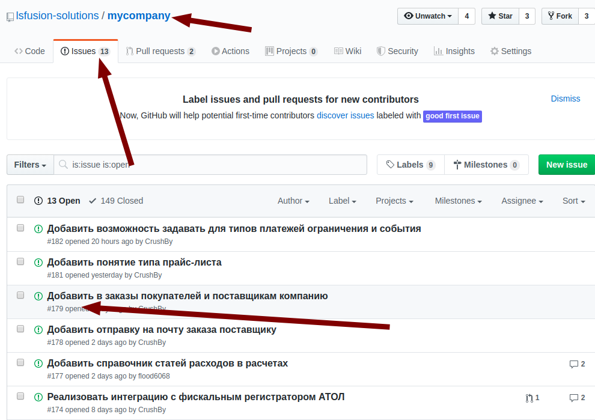

MyCompany - это бесплатная открытая система управления бизнесом. Мы приветствуем разработчиков, которые хотят внести свой вклад в развитие продукта!

#### Что бы Вы могли добавлять свои разработки в код [MyCompany](https://mycompany.lsfusion.org/) необходимо придерживаться следующего алгоритма:

  

Создать ответвление репозитория MyCompany для своей учетной записи GitHub

Необходимо авторизоваться на **GitHub**, перейти в репозиторий  MyCompany ** <https://github.com/lsfusion-solutions/mycompany.git> **под своим пользователем и нажать кнопку **Fork**.

  

  

После этого автоматически создастся связанная копия репозитория MyCompany  в Вашей учетной записи.

  

Создать новый проект в Intellij IDEA из репозитория GitHub

  

В строку подключения надо вставить адрес созданного в Вашей учетной записи репозитория.

  

  

ВНИМАНИЕ!

 Убедитесь, что подключаетесь к своему репозиторию

Выбрать на основном репозитории задачу для реализации

Перейдите в основной репозиторий и выберите в списке ISSUES задачу, которую хотите реализовать, изучите ее постановку.

  

  

Создать в IntelliJ IDEA ветку (Brunch) для выбранной задачи

Выберите в настройках Git IntelliJ IDEA пункт меню **Branches**

  

  

Внимание!

Если в Вашем репозитории уже есть несколько веток, то их нужно создавать только от ветки Local master. Иначе в изменениях будет очень много файлов и архитектор, который будет проводить ревизию кода, просто отклонит ваши изменения!

Внести изменения в код

Проверьте, что находитесь в своей новой ветке.

Внесите свои изменения в код.

Сделать Commit

После того, как Вы внесли изменения, необходимо сделать "commit". 

  

 

  

К нему обязательно надо написать комментарий. 

  

Сделать замену кода из родительского репозитория

  В процессе Вашей разработки исходные коды проекта (upstream) могли быть изменены другими участниками и Ваш "commit" может быть сильно увеличен за счет чужих изменений, поэтому перед отправкой изменений обязательно надо сделать замену кода из родительского репозитория **Rebase my GitHub Fork** , выбрать upstream: https://github.com/lsfusion-solutions/mycompany.git и сделать "push" Ваших изменений.

  

Запросить присоединить изменения к основному проекту

Для того, чтобы запросить присоединение Ваших изменений (Commit) к основному проекту (Pull Request) необходимо перейти в VCS - Git,  выбрать **Create Pull Request**, выбрать удаленный репозиторий upstream: <https://github.com/lsfusion-solutions/mycompany.git>

  

  

Внимание!

Base fork: lsfusion-solutions:mycompany

Base branch: master

Если вы сделаете другие настройки "pull request", то ваш запрос будет отклонен.

Проверить, дошел ли запрос

Чтобы проверить, дошел ли Ваш запрос, необходимо зайти в  https://github.com/lsfusion-solutions/mycompany/pulls , и проверить, есть ли он там.

После ревизии кода техническим руководителем он будет добавлен в основной проект, или отклонен, или запрошена доработка.

Возможные проблемы

-   Нет репозитория upstream при выборе Rebase или Pull Request

Его надо добавить через Remotes    

  

-   Нет доступа к **upstream**

Необходимо переназначить ссылку на upstream на https://github.com:/lsfusion-solutions/mycompany.git

## Изучить язык lsFusion и установить все необходимые инструменты разработчика

MyCompany разработано на платформе [lsFusion](https://ru.lsfusion.org/) .

Необходимую документацию по платформе и языку lsFusion можно найти [тут](https://ru-documentation.lsfusion.org/)

  
