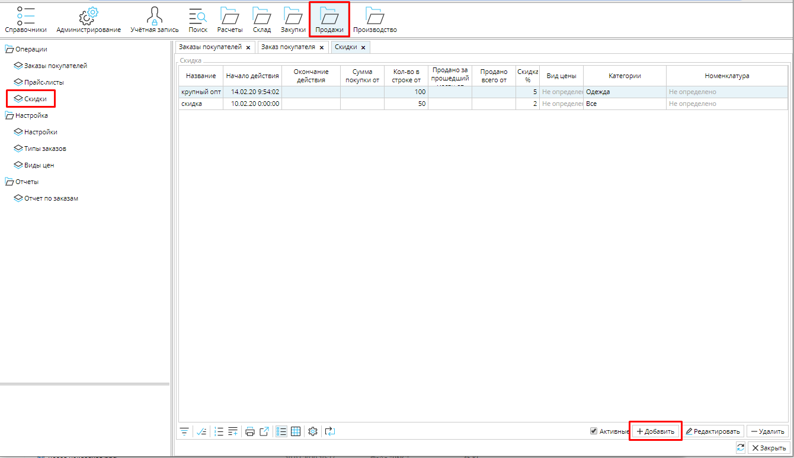
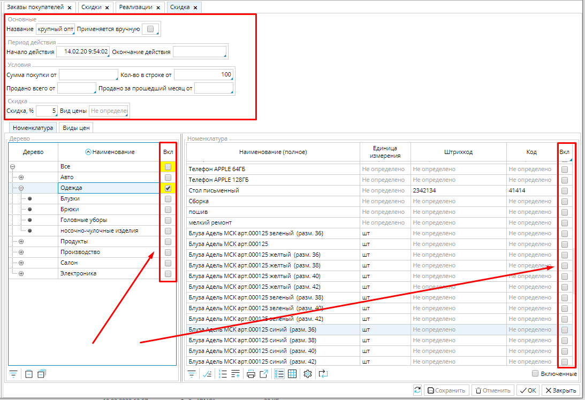
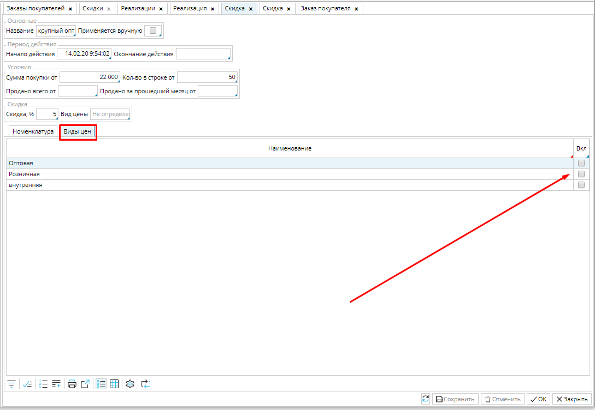
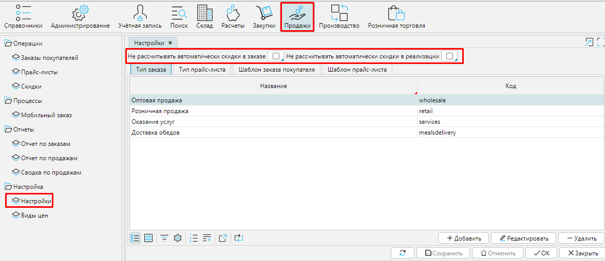

В MyCompany вы можете настроить скидки, которые будут применяться автоматически при продаже товаров в соответствии с выбранными вами параметрами. Кроме того, что это существенно экономит ваше время, вы получаете инструмент, позволяющий в несколько кликов учитывать особенности каждого клиента, а также вовремя проявлять лояльность и создавать выгодные для себя ситуации.

Список уже настроенных скидок вы найдете в **Продажи - Скидки**. 

### Рис. 1 Список скидок

  

Чтобы настроить скидку, нажмите кнопку **Добавить** и установите необходимые параметры в окне скидки. 

### Рис. 2 Настройка параметров скидки

  

**Название** - используйте краткое, но "говорящее" название скидки, чтобы было проще ориентироваться в списке скидок.

**Применяется вручную** - если вы включите эту опцию (поставите галочку), то чтобы применить скидку в заказе или реализации, необходимо будет кликнуть в поле ***Скидка*** и выбрать скидку из списка. Если опция не включена, то скидка будет применяться автоматически при соблюдении условий скидки. 

**Начало/ Окончание действия** - установите срок действия скидки. По умолчанию началом действия скидки будет установлена дата и время ее создания. 

Задайте условия, при которых будет применяться скидка:

**Сумма покупки от** - укажите общую сумму покупки (заказа или реализации) без учета налогов, начиная с которой будет применяться скидка. Скидка будет применена к каждому наименованию товаров в покупке.

**Количество в строке от** - укажите количество товаров одного наименования, начиная с которого будет применяться скидка. Скидка будет применена к каждому наименованию товаров в покупке, количество которого будет больше, либо равно указанному. 

**Продано всего от** - укажите количество товара, и при достижении данного уровня продаж, к товару будет применяться скидка

**Продано за прошедший месяц от** - укажите количество товара, и при достижении данного уровня продаж в предыдущем месяце, к товару будет применяться скидка.

Если вы задаете несколько условий применения скидки, то действует логика сложения условий. Например, если вы укажите ***сумму покупки от 20000 и количество в строке от 100***, то скидка будет применяться, если стоимость покупки без учета налогов будет равна или более 20000 и только к тем наименованиям товаров, количество которых будет не менее 100 единиц.

Размер скидки можно установить несколькими способами:

**Скидка %** - укажите процент, на который уменьшиться цена товаров, или

**Вид цены** - укажите [вид цен](Price_type_settings.md), который будет применяться к товарам, подходящим под параметры скидки (например, можно применить оптовые цены в розничном заказе).

Во вкладке **Номенклатура** отметьте (***галочка Вкл***.) группы товаров или отдельные товары, к которым будет применяться скидка.

Во вкладке **Виды цен**, вы можете указать (***галочка Вкл***.) к каким видам цен будет применяться скидка. По умолчанию скидка применяется ко всем видам цен.

### Рис. 3 Настройка видов цен в скидке

  

Сохраните скидку.

Настроенные вами скидки будут применяться  автоматически, чтобы они не применялись автоматически, необходимо установить соответствующие настройки в **Продажи - Настройки**. В зависимости от вашего желания и необходимости, можно настроить (поставить галочки) **Не рассчитывать автоматически скидки в** **заказе** и/или **Не рассчитывать автоматически рассчитывать скидки в реализации.**

### Рис. 4 Настройка автоматического расчета скидок

  

  
