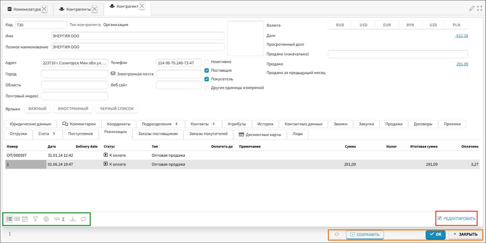
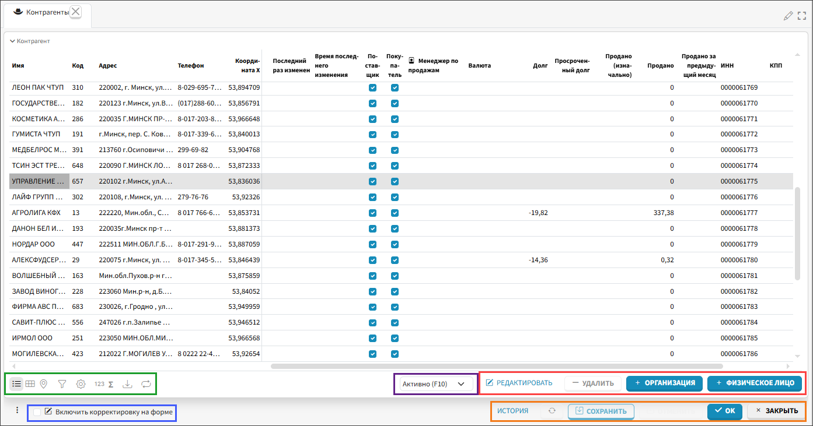
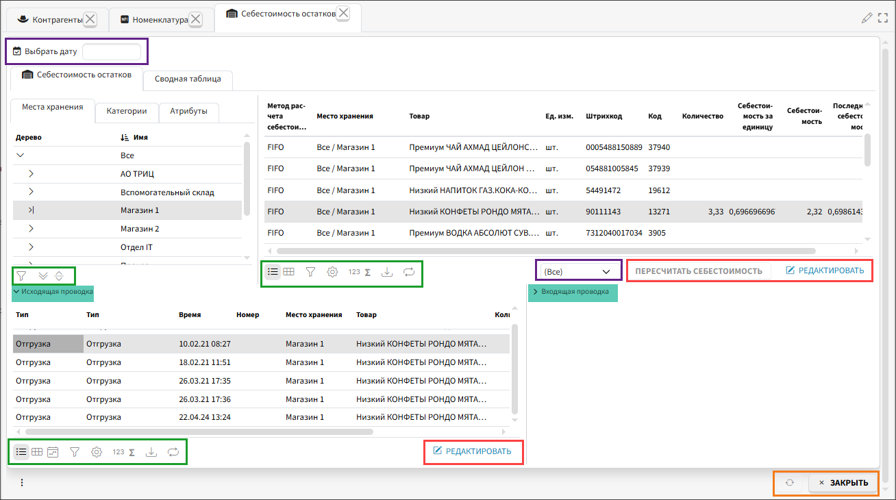
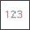
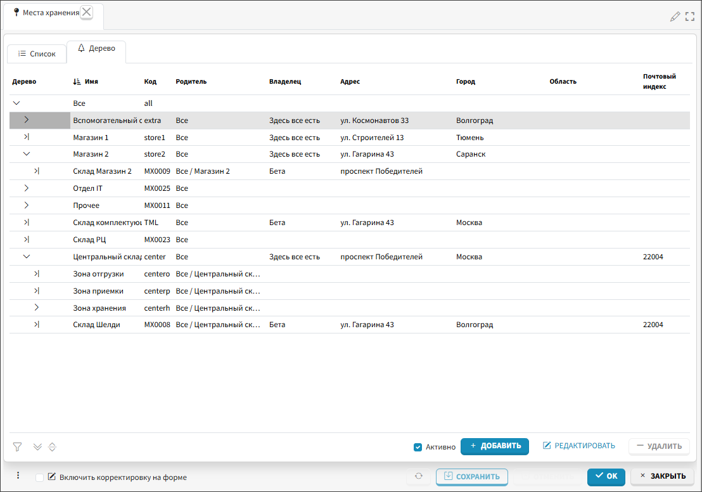
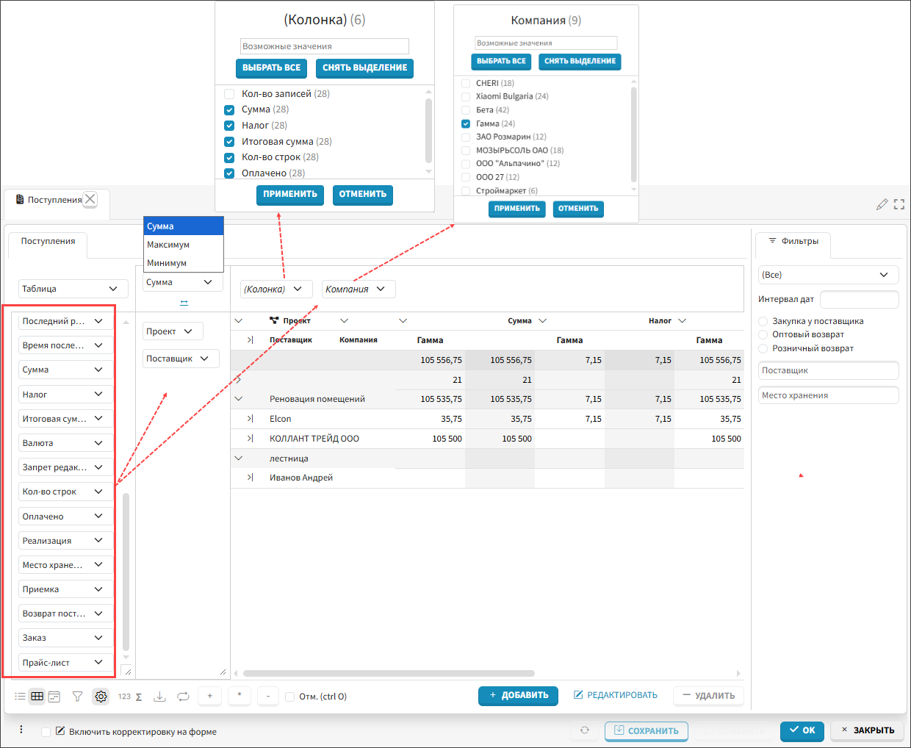
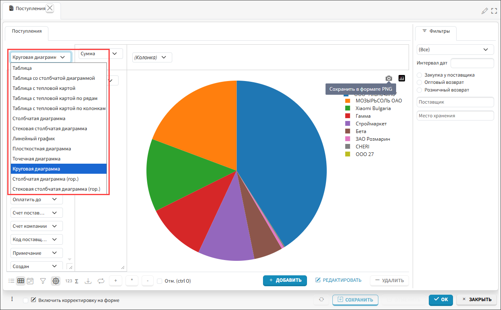
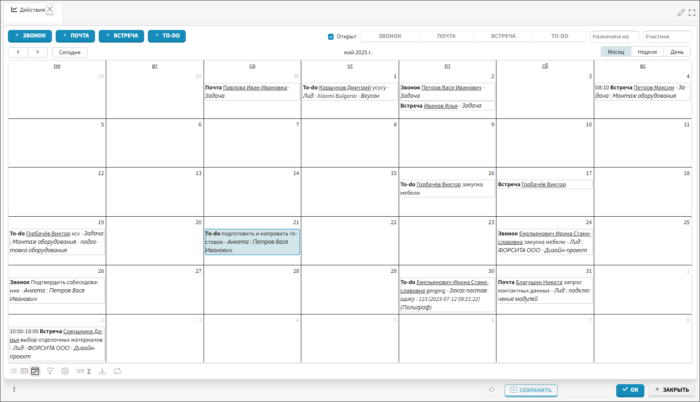
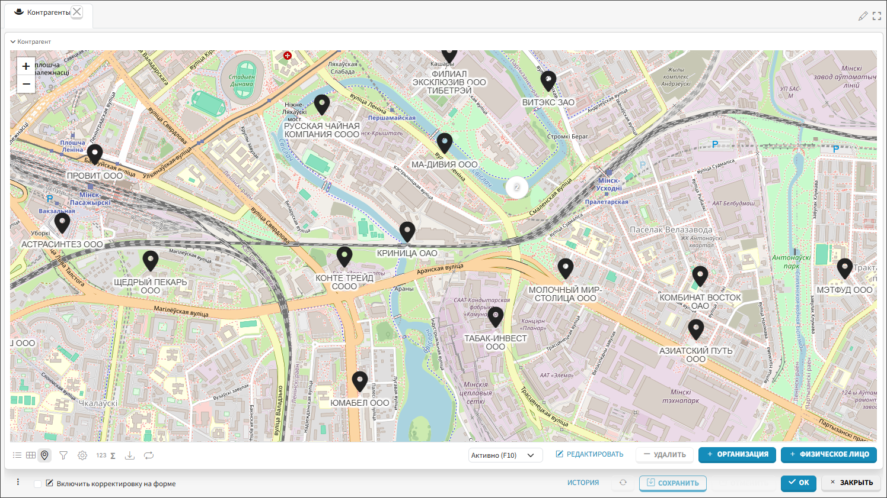

Каждая форма отображает данные по одному (рис. 1) или нескольким (рис. 2) объектам и позволяет выполнять с ними 
действия. 
Формы могут 
быть простыми (рис. 2), состоящими из одного дерева или таблицы, и комбинированными (рис. 3), состоящими из нескольких 
взаимосвязанных 
блоков таблиц и деревьев. Обычно в комбинированных формах отображение данных взаимосвязано: например, на форме с 
остатками в списке товаров отображаются только остатки по товарам, которые относятся к 
выделенному складу в дереве мест хранения (рис. 3).  

 
*Рис. 1 Форма одного объекта*

 
*Рис. 2 Форма со списком объектов*

 
*Рис. 3 Комбинированная форма*

## Основные элементы интерфейса формы

На формах можно выделить стандартные элементы, которые на рисунках 1, 2, 3 выделены цветом. 

 Зеленой рамкой выделена панель инструментов, которая позволяет выполнять ряд действий:

-  кнопки переключения режима отображения данных (подробнее).
-  кнопка вызова настраиваемого фильтра (подробнее о фильтрах). 
-  кнопка вызова окна настроек отображения табличных списков (подробнее о 
  настройке таблиц).
-  подсчет количества записей на форме.
-  подсчет суммы значений в колонке
-  экспорт в Excel. Экспортируется выборка данных на форме, с сохранением упорядочивания и группировок.
-  включение режима ручного обновления. По умолчанию все внесенные в приложение 
  изменения сразу отображаются у всех пользователей. При включении режима ручного обновления данных появляется 
  кнопка **Обновить**, и данные обновляются только по кнопке принудительно. Если во время работы с данными они были изменены, отображение данных становится блеклым. Ручное обновление позволяет снизить нагрузку на сервер и удобно при формировании группировок представлений с большим объемом данных.
-  раскрывает текущий уровень дерева.
-  раскрывает все уровни дерева.
 
 Красной рамкой выделены функциональные кнопки, позволяющие производить действия с 
объектами на форме. К таким действиям обычно относится возможность создавать, копировать, удалять, редактировать 
объекты и т.п. 

 Оранжевой рамкой выделены функциональные кнопки, позволяющие производить действия на 
форме:

-  принудительное обновление данных на форме.
- **Сохранить** - сохраняет изменения, внесенные на форме.
- **Отменить** - отменяет изменения (не сохраненные), внесенные на форме.
- **ОК** - сохраняет изменения, внесенные на форме, и закрывает форму.
- **Закрыть** - закрывает форму.

 Синей рамкой выделена функция **Включить корректировку на форме**, которая включает 
возможность корректировать данные по объектам, представленным на форме, непосредственно на форме, не открывая форму корректируемого объекта. После внесения таких корректировок необходимо использовать кнопки **Сохранить** или **ОК** для сохранения внесенных корректировок.

 Фиолетовой рамкой выделены фильтры на форме, которые определяются в коде 
приложения. Фильтры могут выглядеть как поля с выбором значений, или признаки с флажком. Соответственно на форме 
отображаются только объекты, которые соответствуют установленным фильтрам. 

 Блоки (контейнеры) с данными, из которых состоят формы, можно сворачивать, тогда 
информация, размещенная в этих блоках не отображается и не занимает место на экране. Зеленым фоном на рисунеке 
3 отмечены названия блоков в свернутом и развернутом состоянии.

[//]: # (TODO вставить ссылки на соответствующие заголовки в индивидуальных настройках и работе с данными)

## Режимы отображения данных

В приложениях могут использоваться 2 базовых режима отображения данных: **дерево** и **таблица**. Для таблицы также 
возможно отображение в режиме **сводной таблицы**, **календаря** и **карты**. 

### Дерево

Это представление служит для отображения и управления объектами с иерархической структурой.

 
*Рис. 4 Режим отображения "Дерево"*

### Таблица

Табличное представление данных является основным в системе. Рядами в таблице являются объекты, а колонками - 
их свойства. Пример табличного режима отображения данных представлен на рисунке 2. Из режима таблицы можно перейти в 
режим сводной таблицы, календаря или карты. Чтобы вернуться в табличное представление используют кнопку 
.

### Сводная таблица

Режим отображения сводная таблица позволяет сформировать и визуализировать оперативный отчет. Для 
переключения на сводную таблицу нужно использовать кнопку  в панели инструментов. 

Пользователь 
выбирает данные для добавления в область строк, столбцов и значений и интерпретирует полученный результат. Для создания отчета могут быть использованы все доступные на форме колонки. Для группировки данных соответствующие колонки надо переместить методом drag-and-drop в область строк.  Колонки с числовыми значениями и подсчет количества записей предопределены в фильтре **Колонка**, где пользователь отмечает необходимые ему данные. Если для анализа необходимо использовать значения других колонок, не указанных в фильтре, их надо переместить в область столбцов. По каждому столбцу можно выбрать значения, которые будут использоваться. Числовые данные интерпретируются в разрезе суммы, максимального или минимального значения. В представлении поддерживаются механизмы упорядочивания и фильтрации.

Построенный отчет может быть выгружен в Excel с сохранением всех группировок кнопкой  в панели инструментов. Кнопка 
в режиме сводной таблицы управляет отображением настроек таблицы

 
*Рис. 5 Режим отображения "Сводная таблица"*

Полученные сводные данные можно визуализировать с помощью тепловых карт и различных диаграмм, которые можно экспортировать в отдельное изображение.

 
*Рис. 6 Визуализация в режиме "Сводная таблица"*

### Календарь

В этом режиме данные отображаются в календарной сетке. Перейти в режим можно по кнопке . Данные 
могут отображаться за месяц, неделю или день. Изменить дату объекта можно перетянув его в другую ячейку. Данные можно листать кнопками по месяцам/неделям/дням, в зависимости от выбранного варианта отображения.  Кнопка **Сегодня** перемещает курсор на текущую дату. 

 
*Рис. 7 Режим отображения "Календарь"*

### Карта

В режиме карты список объектов отображается в виде точек на карте. Для этого у объектов должны быть предусмотрены 
поля для указания координат. В этом режиме можно редактировать данные (например, перетянуть точку), и они будут 
сохранены, как если бы изменения вводились в табличном представлении. Для переключения в режим карты используют 
кнопку  на панели инструментов.

 
*Рис. 8 Режим отображения "Карта"*
