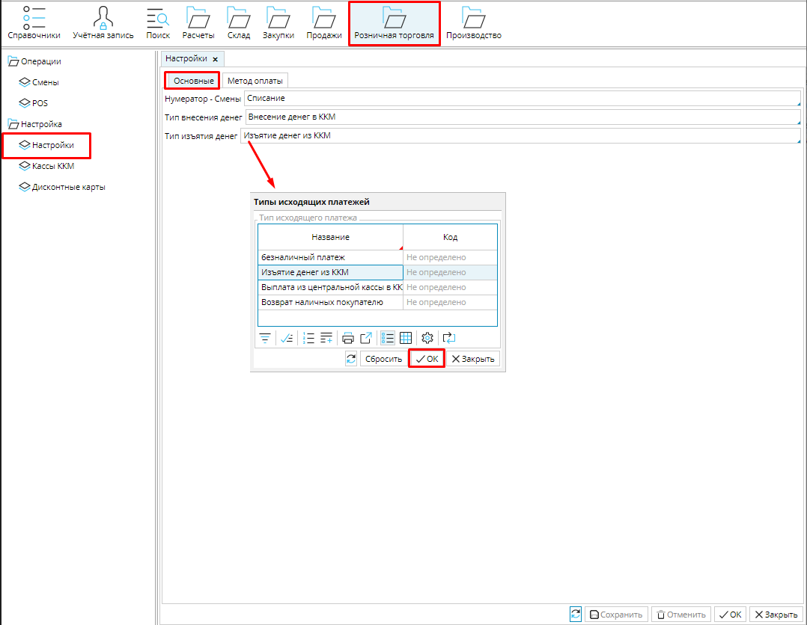
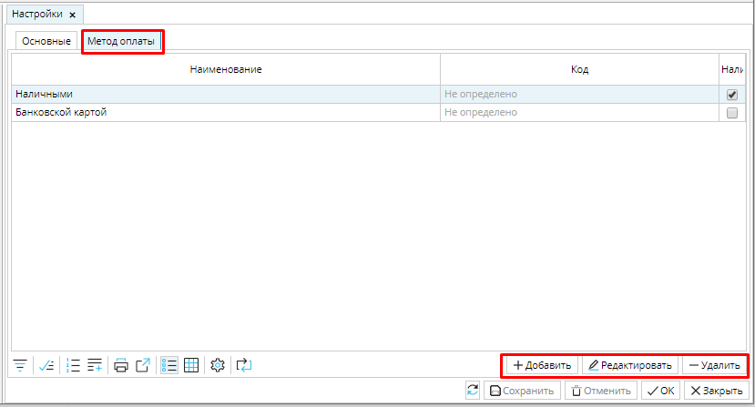
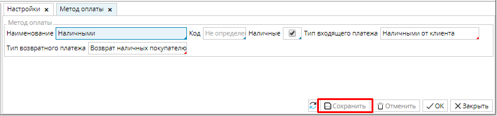

Для слаженной работы модуля необходимо осуществить некоторые настройки в **Розничная торговля** - **Настройки**.

## **Вкладка Основные**

### Рис. 1 Основные настройки

  

**Нумератор - Смена **- выберите [**нумератор**](Numerators.md) для формирования уникального идентификатора кассовых смен 

**Тип внесения денег** - выберите [**тип входящего платежа**](Payment_type.md), который будет создаваться при внесении разменных денег в кассы.

**Тип изъятия денег** - выберите [**тип исходящего платежа**](Payment_type.md), который будет создаваться при выемке денег из кассы.

## ** Вкладка Метод оплаты**

### Рис. 2 Список методов оплаты

  

На вкладке Метод оплаты необходимо настроить те методы оплаты, которые принимаются на кассе.  Список методов формируется с помощью кнопок **Добавить**, **Редактировать** и **Удалить**.  

  

### Рис. 3 Настройка метода оплаты

  

Чтобы создать метод оплаты, нажмите **Добавить** и укажите свойства метода оплаты.

**Наименование** - введите имя метода оплаты.

**Код** - служит для идентификации метода

**Наличные** - отметьте галочкой, если для оплаты используются наличные денежные средства

**Тип входящего платежа** - выберите [**тип входящего платежа**](Payment_type.md), который будет сформирован в системе при получении оплаты данным методом. 

**Тип возвратного платежа** - выберите [**тип исходящего платежа**](Payment_type.md), который будет сформирован в системе, при осуществлении возврата оплаты, проведенной данным методом.

**Сохраните** настройки

  

  

