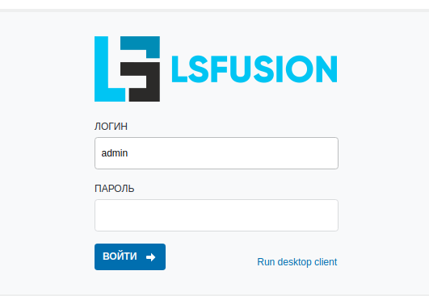

Для установки решения потребуется сервер под управлением операционной системы Linux или Windows с подключением к Интернет.

На нем должно быть минимум 4 гигабайта оперативной памяти и должны быть открыты порты 8080 для работы веб-клиента и 7652 для работы десктоп-клиента.

### RHEL 8+ / CentOS 8+ / Fedora 35+
```
source <(curl -s https://download.lsfusion.org/solutions/install-mycompany-centos8-ru.sh)
```

### RHEL 7 / CentOS 7
```
source <(curl -s https://download.lsfusion.org/solutions/install-mycompany-centos7-ru.sh)
```

### Ubuntu 18+ / Debian 9+
```
source <(curl -s https://download.lsfusion.org/solutions/install-mycompany-ubuntu18-ru.sh)
```

Лог запуска сервера lsFusion можно посмотреть в /var/log/lsfusion5-server/start.log .

Чтобы увеличить количество памяти, выделяемую приложению, нужно отредактировать параметр -Xmx в файлах /etc/lsfusion5-server/lsfusion.conf и /etc/lsfusion5-client/lsfusion.conf. После этого необходимо перезапустить службы.

### Windows

Скачать установщик и запустить [MyCompany-1.0-x64.exe](https://download.lsfusion.org/solutions/MyCompany-1.0-x64.exe) или [MyCompany-1.0.exe](https://download.lsfusion.org/solutions/MyCompany-1.0.exe)

### Войти в MyCompany

1.  Открыть в броузере web-интерфейс MyCompany <http://ip-вашего-сервера:8080>
2.  В открывшемся окне авторизоваться под пользователем **admin** без пароля



  

  


