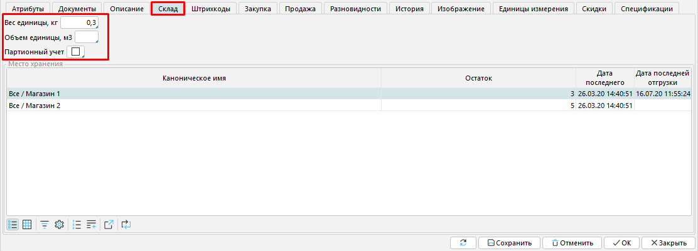

**Номенклатура** - это перечень товаров и услуг, с которыми вы работаете. Создание и редактирование номенклатуры товаров и услуг происходит в закладке **Справочники- Номенклатура**. 

Рабочий стол вкладки **Номенклатура** состоит из трех блоков. В левом верхнем блоке **Дерево** в иерархическом порядке отображаются категории, в правом блоке **Номенклатура** отображаются товары и услуги выбранной в левом верхнем блоке категории, в левом нижнем блоке **Атрибуты** можно просмотреть изображение выбранного товара/услуги либо отфильтровать список номенклатуры по [атрибутам](Attributes.md).  

#### Рис. 1 Вкладка Номенклатура

  

Для создания нового товара или услуги нажмите соответствующую кнопку **+Товар** или **+Услуга**. Откроется форма номенклатуры, в которую необходимо внести информацию. Форма состоит из двух частей. В шапке указывается основная информация о товаре/услуге, во вкладках подробные характеристики.

#### Рис. 2 Форма Номенклатуры

## **Заполнение шапки** {#Itemhead}

**Наименование** - краткое название товара для быстрой идентификации. Если задана основная номенклатура, наименование заполняется автоматически в соответствии с основной номенклатурой и не может быть изменено.

**Наименование (полное)** - поле заполняется автоматически, содержит наименование или имя основной номенклатуры (если задано), и последовательно значения всех заданных атрибутов. Полное наименование отображается в списке номенклатур.   

**Основная номенклатура** - товар или услуга, разновидностью которой является создаваемая номенклатура. Чтобы указать основную номенклатуру, кликните в поле, откроется окно номенклатур (см. рис. 1), где необходимо выбрать нужную позицию из списка. 

**Категория** (полная) - категория, к которой относится товар или услуга. Автоматически устанавливается категория, которая была выбрана в блоке Дерево перед нажатием кнопки добавления товара или услуги. Чтобы изменить категорию, кликните в поле и выберите подходящую категорию из списка категорий, открывшегося по клику. В этом же окне можно добавить новую категорию.  

#### Рис. 3 Установка категории

  

**Код** - если настроен [нумератор ](http://documentation.luxsoft.by/pages/viewpage.action?pageId=72942230)проставляется автоматически.

Артикул - это поле предусмотрено для заполнения кода данного товара у поставщика.

Страна происхождения - по клику в этом поле открывается окно, где можно осуществить выбор страны происхождения товара. Если в списке отсутствует необходимое значение, создайте его с помощью кнопки Добавить.

**Штрихкод** - введите в поле штрихкод товара или услуги, который будет использоваться по умолчанию. Он отобразится во вкладке **Штрихкоды**. Штрихкодов может быть несколько, их можно добавить во вкладке **[Штрихкоды](https://mycompany-docs.lsfusion.org/pages/viewpage.action?pageId=1146994#id-Настройканоменклатуры-Вкладкаштрихкоды)**.

**GTIN** - код, используемый для ведения электронного документооборота.

**ТН ВЭД** - может быть введен вручную.

**Единица измерения** - единица измерения, в которой ведется учет товара/услуги. Чтобы установить единицу измерения кликните в поле и выберите единицу измерения в открывшемся окне, нажмите ОК. Если нужного значения в списке нет, вы можете [добавить единицу измерения](Units_of_measure.md#measurementunits-broken) в этом окне и выбрать ее. 

#### Рис. 4 Установка единицы измерения

  

**Плановая себестоимость** - укажите себестоимость товара/услуги, если используете плановый [метод расчета себестоимости](Categories.md#costingmethod-broken).

  

Укажите предназначен ли товар/услуга для закупки, продажи, или выберите оба варианта. Также можно сделать товар/услугу неактивными. В зависимости от выбора будут отображаться вкладки **Закупка** и **Продажи**, а товар/услуга будут доступны или не доступны  для добавления в документы  закупок и продаж.

## **Настройка вкладок** {#Itemtabs}

 **Атрибуты** -  в этой вкладке отображаются все [атрибуты](Attributes.md) товара или услуги и устанавливаются их значения.  Чтобы установить значение атрибута кликните в поле Значение и в открывшемся окне выберите нужное значение, нажмите **ОК**. Если нужного значения нет в списке, используйте кнопку **+Значение**.

#### Рис. 5 Вкладка Атрибуты

  

**Документы** - в этой вкладке отображаются все документы, касающиеся закупки и/или продажи товара/услуги, и складских операций с товаром. 

#### Рис. 6 Вкладка Документы

  

**Описание** - позволяет добавить более подробное описание продукта, его дополнительные характеристики и свойства, которые не отражены в [шапке номенклатуры](https://mycompany-docs.lsfusion.org/pages/viewpage.action?pageId=1146994#id-Настройканоменклатуры-Itemhead).

####   Рис. 7 Вкладка Описание

  

**Склад** - в этой вкладке указываются вес и объем товара. Также предусмотрена возможность партионного учета товара. Вкладка **Склад** недоступна в форме номенклатуры услуги. 

Рис. 8 Вкладка Склад

  

**Штрихкоды** - у каждой номенклатуры может быть несколько штрихкодов. В этой вкладке с помощью кнопки **Добавить** задаются новые штрихкоды. Штрихкод, для которого отмечена функция **По умолчанию**, отображается в [шапке номенклатуры](https://mycompany-docs.lsfusion.org/pages/viewpage.action?pageId=1146994#id-Настройканоменклатуры-Itemhead). 

#### Рис.9 Вкладка Штрихкоды

  

**Закупка** - эта вкладка отображается, если выбрана опция **Предназначен для закупки** в [шапке номенклатуры](https://mycompany-docs.lsfusion.org/pages/viewpage.action?pageId=1146994#id-Настройканоменклатуры-Itemhead). В ней отображаются прайс-листы поставщиков, в которых фигурирует данная номенклатура. В этой вкладке можно установить **Налоги поставщиков**, которые будут автоматически выставляться в документах закупки. Кликните в поле и выберите налог в открывшемся окне. Список налогов настраивается в **Расчеты-Налоги**.

#### Рис. 10 Вкладка Закупка

  

**Продажа** - эта вкладка отображается, если выбрана опция **Предназначен для продажи **в [шапке номенклатуры](https://mycompany-docs.lsfusion.org/pages/viewpage.action?pageId=1146994#id-Настройканоменклатуры-Itemhead). В ней отображаются ваши прайс-листы, в которых фигурирует данная номенклатура. В этой вкладке можно задать **Цену продажи** и установить **Налоги продаж** (аналогично **Налогам поставщика**),  которые будут автоматически выставляться в документах продажи.

#### Рис. 11 Вкладка Продажа

  

**Разновидности** - если данный товар или услуга является основной номенклатурой, то здесь отображаются ее разновидности, отличающиеся значениями атрибутов. При необходимости из этой вкладки можно создать новую разновидность номенклатуры. Нажмите кнопку **+Разновидность**, откроется новая форма номенклатуры, где будут автоматически заполнены поля, наследуемые от основной номенклатуры.

#### Рис. 12 Вкладка Разновидности

  

**История** - в этой вкладке отражены действия, которые были произведены над конкретным товаром либо услугой, и повлекли изменения в их характеристиках.

####   Рис. 13 Вкладка История

  

**Изображение** - используйте кнопку **Загрузить**, чтобы добавить изображение продукта или услуги. 

#### Рис. 14 Вкладка Изображение

  

**Единицы измерения** - вкладка содержит единицы измерения, в которых возможен учет товаров и услуг. Отметка **Используются** позволяет отразить только те единицы измерения, которые применены к данной позиции.

####   Рис. 15 Вкладка Единицы измерения

  

### Скидки** - здесь отображаются скидки, которые могут быть применены к товару/услуге. [Добавить/изменить скидку](Discount_settings.md) можно в **Продажи-Скидки.

####   Рис. 16 Вкладка Скидки

  

**Спецификации** - если товар является результатом производства в соответствии с определенной спецификацией, то эта спецификация(и) отображаются на данной вкладке. Здесь же можно редактировать, удалить или создать новую спецификацию для товара. 

#### Рис. 17 Вкладка Спецификация

  

  

  
