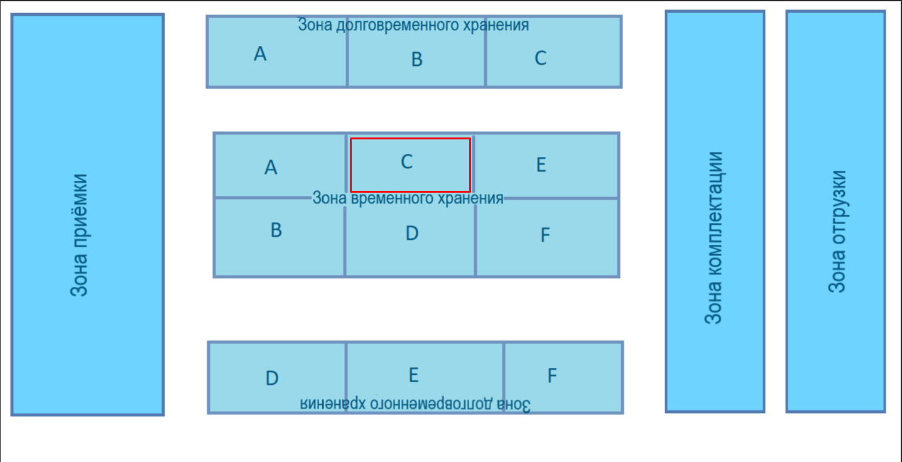
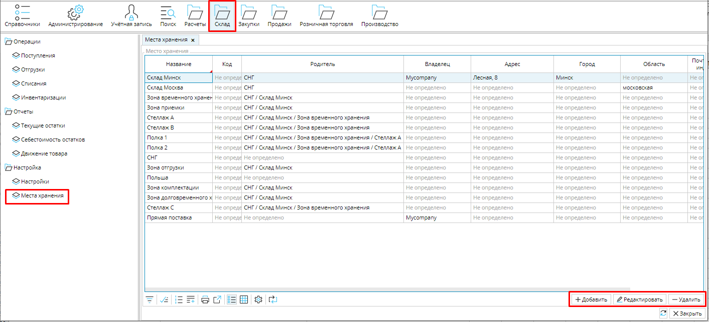
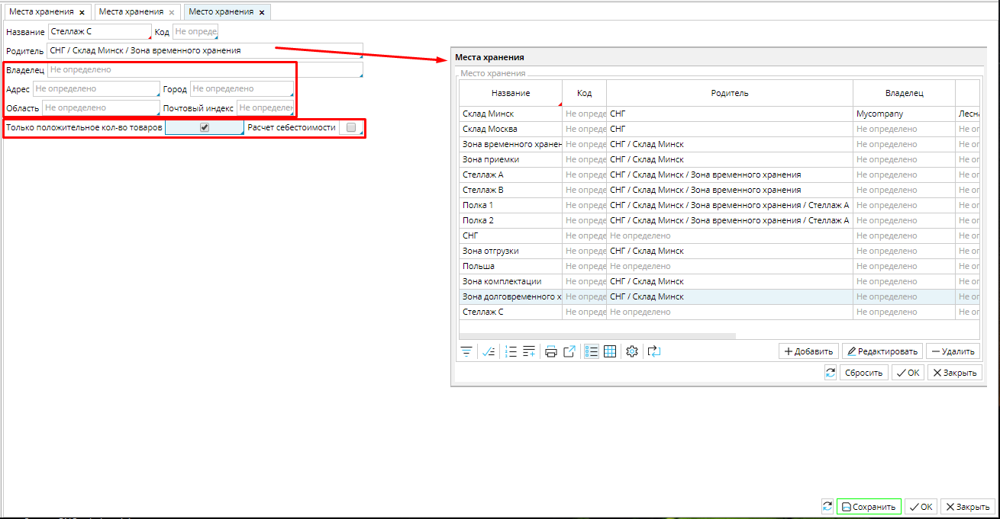

Независимо от того, каким методом размещения товаров на складе вы пользуетесь, вы сможете настроить систему складов в MyCompany для удобного использования вашими сотрудниками как для приемки и размещения товаров,  быстрой комплектации заказов и отгрузки,  так и для учета движения товаров по складам и внутри склада благодаря реализации системы адресного хранения. 

Предположим, ваш склад, назовем его по географическому принципу Склад Минск, имеет следующую структуру: зону приемки, зоны долгосрочного и временного хранения, зоны комплектации и отгрузки. Зоны хранения имеют стеллажи, обозначенные латинскими буквами, а каждый стеллаж в свою очередь может иметь полки, ячейки и т.д.

#### Рис. 1 Схема Склада Минск

  

Для того, чтобы легко найти любой товар, мы можем настроить каждый стеллаж, полку или ячейку, в зависимости от ваших потребностей, как иерархическую структуру **Мест хранения**. Для этого создадим в системе **место хранения** ***Склад Минск***, в нем  создадим каждую зону как место хранения, а в зонах долговременного и временного хранения создадим  места для каждого стеллажа, в стеллажах для полок, и так далее, до самых мелких ячеек, при необходимости.   

В **Склад - Места** хранения вы найдете список существующих складов и сможете создать новые. 

#### Рис. 2 Список Мест хранения

  

### *Например, создадим место хранения Стеллажа С Зоны временного хранения (см рис. 1).*

Нажмите **Добавить** и заполните данные нового места хранения.

Укажите **Название ** - ***Стеллаж  С***.   

Далее выберите **Родителя**  (склад или зону, в которой находится данное место хранения) - кликните в поле и выберите родительское место хранения из открывшегося списка: ***Зона временного хранения***. 

**Владелец** - компания, которой принадлежит склад. По клику в поле открывается список компаний, выбирайте подходящую и нажимайте ОК.

**Адрес** - адрес склада.

Данные **Владельца** и **Адрес ** целесообразно указывать для места хранения, которое соответствует физически существующему складу, а не отдельной зоне. Поэтому в данном случае поля не заполняем. 

**Только положительное количество товаров** - если эта опция активирована, то система не позволит создать отрицательный остаток товара на складе, т.е. отгрузить товаров больше, чем есть. 

**Расчет себестоимости** - эту опцию необходимо активировать, чтобы автоматически происходил расчет себестоимости товаров и их списание в соответствии с методом (FIFO, плановый или средняя себестоимость), указанным для категории товаров. Достаточно активировать опцию для родительского места хранения, и она будет применяться ко всем вложенным.

**Сохраните** новое место хранения.

#### Рис. 3 Создание Места хранения

  

  
