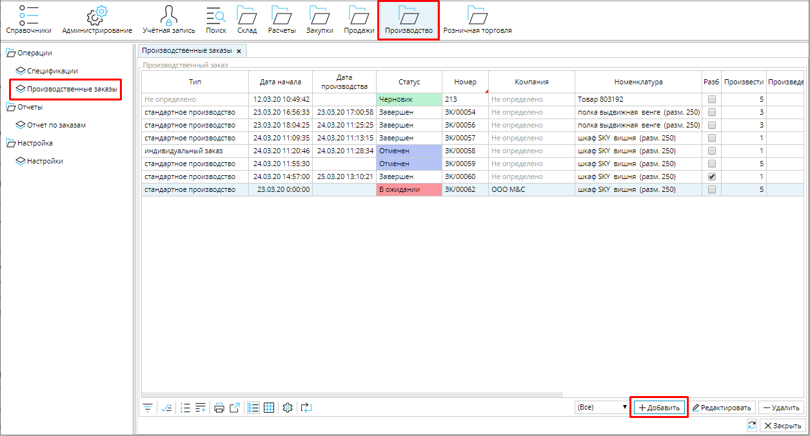
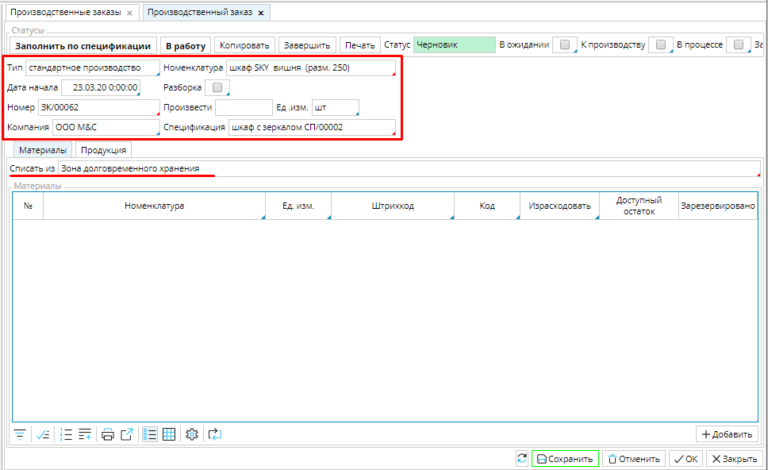
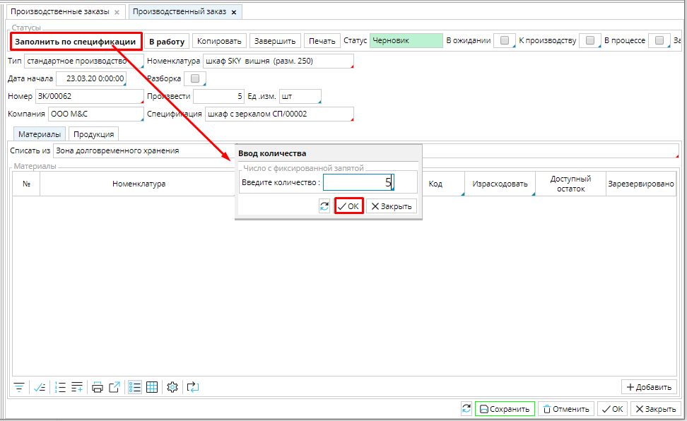
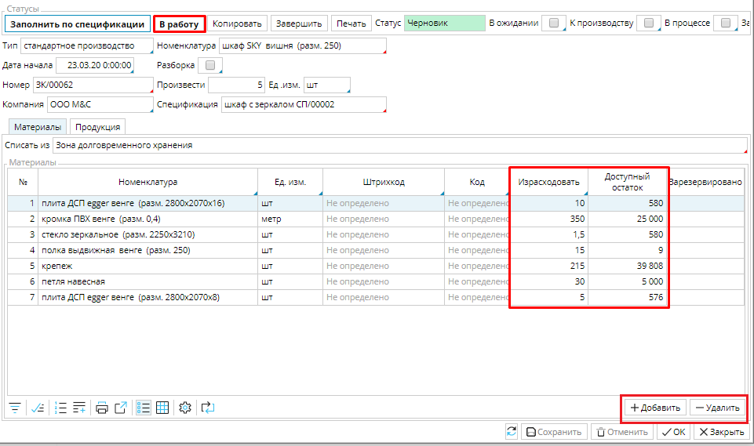
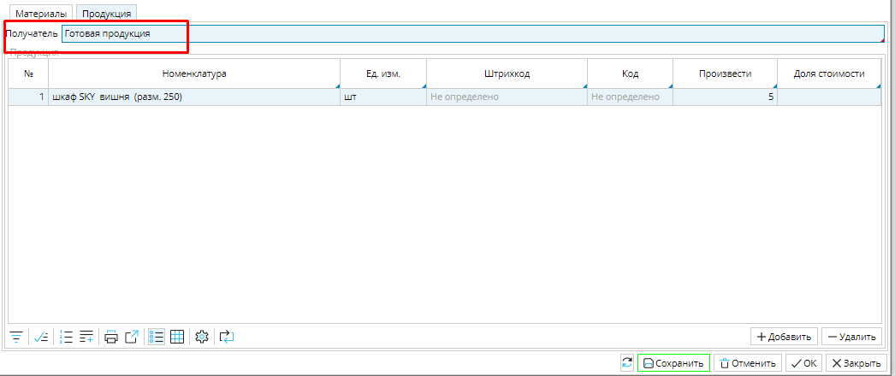
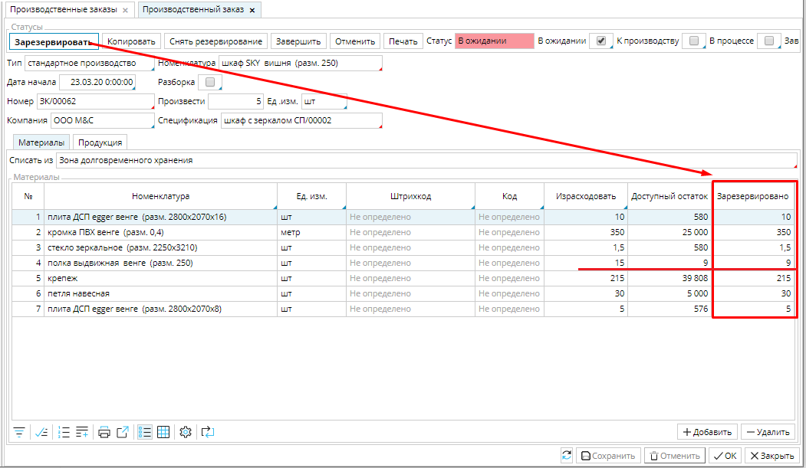
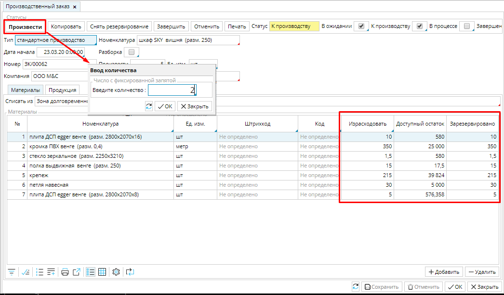
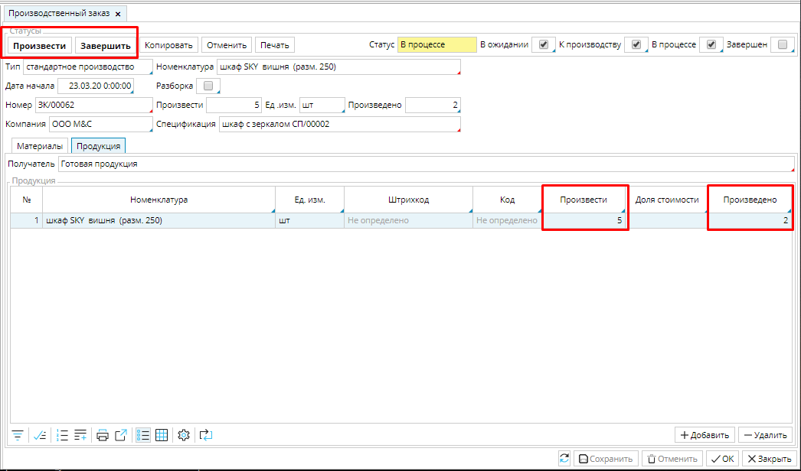
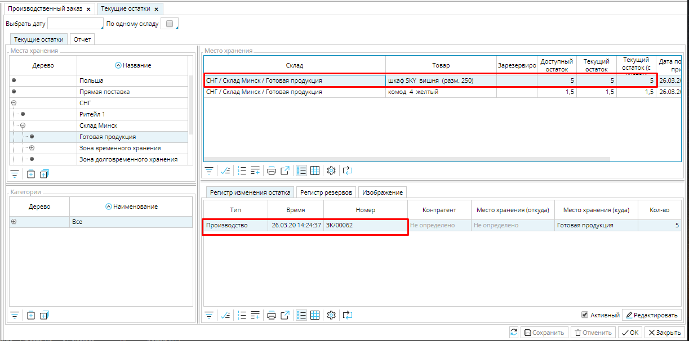

Чтобы поставить задачу на производство чего-либо, необходимо создать производственный заказ. Для этого надо перейти в **Производство** - **Производственные заказы**, где отображается список всех заказов на сборку/ разборку, и нажать кнопку **Добавить**.  

### Рис. 1  Список производственных заказов

  

Откроется форма нового заказа, где надо заполнить основные данные.

### Рис. 2 Новый заказ

  

**Тип ** - необходимо указать [**тип производственного заказа**](Manufacturing_order_type.md).

**Номенклатура** - укажите товар, который будет произведен в результате выполнения заказа, для этого надо кликнуть в поле и выбрать товар из открывшегося списка номенклатур.

**Дата начала** - в поле будут автоматически установлены дата и время создания заказа. При необходимости дату и время начала выполнения заказа можно изменить.

**Разборка** - отметьте данное свойство, если это [**заказ на разборку**](Unbuild_order.md).

**Номер** - идентификационный номер заказа, можно вводить вручную или настроить [**нумератор**](Numerators.md).

**Компания** - укажите, какая из ваших компаний будет выполнять заказ.

**Ед. изм.** - наследуется от ***Номенклатуры***, можно установить вручную, если не указана в карточке товара.

**Спецификация** - будет заполнена автоматически, если у товара, выбранного для производства, есть спецификация; если спецификаций несколько, автоматически будет указана спецификация ***по умолчанию***, чтобы выбрать другую, необходимо кликнуть в поле и в открывшемся окне выбрать нужную; если у товара нет спецификации, необходимо кликнуть в поле и в открывшемся окне нажать кнопку **Добавить** и [**создать спецификацию**](Bills_of_Materials.md).

**Списать из**  -  требуется указать [**место хранения**](Location_settings.md), откуда будут списаны компоненты для производства. Кликните в поле и выберите место хранения из списка. Все компоненты для производства по спецификации должны находиться в указанном месте хранения.

Когда заполнены исходные данные, необходимо нажать кнопку **Заполнить по спецификации** и в открывшемся окне указать количество товаров, которые необходимо произвести. 

### Рис. 3 Ввод количества товаров к производству

  

После этого на вкладке **Материалы** автоматически заполнится таблица материалов, в которой будет указано количество компонентов ( столбец ***Израсходовать***), необходимых для производства заданного количества продукции. Также будет отображен ***Доступный остаток*** компонентов в выбранном месте хранения. 

С помощью кнопок **Добавить**/ **Удалить** можно изменить состав материалов для конкретного заказа.  

 

### Рис. 4 Заполнение таблицы материалов

  

На вкладке **Продукция** будет указан производимый продукт и его количество. Здесь в поле **Получатель** необходимо указать место хранения, куда поступит готовая продукция. 

### Рис. 5 Вкладка Продукция

  

После того, как все данные заполнены, заказ можно отправлять **В работу** соответствующей кнопкой (рис. 4). 

Следующий шаг - зарезервировать компоненты для производства. Для этого необходимо нажать кнопку **Зарезервировать,** и компоненты, забронированные для производства по данному заказу будут отображены в таблице.

### Рис. 6 Резервирование компонентов для производства

  

Если доступно недостаточное количество компонентов, дальнейшая работа по заказу будет невозможна, пока запасы компонентов не будут пополнены до необходимого количества. Когда все необходимое количество комплектующих есть в наличии и зарезервировано, в заказе становится доступна кнопка **Произвести**. Необходимо нажать на эту кнопку и в открывшемся окне ввести количество единиц товара, которое надо произвести. Вы можете запустить на производство весь заказ, или выполнять его частями. 

### Рис. 7 Поступление заказа к производству

  

Количество произведенных единиц будет отражаться на вкладке **Продукция**. После того, как произведена хотя бы одна единица продукции, вы можете **Завершить** заказ, нажав на одноименную кнопку.

### Рис. 8 Произведенная продукция

  

Произведенная продукция отображается на складе только после завершения заказа.  

### Рис. 9 Готовая продукция отгружена на склад

  

  

  

