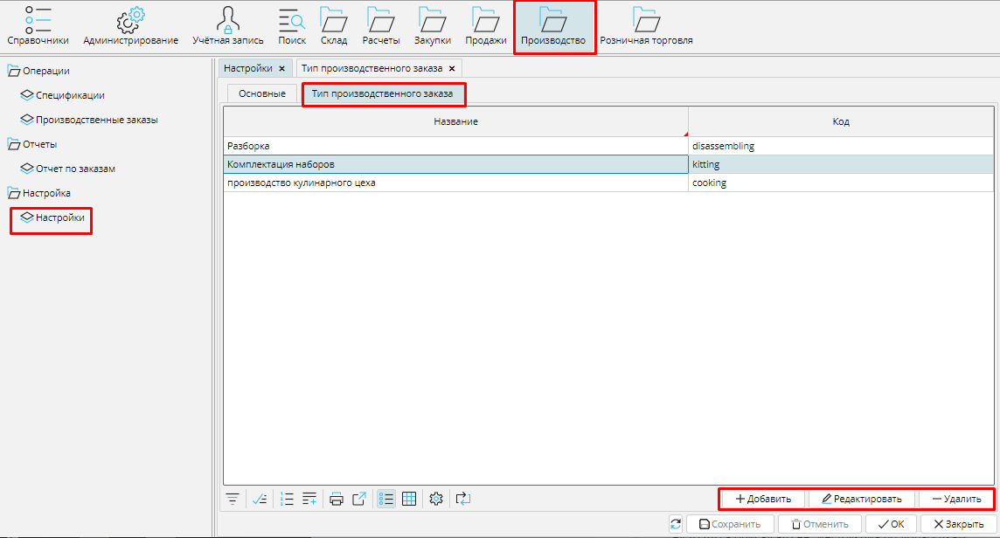
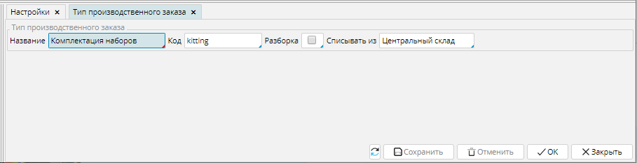

В зависимости от потребностей пользователь может настроить необходимое количество типов производственных заказов. Они отображаются в **Производство** - **Настройки** на вкладке **Тип производственного заказа**. Чтобы создать новый тип заказа необходимо нажать на кнопку **Добавить** и заполнить данные в форме нового типа производственного заказа.

### Рис. 1 Список типов производственных заказов

  

Необходимо указать **Название** и  **Код**. В поле **Списывать из** можно указать [**место хранения**](Location_settings.md), из которого будут списываться комплектующие для производства. Оно будет автоматически заполняться в заказе данного типа.

**Разборка** - активируйте (поставьте галочку) эту опцию, если в ходе выполнения заказа этого типа [**номенклатура разбирается**](Unbuild_order.md) на составляющие по [**спецификации**](Bills_of_Materials.md).

Нажмите **ОК** чтобы сохранить настройки и закрыть форму.

### Рис. 2 Новый тип производственного заказа

  

  

  

