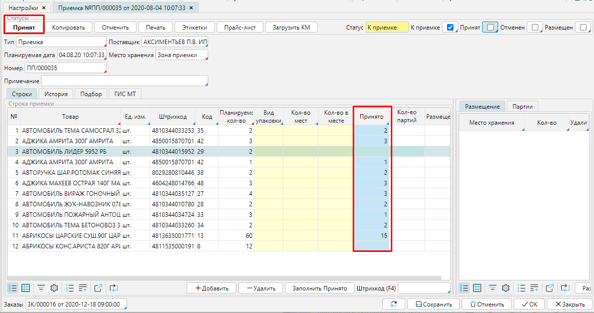

Заказ может отражать длительный договор с поставщиком, по которому вы получаете товар несколькими партиями. В таком случае на каждую поставку создается **Приемка **и **Поступление**.

Для того, чтобы это было возможно, необходимо в настройках [**Типа заказа**](Purchase_order_type.md) (**Закупки - Настройки - Тип заказа**) обязательно указать **Политику оформления поступления** ***Принятое количество***. 

  
Рис. 1 Настройки типа заказа

  

Когда **Заказ** переведен в статус ***Подтвержден***, автоматически создается **Приемка **в статусе ***К приемке ***на заказанное количество товара. 

Рис. 2 Подтвержденный заказ

  
Когда вы получаете первую поставку, в **Приемке **в столбце **Принято **указываете поступившее количество товара, нажимаете **Принят**. Товар поступает на указанный склад, в **Заказе** будет создано еще одна  **Приемка *****К приемке*** на оставшееся количество товара и станет доступна функция **Создать Поступление **для [оприходования и оплаты товара](Vendor_payments.md). **Поступление **создается на количество поступившего товара. 

  
Рис. 3 Приемка на поступивший товар

  

  
Рис. 4 Заказ после приемки первой партии товара

  

  
Рис. 5 Поступление на принятое количество

  

Таким образом,  вы получаете и приходуете товар, создавая документы для каждой поставки, пока не получите все заказанное количество. 

  

  
