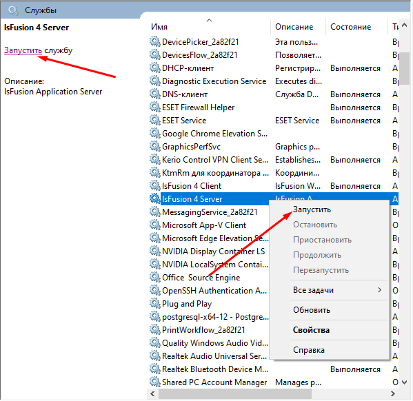
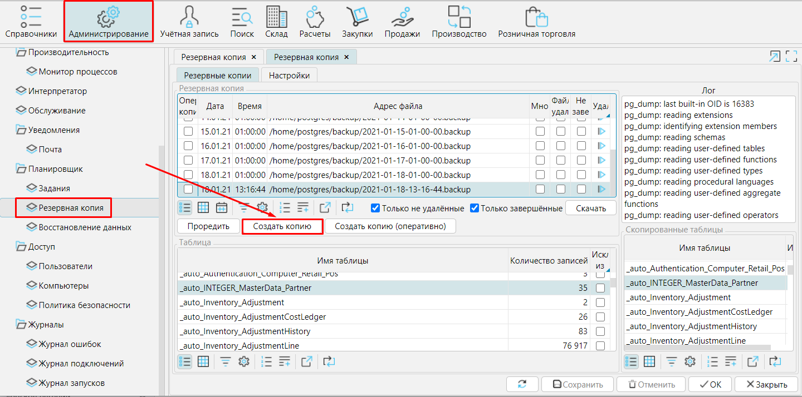
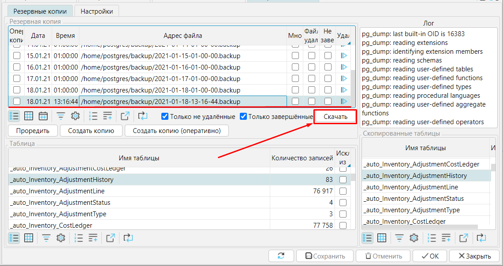

Если у вас возникла необходимость перенести свою рабочую программу на другой сервер, необходимо:

-    [**установить**](Installation.md) MyCompany на новый сервер (запустите для проверки корректности установки)
-   перенести на него бизнес-логику
-   перенести базу данных.

## Перенос бизнес-логики {#stop_server}

**1.** Прежде, чем переносить бизнес-логику, необходимо остановить сервер.

**Windows**:

 
*Рис. 1 Остановка сервера в ОС Windows*

**Linux**: ...`: systemctl stop lsfusion4-server`

**2.** Необходимо скопировать все файлы бизнес-логики и вставить в соответствующую папку  на новый сервер. По умолчанию файлы бизнес-логики находятся в папке:

**Linux**: /<u>var/lib/lsfusion/</u>

**Windows**: <u>C:\\Program Files\\lsFusion 4\\Server\\lib\\</u>

Чтобы проверить, корректно ли скопировались файлы, запустите сервер и проверьте работает ли программа.

Windows:

*Рис. 2 Запуск сервера в ОС Windows*

  

Запуск на **Linux**: ...`: systemctl start lsfusion4-server`

  

## Перенос Базы данных

**1**. [**Остановите**](#stop_server) новый сервер

**2.** Создайте бэкап своей рабочей базы: **Администрирование** - **Резервная копия** кнопка **Создать копию**.

 
*Рис. 3 Создание резервной копии базы данных*

**3.** Сохраните копию базы данных, чтобы переместить на новый сервер: нажмите **Cкачать** и укажите путь, куда сохранить файл.

 
*Рис. 4 Сохранение резервной копии*

**4** Восстановите базу данных с помощью **PostgreSQL**. В командной строке запустите команду `pg\_restore`.

Windows :

Все необходимое можно сделать через утилиту **pgAdmin**, которая устанавливается вместе с PostgreSQL.

:::info
Данные сервера, порта, пользователя и пароля PostgreSQL прописаны в файле **C:\\Program Files\\lsFusion 6\\Server\\conf\\settings.properties**
:::
  

**Linux** по умолчанию:

-   зайдите в SSH консоль и переключитесь на пользователя postgres : `su postgres`
-   зайдите в psql : `psql`
-   удалите текущую базу данных : `DROP DATABASE lsfusion;`
-   создайте новую базу данных : `CREATE DATABASE lsfusion WITH ENCODING='UTF8' TEMPLATE template0;`
-   выйдите из psql : `\q`
-   запустите команду `/usr/bin/pg\_restore -*h сервер-p порт -U имя\_пользователя\_PostgreSQL -d имя\_БД "имя\_файла.backup"`  
    *Например*:`usr/bin/pg\_restore -h localhost -U postgres -d lsfusion 2021-01-20-01-00-00.backup`
-   при необходимости введите запрошенный пароль пользователя PostgreSQL

:::info
Данные сервера, порта, пользователя и пароля PostgreSQL прописаны в файле **/etc/lsfusion6-server/conf/settings.properties**
:::

  

