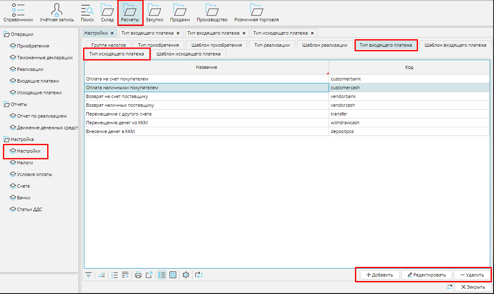
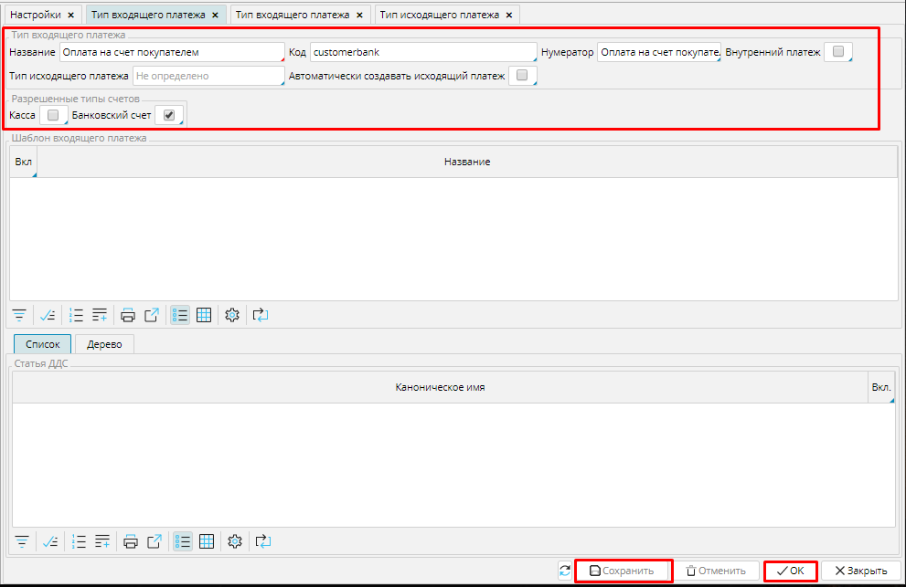

В системе поддерживаются типы входящих и исходящих платежей. Вы можете настраивать их исходя из своих потребностей. Например, если вы принимаете оплату и наличными, и банковской картой, а оплачиваете свои закупки только безналичными переводами, то можете настроить 2 типа входящих платежей и один тип исходящих. Список типов платежей вы можете просмотреть  **Расчеты - Настройки** вкладки **Тип Входящего / Исходящего платежа**.

### Рис. 1 Список типов входящих платежей

  

Настраиваются входящие и исходящие платежи одинаково. Нажмите кнопку **Добавить**  на вкладке Тип исходящего или входящего платежа и заполните необходимые поля в форме нового типа платежа, которая откроется.

### Рис. 2 Настройка типа входящего платежа

Напечатайте **Название** и **Код** типа платежа, чтобы легко его идентифицировать.

**Нумератор**-назначьте [**нумератор**](Numerators.md), чтобы автоматически формировался уникальный код каждого платежа данного типа.

**Внутренний платеж** - отметьте галочкой это свойство, если тип платежа предназначен для осуществления перечислений в рамках вашей компании. Например, трансфер с одного счета на другой, или внесение/ выемка денег из кассы.

**Тип исходящего (входящего) платежа** - если при создании определенного типа входящего (исходящего) платежа необходимо создавать и исходящий (входящий) платеж, то тип последнего указывается в данном поле. Например, при внесении разменных денег в кассу, со счета центральной кассы осуществляется исходящий платеж, а на счет определенной кассы поступает входящий платеж. 

**Автоматически создавать исходящий (входящий) платеж **- отметьте галочкой это свойство,  если обратный платеж должен создаваться автоматически.

**Касса** - отметьте галочкой, если данный тип платежа может использоваться для кассовых счетов.

**Банковский счет** - отметьте галочкой, если данный тип платежа может использоваться для банковских счетов.

Сохраните настроенный тип платежа кнопкой **Сохранить** или **ОК**

  

  

  
